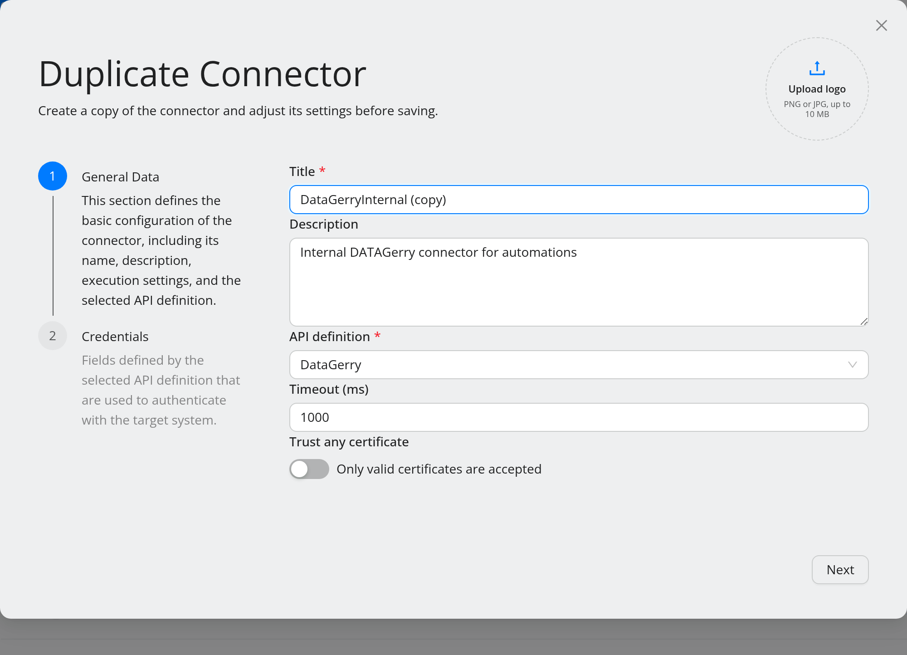

.. _concept-connectors:

##############################
Connectors and API definitions
##############################

.. contents::
   :local:

These two are constantly confused, so it is worth being precise: an **API
definition** describes *how to talk to a kind of system*; a **connector** is *one
instance of such a system, with credentials*.

.. note::
   Up to 5.1 the interface called an API definition an **invoker**. The REST API,
   the command palette (``upload invoker``) and the folder on disk still use that
   name.

API definition
==============

An API definition is a definition file (XML) that describes an API:

* the **authentication type** — API key, token, basic, or endpoint
  authentication — and the fields required for it,
* the **operations** the API exposes: for each one an HTTP method, an endpoint
  path, request headers and body, and the shape of the success and error
  response,
* optionally a **pagination** description, so OpenCelium can fetch a paged
  result set as a whole (see :ref:`concept-pagination`).

One API definition is written once per product. `i-doit`, `CheckMK`, `OTRS` are
API definitions.

API definitions live in ``src/backend/src/main/resources/invoker``. The admin menu
lists them under **Configurations → API Definitions**. There are four ways to add
one:

* **create** it in the UI,
* **upload** a file — ``.xml``, or a ``.zip`` of several, up to 1 GB,
* **install** them from the online repository *(5.2)* — see below,
* **synchronise** them from the Service Portal (subscribers).

Install from the online repository
----------------------------------

.. note::
   **New in 5.2.**

The public repository `github.com/opencelium/invoker
<https://github.com/opencelium/invoker>`_ holds the API definitions maintained by
the OpenCelium team. Install them with the palette command
``install online-invokers`` (or the onboarding tour's *Install from online
repository*). Files already on the server are updated, new ones are added, and API
definitions that exist only on your server are kept. It needs the permission to
create API definitions, internet access from the server, and online services
switched on; the repository location is configurable — see
:ref:`ref-config-online-services`.

.. note::
   Editing an API definition file does **not** update the connectors and workflows that
   already use it. That is deliberate — an API definition change is not always wanted
   downstream. Synchronise explicitly when you want it to propagate.

Connector
=========

A connector is an API definition plus:

* a **title** and description,
* the **credentials** for one concrete system (the fields come from the
  API definition's authentication type),
* a **timeout** (default ``1000``) and an **SSL certificate** flag,
* optionally an icon, which is what you see on the canvas.

`Production CheckMK` and `Staging CheckMK` are two connectors over the same
CheckMK API definition. In a workflow, **Use Another Connector** on a step's
context menu switches it between such connectors without rebuilding it — see
:doc:`../guides/build-a-workflow`.

Duplicate a connector
---------------------

.. note::
   **New in 5.2.**

The fastest way to the second of those connectors is the **Duplicate connector**
icon in the connector list. It opens the connector wizard pre-filled from the
original — title ``<title> (copy)``, description, API definition, timeout and SSL
flag — so you only adjust what differs, typically the URL and the credentials, and
save. The icon is not copied. Duplicating needs the permission to create
connectors.

Availability
============

A connector can be checked with a **connector test** (called *connection test* up
to 5.1): OpenCelium performs the API definition's test operation against the
connector's credentials. In the workflow editor the result appears as a status dot
on connector nodes and in the step drawer:

* **green** — the test passed,
* **orange** — the credentials were rejected,
* **red** — the system could not be reached, or the test failed for another
  reason; the tooltip carries it,
* **grey** — not tested yet,
* **locked** — the credentials need the master password.

From 5.2 an orange or red dot pulses. Hovering it shows a pencil that opens the
**Update Connector** wizard on its *Credentials* step, right from the canvas.

The point is to notice a broken target system while building, not in production.

Protecting credentials
======================

By default anyone who may read a connector can read its credentials. Setting a
**master password** changes that: credentials stay hidden until the password is
entered, once per browser session.

The master password also gates two other things in 5.0: browsing a connector's
GraphQL schema, and the :doc:`../guides/configure-the-system` page.

Set it under ``opencelium.connector.master-password``. ASCII only.

.. _concept-pagination:

Pagination
==========

Some APIs return data page by page. Rather than modelling that in every
workflow, you describe it once in the API definition, in a ``pagination`` element at the
same level as ``authType`` and ``operations``. OpenCelium then fetches all pages
and hands the workflow the complete result.

Parameters:

.. list-table::
   :header-rows: 1
   :widths: 18 82

   * - Parameter
     - Meaning
   * - ``LINK``
     - URL that fetches the next page.
   * - ``SIZE``
     - Total number of elements.
   * - ``PAGE``
     - Page number. Incremented by one.
   * - ``LIMIT``
     - Number of elements to fetch at a time.
   * - ``OFFSET``
     - Starting point; incremented by ``LIMIT``.
   * - ``RESULT``
     - The array of elements in the response.
   * - ``HAS_MORE``
     - Signals that more elements remain.
   * - ``CURSOR``
     - Pointer to a specific record.
   * - ``ORDER``
     - Sequence of elements (``asc``, ``desc``).

Actions:

.. list-table::
   :header-rows: 1
   :widths: 18 82

   * - Action
     - Meaning
   * - ``READ``
     - Read the value from the given path in the reference.
   * - ``WRITE``
     - Place the parameter's value at the given path.
   * - ``INCREMENT``
     - Add, then increase. Used for ``OFFSET``.
   * - ``COLLECT``
     - Aggregate elements from all responses into one list. Used for ``RESULT``.
   * - ``FETCH``
     - Retrieve the next page. Used for ``LINK``.

Reference paths look like ``response.body.$.items``,
``request.url.$.limit``, ``response.header.$.next``.

Worked examples are in :doc:`../reference/operators` under
:ref:`ref-pagination-examples`.

Where to go next
================

* :doc:`../guides/build-a-workflow` — use a connector in a workflow.
* :doc:`../guides/call-any-api` — when you do *not* want to write an API definition.
* :doc:`../reference/screens` — the connector screens field by field.
