##################
Admin Panel
##################

The Admin Panel centralizes everything needed to operate OpenCelium:
user/group administration, LDAP diagnostics, template tooling,
update/licensing utilities, and category management.

.. contents::
   :local:

Users
"""""""""""""""""

The **Users** card lists every account, including the currently logged-in
user (which cannot be deleted). Each row shows the name, email, and
primary group; switching to grid view displays avatar cards instead.

|image_user_0|

Open a user to review phone numbers, department, organization,
salutation, avatar, last login time, and group membership. Users without
a custom avatar simply show the default image.

|image_user_1|

Creating or editing a user follows three steps: **Credentials** (email,
password, password confirmation, all required), **User Details** (name,
surname, phone number, department, organization, salutation, avatar), and
**User Group** (select a group and review its description).

|image_user_2|

Emails must be valid and unique, passwords must contain 8–16 characters,
and the confirmation field must match. Name and surname remain mandatory
in the details step.

|image_user_3|

Groups
"""""""""""""""""

**Groups** define which components a set of users can access. The list
view shows the name, description, and included components; open a group
to see the permission matrix.

Group creation has three steps:

1. **General data** – name (required), description, and icon.
2. **Components** – pick one or more of the nine components (My Profile,
   User, User Group, Connector, Connection, Schedule, Dashboard, App,
   Invoker).
3. **Permissions** – assign create/read/update/delete. The Admin toggle
   checks every permission for that component.

LDAP Check
"""""""""""""""""

The LDAP card provides a test harness for the configuration described in
:doc:`../management/authentication`. You can load the current
``application.yml`` values, adjust them temporarily, and run a bind
test. The UI echoes the status while the backend logs detailed errors so
you can cross-check with ``journalctl``. Use this card whenever you
change LDAP URLs, bind accounts, or group mappings.

External Applications
"""""""""""""""""""""

The **External Applications** card shows the status of services
OpenCelium depends on. By default you will see MariaDB (stores user,
connection, and scheduler metadata) and MongoDB (stores connection
graphs). Each card displays the actuator health status and version
reported by the backend health check. Unavailable services turn red.

Invokers
"""""""""""""""""

The **Invokers** card lets you import, update, or remove invoker XML
files. These files describe authentication details and the callable APIs
that later appear in the Connection designer. Refer to
:ref:`management-invoker` for the full wizard.

Templates
"""""""""""""""""

**Templates** capture complete connections for reuse. See
:ref:`management-business_template` for the workflow to export or apply
them.

.. _admin_panel-data_aggregator:

Data Aggregator
"""""""""""""""""

**Data Aggregator** scripts collect metrics from method executions so
notifications can summarize results. Follow
:ref:`management-data_aggregator` for authoring guidance.

Notification Templates
"""""""""""""""""""""""

**Notification Templates** define email, Slack, or Teams bodies that
schedulers use for *pre*, *post*, or *alert* events. See
:ref:`management-notification_template` for placeholders and examples.

License Management
"""""""""""""""""""

The License Management card mirrors the full workflow described in
:doc:`../management/license_management`. It surfaces the current
subscription, warns if the API-call quota is exhausted, and exposes
“Activation Request”, “Import License”, and “Activate Online” actions.
Online activation only appears when the user has enabled **Online
Service Sync** in their profile (:ref:`usage-my_profile`), because that
permission allows the frontend to contact the Service Portal. The
embedded *Detail View* lets you trace API usage back to specific
connections when debugging overages.

.. _admin_panel-update_assistant:

Update Assistant
"""""""""""""""""

The *(Update Assistant)* card automates upgrades. When a newer version is
available in the package cloud the card highlights it and guides you
through the process.

.. note::
   The card is only enabled when ``opencelium.installation.type`` is set
   to ``sources`` in ``application.yml``.

The *System Check* verifies prerequisites and reminds you to create a
backup before continuing.

|image_update_assistant_0|

| The *Update Assistant* provides two options: 
| * **Online:** get the new versions via package cloud 
| * **Offline:** download the version and upload it offline

|image_update_assistant_1|

After selecting a version click *Update OC* to complete the process. For
troubleshooting, see :ref:`Logging <getting_started-administration-logging>`.

.. _admin_panel-migration:

Migration from 3.x to 4.x
"""""""""""""""""""""""""
Since version 4.0 OpenCelium stores connection graphs in MongoDB. The
*Migration* card assists when upgrading from older Neo4j-based releases.
Use it after applying an application upgrade: provide the preserved
Neo4j URL, user, and password (from your backup ``application.yml``),
then click *Migrate* to transfer the data.

|image_migration_0|

Categories
"""""""""""""""""

The Categories card centralizes the hierarchy that was previously only
available from the Connections page. It lets you create, rename, or
delete categories (including recursive deletes that remove subfolders and
dependent connections). Changes propagate immediately to the category
filters shown in :doc:`connections`, :doc:`schedules`, and the
dashboard widgets, so this card is the preferred place to curate your
taxonomy.

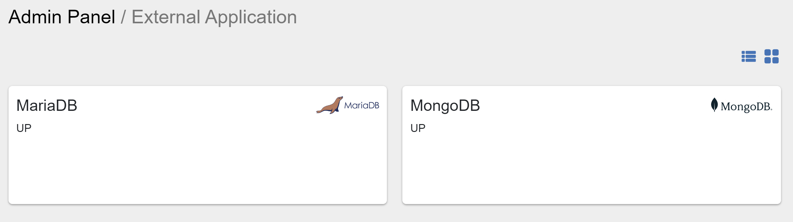
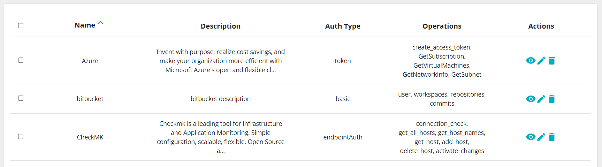

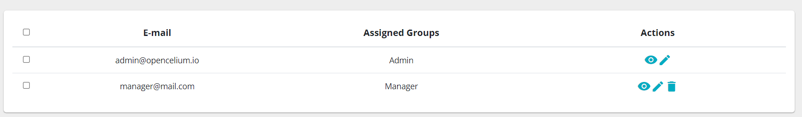
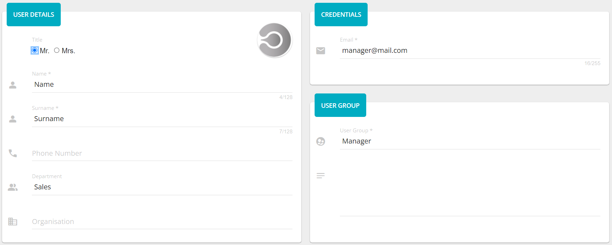
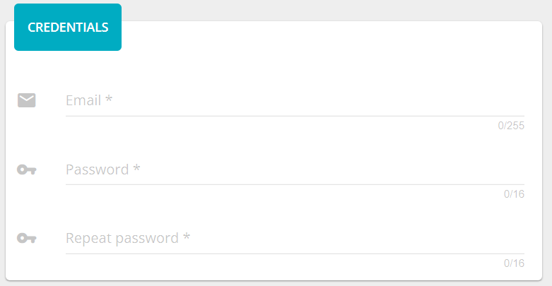
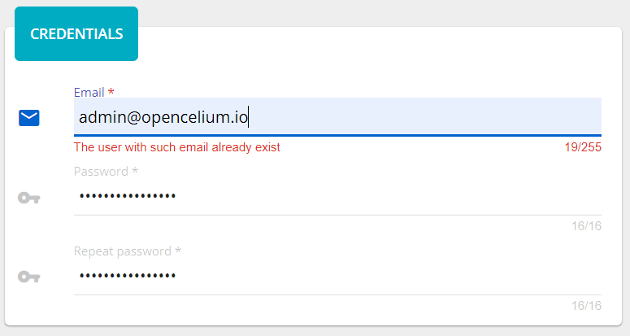
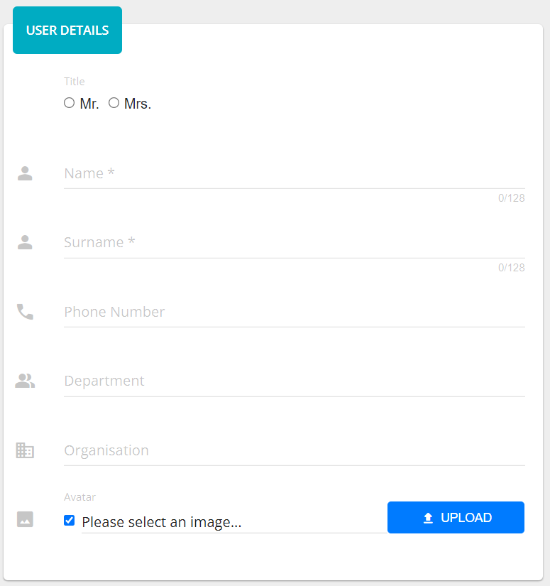
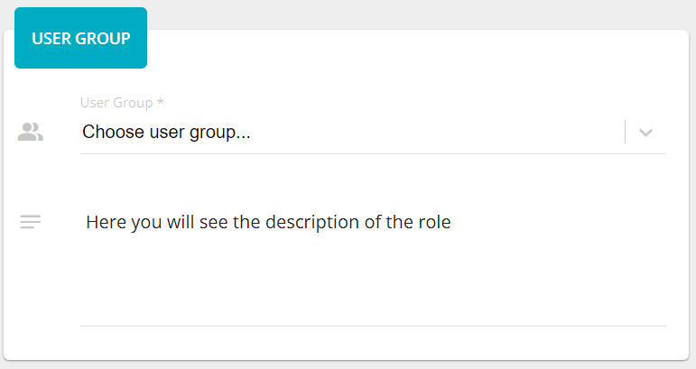

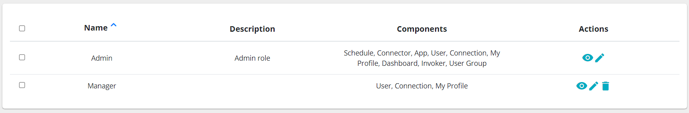
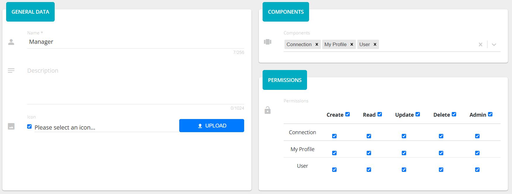
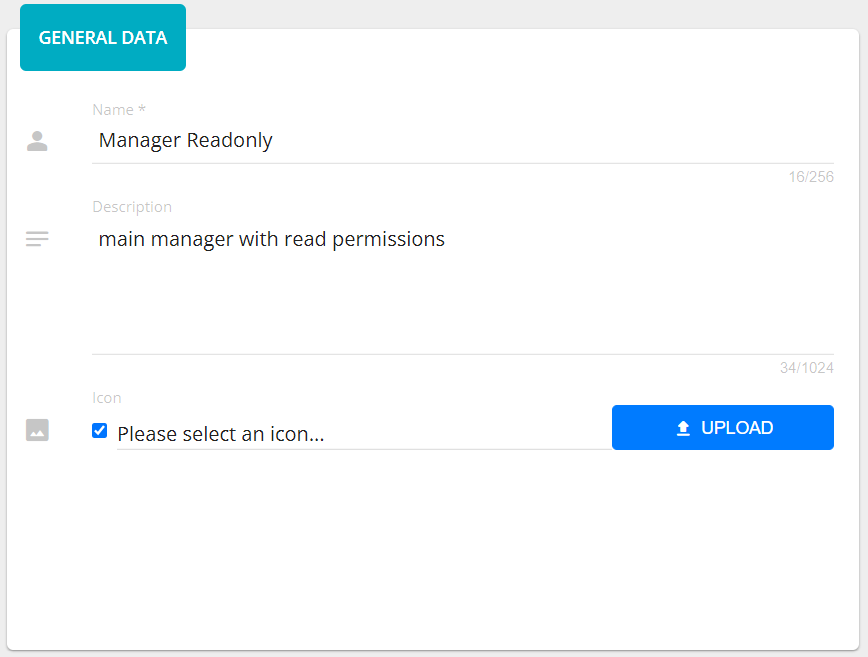
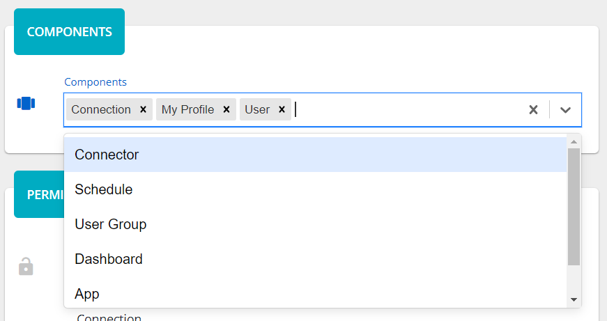
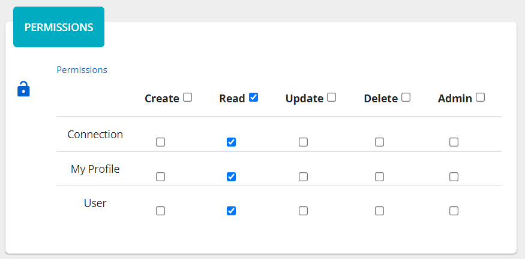

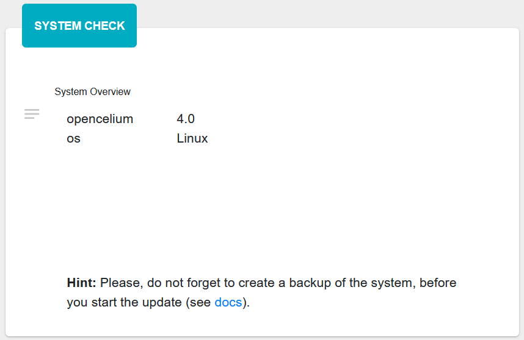
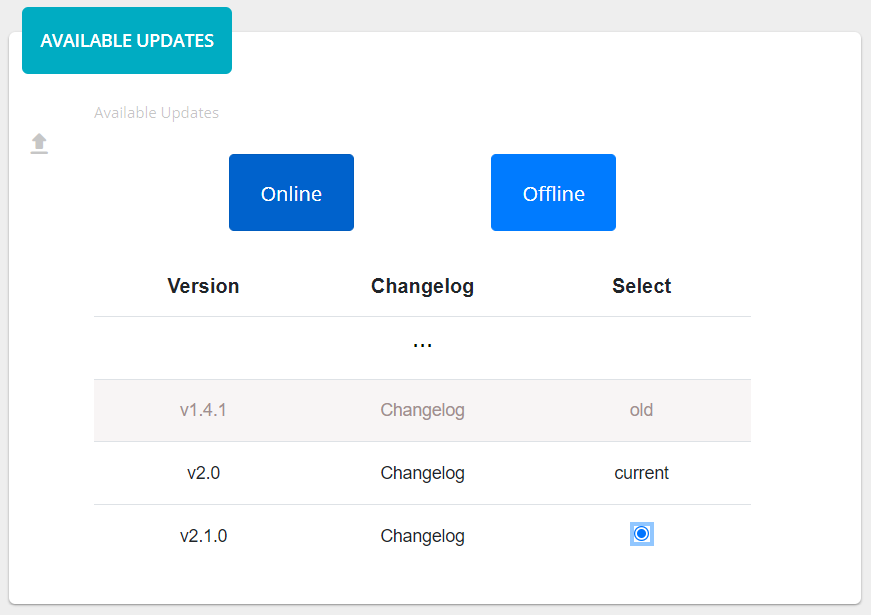
   
.. |image_migration_0| image:: ../img/admin/4.png
   :align: middle
   
