######################
Application Management
######################

OpenCelium presents a unified interface across every module, so once you
learn the navigation, the patterns repeat everywhere.

.. contents::
   :local:

Navigation
==========

The left-hand menu shows icon-only shortcuts by default. Hover over the
rail (or click the burger icon |burger_icon|) to expand it and reveal
labels. Administrative items expose sub-menus that can be expanded or
collapsed individually.

|menu|

Top Bar & Global Search
=======================

Every page shares the same top bar:

- **Global search** – typing part of a connector, connection, or schedule
  title sends a query to ``/search/{title}`` and displays grouped
  results. Selecting one navigates directly to that module and pre-fills
  the search filter.
- **Notification bell** – opens the notification drawer regardless of
  where you are in the app.
- **Profile avatar** – opens the profile page so you can adjust personal
  settings (see :ref:`usage-my_profile`).

Notification Panel
==================

Actions such as create, update, and delete always produce a toast. Each
toast is also added to the notification panel, which records the type
(info, warning, error), timestamp, and message. Use the chevron icon to
expand long messages, click entity links to jump to the affected record,
or clear individual/all entries with the trash buttons.

|notification_panel|

List & Grid Views
=================

Data-heavy modules offer both table and card layouts. In table view you
can:

- Sort by clicking the title column |title_sort_icon|.
- Inline-edit names and descriptions (Connections, Connectors, Schedules)
  by double-clicking the value |connector_inline_name_update|.
- Select multiple rows for bulk actions.

|list_view|

Switch to the grid view |grid_icon| to see cards with icons. You can
upload a new icon directly from the grid |upload_image_icon|. Both
layout modes honor pagination |paginator| and the universal search box.

|grid_view|

Add/Update Forms
================

Entry creation flows all follow the same pattern: click **Add
<Element>**, complete each form section, and submit. Validation only runs
when the section is submitted, so required fields stay highlighted until
they are filled.

|form_section|

Some sections are conditional—for example, a subsection might only
appear after you choose a connector. This ensures dependencies are met
before additional options are shown.

.. _usage-my_profile:

Profile & Theme Sync
====================

The profile page stores personal details and two platform-wide toggles:

- **Theme** – select a theme to apply it immediately; the choice is saved
  with your account.
- **Online Service Sync** – when enabled, OpenCelium loads a Service
  Portal iframe to synchronize avatars (Gravatar), custom themes, and
  online license activation (see :doc:`../management/license_management`).

Both settings update the backend via the user-detail API, so your
account must have permission to edit itself.

Dashboard Overview
==================

The :doc:`dashboard` follows the same layout conventions described here
but adds draggable widgets. Use the pencil icon to enter edit mode,
drag/drop or remove widgets, and save. Widget preferences are stored per
user through the ``/widget`` and ``/widget_setting`` endpoints, so your
layout persists across browsers.

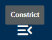
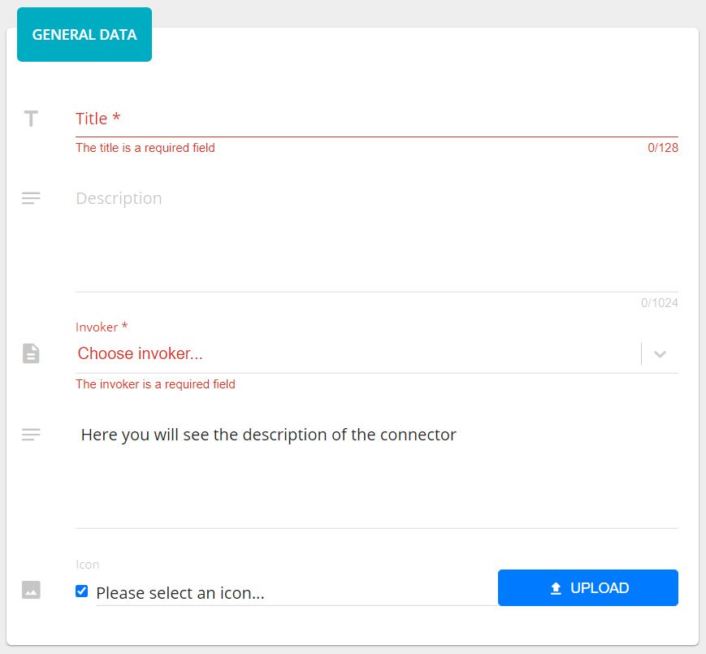

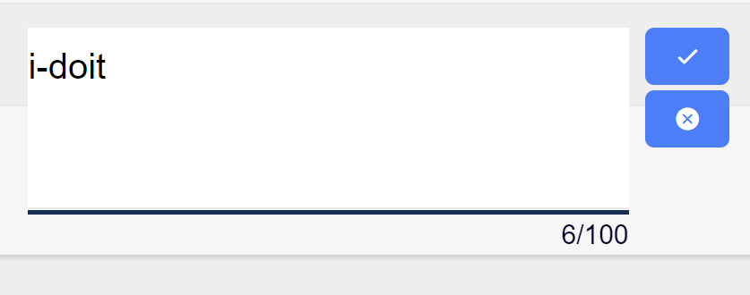
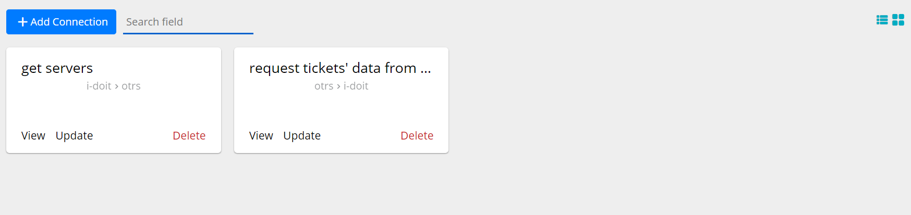
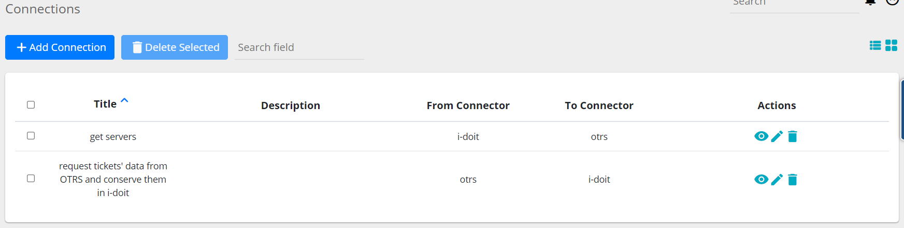
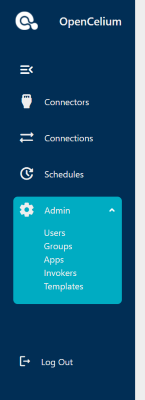
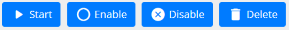
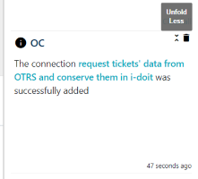
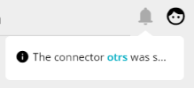
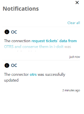
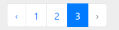
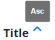
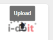
