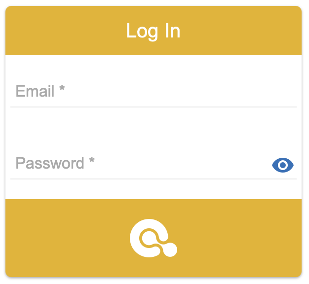

##################
Login
##################

After launching the application in your browser you will see the login page.

|image_login_0|

The default admin user has the following credential data:

   * **login:** admin@opencelium.io
   * **password:** 1234

As soon as you login into the system you will see the dashboard and the menu
on left side. The menu gives you direct acces to the most importants parts
of the system:

   * Connectors
   * Connections
   * Schedules
   * Admin
   * Users
   * Groups
   * Apps
   * Invokers
   * Templates

Please see the next section to get a general overview over the application
and its usage.

