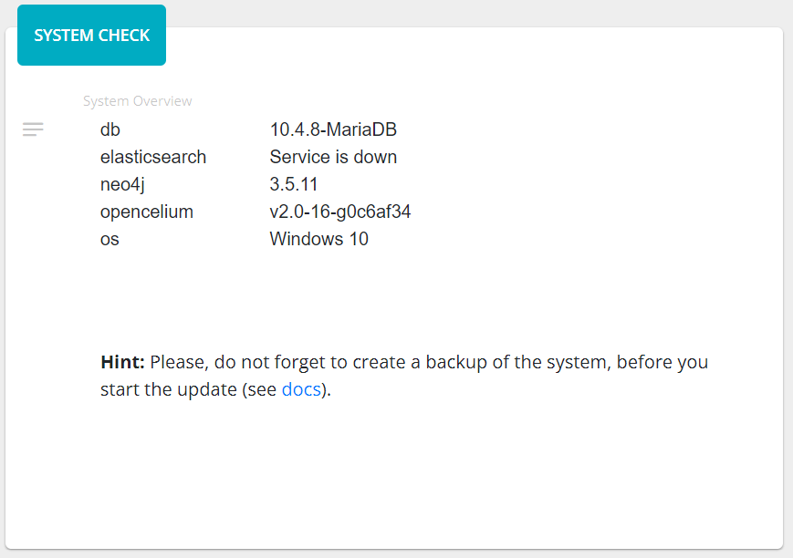

##################
Updating
##################

Compatibility Matrix
"""""""""""""""""""""

.. raw:: html

	
The tests were conducted using the archived package version (ZIP) and the Ubuntu 24.04 LTS operating system.

	 

	

	    

	    

	

	
	<table id="compatibility-datatable" class="table table-striped table-hover w-100"></table>

|
|

.. note::
        | The matrix lists the upgrade paths that have actually been tested.
        | The 5.0 target rows are added once the release tests for the
        | individual source versions have been completed.

.. warning::
        | Before updating, always do a full backup of your system!

.. contents::
   :local:

From OC 4.x to 5.0
""""""""""""""""""

5.0 is a major release. Read this section before you update.

What changes
============

* **Connections are now Workflows.** A workflow is no longer bound to a *from*
  and a *to* connector; every step carries its own connector, and a workflow can
  call any number of connectors. The concept is described in
  :ref:`usage-workflow-model`.
* **The frontend was rebuilt.** New navigation, new workflow editor, and a
  global :doc:`command palette <../usage/command_palette>` (``Ctrl+K``).
* **New administration screens** replace the old admin panel cards:
  :ref:`System Check <admin_panel-system_check>` instead of *External
  Applications*, and :ref:`System Configuration <admin_panel-system_config>` for
  editing ``application.yml`` from the UI.
* **The Neo4j migration tool is gone.** It only ever applied to updates from
  3.x, which is no longer a supported source version.

Your workflow data
==================

Existing connections are **not rewritten in the database** by the update. 5.0
converts documents from older versions to the new layout *in memory, on the read
path only*, so you can update, inspect your workflows, and roll back without
having migrated any data. The same applies to templates.

.. warning::
   As soon as you open a pre-5.0 workflow in 5.0 **and save it**, the stored
   document uses the new layout and can no longer be read by a 4.x
   installation. Keep the backup you took before the update until you are
   confident in the new version.

See :ref:`usage-workflow-migration` for what the conversion does in detail.

Adjust your application.yml
===========================

The update does not rewrite your ``application.yml``. Two settings **moved** in
5.0 and silently lose their effect if you carry the old file over unchanged:

.. list-table::
   :header-rows: 1
   :widths: 45 45 10

   * - 4.x
     - 5.0
     - Effect if not changed
   * - ``spring.data.ldap``
     - ``spring.security.ldap``
     - LDAP logins stop working
   * - ``logging.level.org.springframework.data.ldap``
     - ``logging.level.org.springframework.security.ldap``
     - LDAP debug logging stops working

Two settings were also **corrected**; if you copied them from an old
``application_default.yml``, fix the spelling:

* ``spring.jpa.hibernate.dll-auto`` → ``spring.jpa.hibernate.ddl-auto``
* ``spring.web.resources.add-mappings=false:`` → ``spring.web.resources.add-mappings: false``

And the ``opencelium.online-services.*`` ``active`` flags are now real booleans
(``false``) instead of quoted strings (``"false"``).

New optional sections you may want to set are ``opencelium.config`` and
``opencelium.sweeper.test-connection`` — see
:ref:`getting_started-administration-app_config` and
:ref:`getting_started-administration-sweeper`.

Adjust your frontend endpoint configuration
===========================================

The frontend now reads its endpoints at runtime from ``config.json`` next to
``index.html``; the ``settings.json`` of earlier versions is ignored. If you had
customised the backend routing, port the values over as described in
:ref:`getting_started-administration-app_config` — the relevant section is
*Routing of the backend through an endpoint* in
:doc:`administration`.

If OpenCelium runs behind a reverse proxy, make sure both ``/api`` **and**
``/ws`` are proxied. The shipped ``conf/nginx_default.conf`` already does this;
a hand-written config that only proxies ``/api`` breaks the workflow test run,
the live dashboard and the support-log notifications.

Update zip file installations
=============================

| Log in to OpenCelium, open the admin menu and click on *Update Assistant*.
| Click here to see, how to use :ref:`Update Assistant <admin_panel-update_assistant>`.

Update DEB package for Ubuntu 24.04 LTS
=======================================

.. code-block:: sh
	:linenos:

	apt update
	apt install --only-upgrade -y opencelium
	

Update RPM package for SUSE Linux Enterprise Server 15 SP5
==========================================================

.. code-block:: sh
	:linenos:

	zypper refresh
	zypper update -y OpenCelium

Update RPM package for RedHat 9.2
=================================

.. code-block:: sh
	:linenos:

	yum update
	yum update -y OpenCelium

Update Docker Compose
=================================

.. warning::
        | Before updating, do a backup of your configuraton files (conf folder and .env file) 
        | to preserve your own settings! 

.. code-block:: sh
	:linenos:

        cd opencelium-docker
	docker compose down -v
	git pull
        docker compose up -d
	
| 
|

From OC 3.x to 4.1
"""""""""""""""""""

.. note::
        | This update guide is intended for existing zip file 3.x installations.
        | For all other installations, please send us an email to : support@opencelium.io

.. warning::
        | 3.x cannot be updated to 5.0 directly. Update to 4.1 as described here
        | first, then follow *From OC 4.x to 5.0* above. The Neo4j-to-MongoDB
        | migration tool used in the last step of this guide was removed in 5.0,
        | so it has to be run while you are still on the 4.x line.

Prepare Update
==================

**1. Stop Services:**

.. code-block:: sh
        :linenos:

        oc stop_backend
        systemctl stop nginx

**2. Install MongoDB:**

| Use default MongoDB installation guide.
| You can find documentation here: `MongoDB Installation <https://www.mongodb.com/docs/manual/administration/install-on-linux/>`_

**3. Backup current installation**

.. code-block:: sh
        :linenos:
        
        mkdir /opt/opencelium /opt/openceliumOld
        mv -t /opt/openceliumOld /opt/conf /opt/logs /opt/scripts /opt/src /opt/tools /opt/CHANGELOG.rst /opt/LICENSE.md /opt/README.md

Install Application
===================

Download and unzip application, and create a link for it.

.. code-block:: sh
        :linenos:

        wget --content-disposition "https://packagecloud.io/becon/opencelium/packages/anyfile/oc_4.1.zip/download?distro_version_id=230" -P /opt/opencelium/
        unzip -o -d /opt/opencelium/ /opt/opencelium/oc_4.1.zip
        rm /opt/opencelium/oc_4.1.zip
        rm /usr/bin/oc
        ln -s /opt/opencelium/scripts/oc_service.sh /usr/bin/oc
        chmod +x /usr/bin/oc

Configuration
==================

**1. MariaDB:**

Create mysql user for OpenCelium. Older versions always used the MySQL root user, but now we use a separate openlium db user.

.. note::
	| Please change the password (secret1234) in the following command line!
	| After running the command, enter your root password at password prompt, to create opencelium user.

.. code-block:: sh
        :linenos:

        mysql -u root -p -e "GRANT ALL PRIVILEGES ON opencelium.* TO 'opencelium'@'localhost' IDENTIFIED BY 'secret1234'; FLUSH PRIVILEGES;"

**2. MongoDB:**

Start and enable mongod service and create a user for Opencelium.

.. code-block:: sh
        :linenos:

        systemctl restart mongod
        systemctl enable mongod
        mongosh --eval "db.getSiblingDB('opencelium').createUser({user: 'oc_admin', pwd: passwordPrompt(), roles: ['readWrite','dbAdmin' ]})"

**3. Nginx:**

| Remove old config and link new configuration file for OpenCelium.
| Debian/Ubuntu:

.. code-block:: sh
	:linenos:
	
	rm /etc/nginx/sites-enabled/oc
	ln -s /opt/opencelium/conf/nginx.conf /etc/nginx/sites-enabled/oc.conf
	
SUSE Linux Enterprise/RedHat:

.. code-block:: sh
	:linenos:
	
	rm /etc/nginx/conf.d/oc
	ln -s /opt/opencelium/conf/nginx.conf /etc/nginx/conf.d/oc.conf
	
.. note::

        | For SSL, use /opt/opencelium/conf/nginx-ssl.conf file and add your certificates.

	

**4. OpenCelium:**

Create and adjust configuration.

.. code-block:: sh
        :linenos:

        cp /opt/opencelium/src/backend/src/main/resources/application_default.yml /opt/opencelium/src/backend/src/main/resources/application.yml
        cp /opt/openceliumOld/src/backend/src/main/resources/invoker/* /opt/opencelium/src/backend/src/main/resources/invoker/
        cp /opt/openceliumOld/src/backend/src/main/resources/templates/* /opt/opencelium/src/backend/src/main/resources/templates/

.. note::
        | Modify application.yml
        | Within section "Database configuration section of MariaDB and MongoDB":
        | - change password of opencelium user for MariaDB (default "secret1234")
        | - change password of oc_admin user for MongoDB in uri line (default "secretsecret")
        | - Just in case you had special settings in application.yml, copy these settings to the new application.yml
        |   (See old application.yml in /opt/openceliumOld/src/backend/src/main/resources)
        |  
        | Just in case you are using SSL, add certs to the ssl section. 
        | It has to be a p12 keystore file with password! 
        | If you just have key and pem you can create a p12 as follows:

        
        .. code-block:: sh
                :linenos:
                
                openssl pkcs12 -export -out /opt/opencelium/src/backend/src/main/resources/opencelium.p12 -in /etc/ssl/certs/opencelium.pem -inkey /etc/ssl/private/opencelium.key
        
Finally start OpenCelium backend and frontend.

.. code-block:: sh
        :linenos:

        ln -s /opt/opencelium/conf/opencelium.service /etc/systemd/system/opencelium.service
        systemctl daemon-reload
        systemctl enable opencelium
        systemctl start opencelium
        systemctl start nginx

.. note::
        | Afterwards you can connect to `http://localhost`      
        | Default User and Password is:
        
        | admin@opencelium.io
        | 1234
        
        | If you want to have a look into OpenCelium Logs please use:
        
        .. code-block:: sh
                :linenos:
                
                journalctl -xe -u opencelium -f
                
              
**5. Migration from Neo4j to MongoDB:**

Since version 4.0 OpenCelium stores its connection data in MongoDB. The
*Migration* tool moves the data from Neo4j to MongoDB when you come from an
older version. It has to be run as the **last** step, after the application
itself was updated.

| Log in to OpenCelium, open the *AdminPanel* and click on *Migration*.
| Enter the Neo4j URL, user and password you used before — see the old
  ``application.yml`` in your backup directory — and click *Migrate* to start.

.. note::
        | The Migration card exists in the 4.x line only. It was removed in 5.0,
        | so this step must be completed before updating to 5.0.

