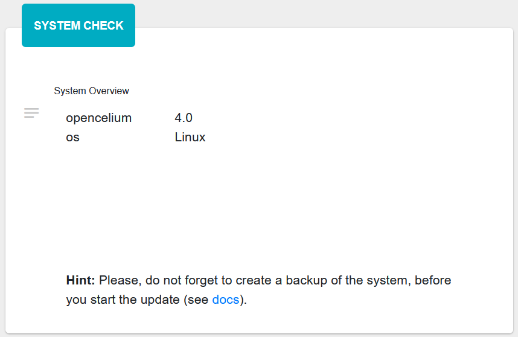

##################
Updating
##################

From OC 4.0 to latest
"""""""""""""""""

Update zip file installations
==================

| Log in to OpenCelium, open the *AdminPanel* and click on *Update Assistant*.
| Click here to see, how to use `Update Assistant <https://docs.opencelium.io/en/prod/usage/admin.html#update-assistant>`_ 

Update DEB package for Ubuntu 24.04 LTS
==================

.. code-block:: sh
	:linenos:

	apt update
	apt install --only-upgrade -y opencelium
	

Update RPM package for SUSE Linux Enterprise Server 15 SP5
==================

.. code-block:: sh
	:linenos:

	zypper refresh
	zypper update -y OpenCelium

Update RPM package for RedHat 9.2
==================

.. code-block:: sh
	:linenos:

	yum update
	yum update -y OpenCelium
	
| 
| 

From OC 3.x to 4.x (latest)
"""""""""""""""""

.. note::
        | This update guide is intended for existing zip file 3.x installations. 
        | For all other installations, please send us an email to : support@opencelium.io

Prepare Update
==================

**1. Stop Services:**

.. code-block:: sh
        :linenos:

        oc stop_backend
        systemctl stop nginx

**2. Install MongoDB:**

| Use default MongoDB installation guide.
| You can find documentation here: `MongoDB Installation <https://www.mongodb.com/docs/manual/administration/install-on-linux/>`_

**3. Backup current installation**

.. code-block:: sh
        :linenos:
        
        mkdir /opt/opencelium /opt/openceliumOld
        mv -t /opt/openceliumOld /opt/conf /opt/logs /opt/scripts /opt/src /opt/tools /opt/CHANGELOG.rst /opt/LICENSE.md /opt/README.md

Install Application
==================

Download and unzip application, and create a link for it.

.. code-block:: sh
        :linenos:

        wget --content-disposition "https://packagecloud.io/becon/opencelium/packages/anyfile/oc_latest.zip/download?distro_version_id=230" -P /opt/opencelium/
        unzip -o -d /opt/opencelium/ /opt/opencelium/oc_latest.zip
        rm /opt/opencelium/oc_latest.zip
        rm /usr/bin/oc
        ln -s /opt/opencelium/scripts/oc_service.sh /usr/bin/oc
        chmod +x /usr/bin/oc

Configuration
==================

**1. MariaDB:**

Create mysql user for OpenCelium. Older versions always used the MySQL root user, but now we use a separate openlium db user.

.. note::
	| Please change the password (secret1234) in the following command line!
	| After running the command, enter your root password at password prompt, to create opencelium user.

.. code-block:: sh
        :linenos:

        mysql -u root -p -e "GRANT ALL PRIVILEGES ON opencelium.* TO 'opencelium'@'localhost' IDENTIFIED BY 'secret1234'; FLUSH PRIVILEGES;"

**2. MongoDB:**

Start and enable mongod service and create a user for Opencelium.

.. code-block:: sh
        :linenos:

        systemctl restart mongod
        systemctl enable mongod
        mongosh --eval "db.getSiblingDB('opencelium').createUser({user: 'oc_admin', pwd: passwordPrompt(), roles: ['readWrite','dbAdmin' ]})"

**3. Nginx:**

| Remove old config and link new configuration file for OpenCelium.
| Debian/Ubuntu:

.. code-block:: sh
	:linenos:
	
	rm /etc/nginx/sites-enabled/oc
	ln -s /opt/opencelium/conf/nginx.conf /etc/nginx/sites-enabled/oc.conf
	
SUSE Linux Enterprise/RedHat:

.. code-block:: sh
	:linenos:
	
	rm /etc/nginx/conf.d/oc
	ln -s /opt/opencelium/conf/nginx.conf /etc/nginx/conf.d/oc.conf
	
.. note::

        | For SSL, use /opt/opencelium/conf/nginx-ssl.conf file and add your certificates.

	

**4. OpenCelium:**

Create and adjust configuration.

.. code-block:: sh
        :linenos:

        cp /opt/opencelium/src/backend/src/main/resources/application_default.yml /opt/opencelium/src/backend/src/main/resources/application.yml
        cp /opt/openceliumOld/src/backend/src/main/resources/invoker/* /opt/opencelium/src/backend/src/main/resources/invoker/
        cp /opt/openceliumOld/src/backend/src/main/resources/templates/* /opt/opencelium/src/backend/src/main/resources/templates/

.. note::
        | Modify application.yml
        | Within section "Database configuration section of MariaDB and MongoDB":
        | - change password of opencelium user for MariaDB (default "secret1234")
        | - change password of oc_admin user for MongoDB in uri line (default "secretsecret")
        | - Just in case you had special settings in application.yml, copy these settings to the new application.yml
        |   (See old application.yml in /opt/openceliumOld/src/backend/src/main/resources)
        |  
        | Just in case you are using SSL, add certs to the ssl section. 
        | It has to be a p12 keystore file with password! 
        | If you just have key and pem you can create a p12 as follows:

        
        .. code-block:: sh
                :linenos:
                
                openssl pkcs12 -export -out /opt/opencelium/src/backend/src/main/resources/opencelium.p12 -in /etc/ssl/certs/opencelium.pem -inkey /etc/ssl/private/opencelium.key
        
Finally start OpenCelium backend and frontend.

.. code-block:: sh
        :linenos:

        ln -s /opt/opencelium/conf/opencelium.service /etc/systemd/system/opencelium.service
        systemctl daemon-reload
        systemctl enable opencelium
        systemctl start opencelium
        systemctl start nginx

.. note::
        | Afterwards you can connect to `http://localhost`      
        | Default User and Password is:
        
        | admin@opencelium.io
        | 1234
        
        | If you want to have a look into OpenCelium Logs please use:
        
        .. code-block:: sh
                :linenos:
                
                journalctl -xe -u opencelium -f
                
              
**5. Migration from Neo4j to MongoDB:**

| - Log in to OpenCelium
| - Click on "Admin Panel"
| - Click on "Migration"
| - Enter predefined Neo4j URL and add Neo4j credentials 
|   (See old application.yml in /opt/openceliumOld/...)
| - Click on "Migrate" to start migration

