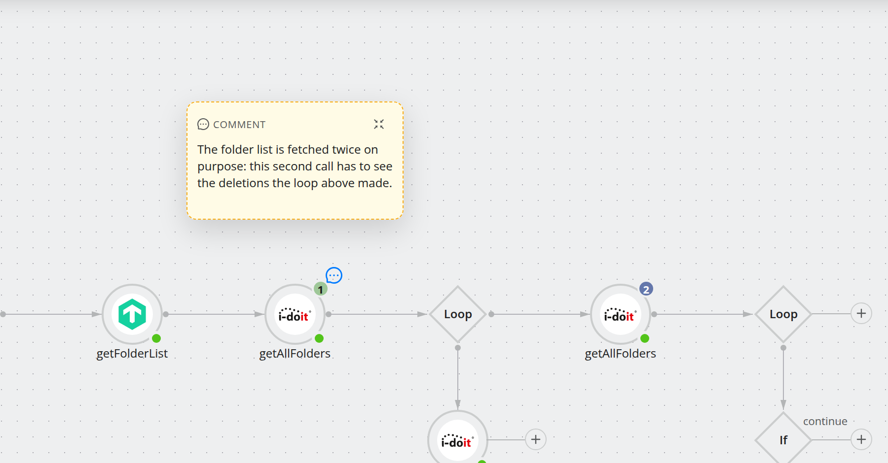

.. _guide-annotate:

####################
Annotate a workflow
####################

.. contents::
   :local:

.. note::
   **New in 5.1.**

A **comment box** is a note on the canvas, anchored to a step. It is for the
things a workflow cannot say about itself: why this endpoint and not the obvious
one, which ticket the workaround came from, what to check before changing the
loop condition.

Notes are saved with the workflow and travel with it — including into a template
— so they are read by whoever opens it next, not just by you.

Add a note
==========

#. Select the step the note belongs to.
#. Click the **comment** icon in the node toolbar.

The note appears above its step, stepping further up if that spot is already
taken so it never lands on top of another node. Each step carries **at most one**
note; the comment icon disappears from the toolbar once the step has one.

The step the note belongs to carries a **comment badge** — the blue speech
bubble above ``getAllFolders``. Clicking it hides and shows the note again.

Work with a note
================

.. list-table::
   :header-rows: 1
   :widths: 26 74

   * - Action
     - How
   * - **Write**
     - Click into the note and type. Text is saved with the workflow like any
       other change — there is no separate save.
   * - **Resize**
     - Select the note and drag a corner or edge handle.
   * - **Move**
     - Drag it. The position is remembered **relative to its step**, so moving
       the step later takes the note with it.
   * - **Minimise**
     - The minimise icon in the note's header collapses it to a badge on its
       step, which keeps a busy canvas readable.
   * - **Show again**
     - Click the comment badge on the step. The badge is coloured while the note
       is open and muted while it is minimised.
   * - **Delete**
     - Select the note and use the delete icon in its toolbar.

A note is an annotation, not a step. It has no configuration, no context menu and
no place in the execution order — the engine never sees it, and adding one does
not change any step's ``index``.

.. note::
   Deleting a step deletes its note as well. A note cannot exist without the step
   it is anchored to.

How it is stored
================

Notes live in the workflow's saved ``ui`` blob, not in its methods, which is why
they never influence execution. Each note records its text, the id of the step it
is anchored to, its offset from that step, its size, and whether it is minimised.

Where to go next
================

* :doc:`build-a-workflow` — the rest of the canvas.
* :doc:`reuse-with-templates` — notes travel with a template.
* :doc:`undo-and-history` — take back an edit, including a deleted note.
