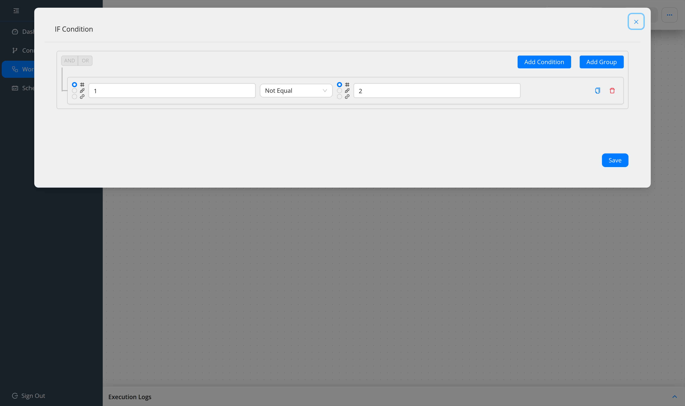

###################
Branch and loop
###################

.. contents::
   :local:

Conditional logic and repetition are both **operators**. One operator holds as
many conditions as you need, combined with AND/OR and grouped, so you rarely need
more than one.

Add an operator
===============

Use the **+** handle on the step the operator should follow, choose **Add
Operator**, then ``If`` or ``Loop``. Both selects are searchable.

* An ``If`` node has two outgoing paths, ``true`` and ``false``.
* A ``Loop`` node has a nested path for the repeated steps, and a continuation
  path for what comes after.

Mind which handle you use when adding steps afterwards: the nested path runs
*inside* the loop, the continuation path runs after it.

Define the condition
====================

Double-click the operator. The condition builder opens.

* **Add Condition** adds a row; **Add Group** adds a nested group.
* The **AND / OR** toggle joins the rows of a group.
* The copy icon on a row duplicates it, inserting the clone directly below.
* Each side of a row takes its value from **Constant**, **Method** (an earlier
  step's *Body*, *Header* or *Status*) or **Webhook**.

Pick the comparison from the operator select — the full catalogue with arguments
and examples is in :doc:`../reference/operators`.

Save the operator to return to the canvas.

.. note::
   An operator with no condition is refused on save with
   ``OPERATOR_EXPRESSION_IS_EMPTY``, and the node is outlined in red.

Loops
=====

A ``Loop`` uses one of three operators:

.. list-table::
   :header-rows: 1
   :widths: 18 40 42

   * - Operator
     - Iterates over
     - Arguments
   * - ``For``
     - the elements of an array
     - ``o1`` — the array
   * - ``ForIn``
     - the properties of an object
     - ``o1`` — the object
   * - ``SplitString``
     - the parts of a split string
     - ``o1`` — the string, ``o2`` — the delimiter

The loop exposes a **loop variable** (the iterator). The info panel beside the
condition shows it, with a description, its arguments and worked examples.

Using the iterator
------------------

Inside the loop, append the iterator to a reference so each pass reads its own
element. For iterator ``i`` and parameter ``result``:

* ``result[i]`` — the current element,
* ``result[1]`` — always the first element,
* ``result[*]`` — the whole array.

An empty array performs no iterations — that is not an error.

Nesting
=======

Operators nest freely: a loop inside a loop, an ``If`` inside a loop branch.
Deleting an operator deletes everything nested inside it, so the confirmation
dialog is not a formality.

In the execution log, nested loop iterations are grouped and paginated, so you can
page to a specific iteration — see :doc:`debug-a-workflow`.
