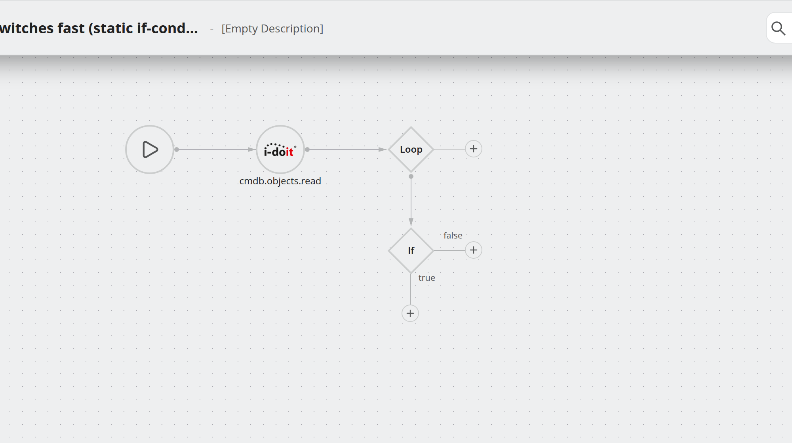
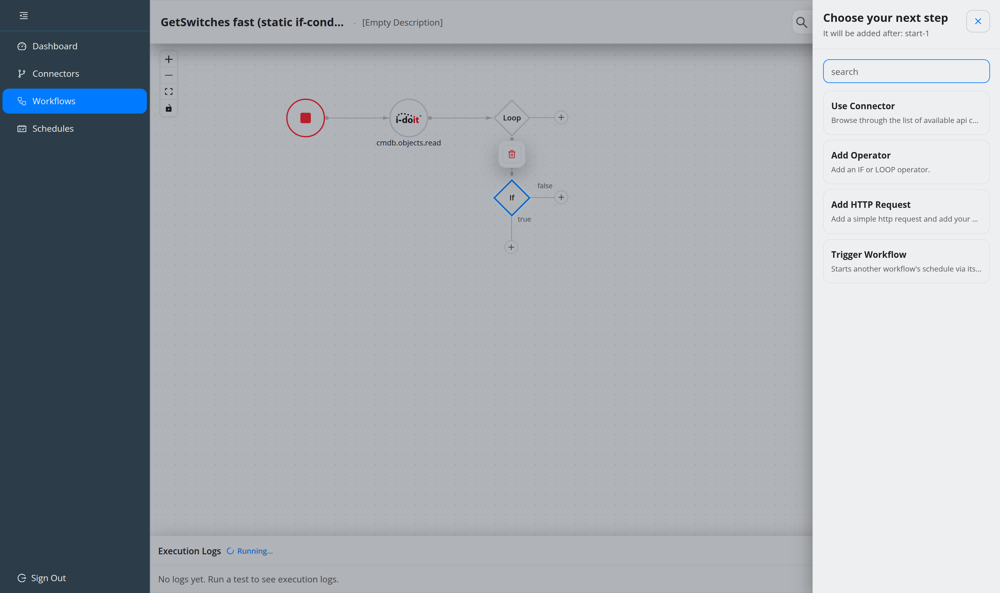
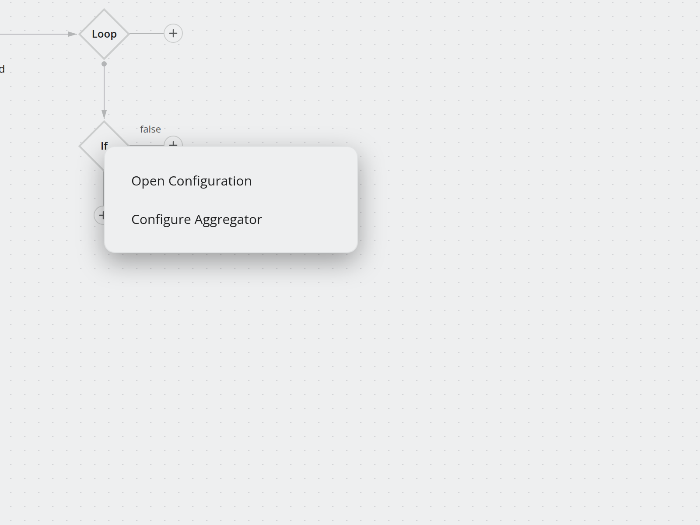
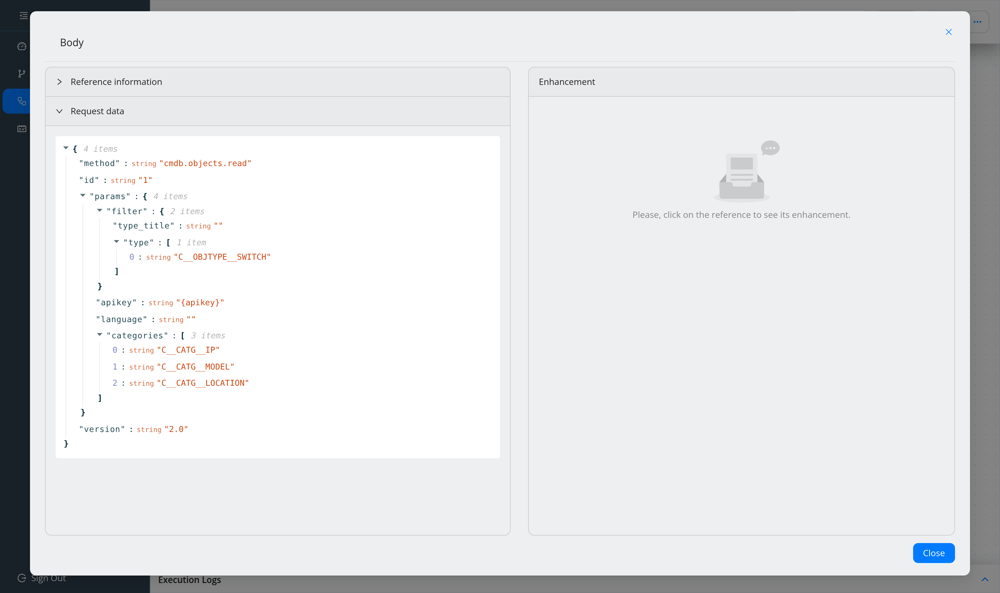

##################
Build a workflow
##################

.. contents::
   :local:

Assumes you have connectors for the systems involved
(:doc:`../concepts/connectors-and-invokers`). For a guided end-to-end example
including the setup, see :doc:`../start/first-workflow`.

Open the editor
===============

``Alt+W``, or **Create Workflow** in the top bar, or **Workflows → Create**. To
edit an existing one, use the pencil icon in the workflow list.

The editor replaces the application header with its own; the navigation sidebar
stays. Four areas:

* the **header** — title, description, schedules pill, command palette, test run,
  Save, and the header menu,
* the **canvas** — the graph,
* the **step drawer** — slides in from the right when you add a step,
* the **Execution Logs** panel — collapsed until a test run produces output.

Name it
=======

Click the title in the header and type. Titles are unique and checked as you
type. Committing a title or description change **auto-saves** with a generated
version comment, so a rename never loses a version.

Add steps
=========

Hover a node and use the **+** handle on its right or bottom edge. The drawer opens
with *Choose your next step* and tells you where the step will land.

.. list-table::
   :header-rows: 1
   :widths: 26 74

   * - Option
     - Use it for
   * - **Use Connector**
     - The normal case. Pick a connector, then one of its operations.
   * - **Add HTTP Request**
     - An endpoint you do not want to model as an invoker. See
       :doc:`call-any-api`.
   * - **Add Operator**
     - Branching (``If``) or repetition (``Loop``). See :doc:`branch-and-loop`.
   * - **Trigger Workflow**
     - Fire-and-forget another workflow. See :doc:`chain-workflows`.

The search box at the top searches connectors, operators and methods at once.

Configure a step
================

Double-click a node, or right-click it for the context menu:

* **Change Label** — a readable name of your own.
* **Open Configuration** — the request and response.
* **Configure Aggregator** — attach a data aggregator. Unassigning removes it from
  this step only; the aggregator itself stays available elsewhere.
* **Request → Edit URL / Edit Header / Edit Body**
* **Show Response** — the response definition (body, header, status).

For a connector method the HTTP method is read-only — it comes from the invoker.
For a simple HTTP request you choose it.

References go directly into the URL field; the separate query-parameter editor of
earlier versions is gone.

Map the data
============

Open **Body** on the receiving step. The body is a JSON tree (or XML, or GraphQL —
see :doc:`call-any-api`). Select a field, then insert a reference to an earlier
step's response.

A field must hold either plain text **or** references — mixed values are
rejected.

Prefer plain references over scripts; only add an enhancement where the value
genuinely needs transforming. :doc:`../concepts/data-mapping` covers the rules,
including arrays, loop iterators and the ``VAR_0`` / ``RESULT_VAR`` contract.

Read the canvas
===============

* **Colour + number badge** — steps sharing them call the same method on the same
  connector.
* **Aggregator badge** — a data aggregator is attached; click it to configure.
* **Asynchronous badge** — a Trigger Workflow step, which does not wait.
* **Status dot** — the connector's health, see
  :doc:`../concepts/connectors-and-invokers`.
* **Red outline** — a validation error from the last save or test start. It clears
  on the next attempt or when you edit the node.

Find things in a large workflow
===============================

In the editor's command palette, type ``workflow`` to lock the scope, then
``workflow search <term>``. The search is fuzzy and matches method names, URLs,
headers, query parameters, request and response bodies, and operator conditions.
Matches are highlighted yellow on the canvas; ``Esc`` clears them.

Save
====

``Ctrl+S``, or **Save**. Each save creates a version and asks for a comment.
Leaving with unsaved changes asks for confirmation — including on tab close and
reload.

Where to go next
================

* :doc:`debug-a-workflow` — run it and read the logs.
* :doc:`schedule-and-notify` — run it regularly.
* :doc:`reuse-with-templates` — reuse it elsewhere.
