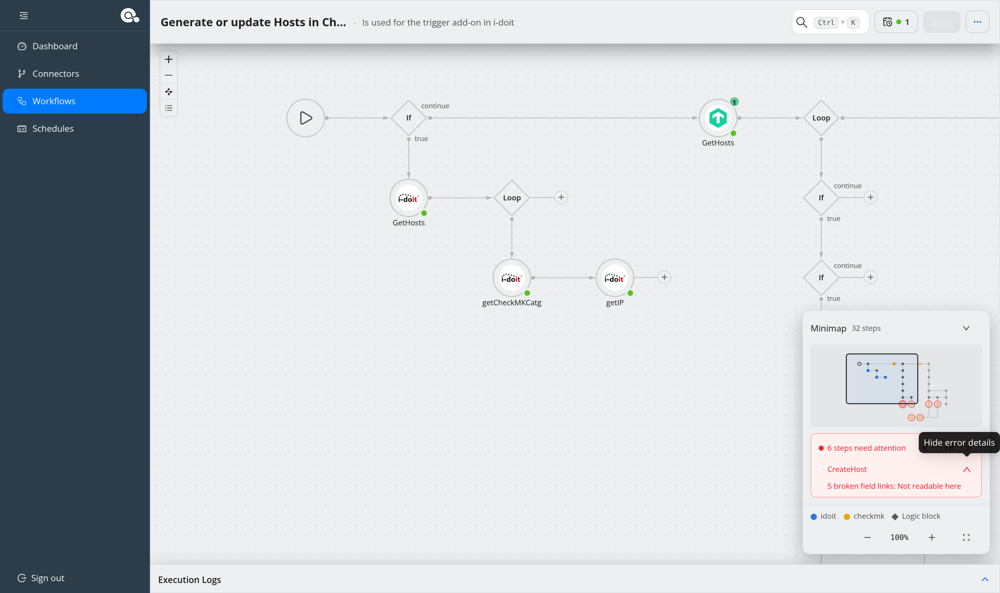
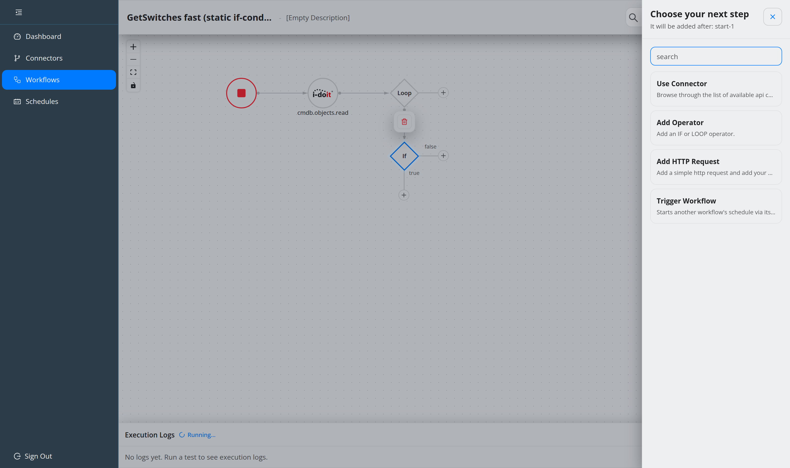
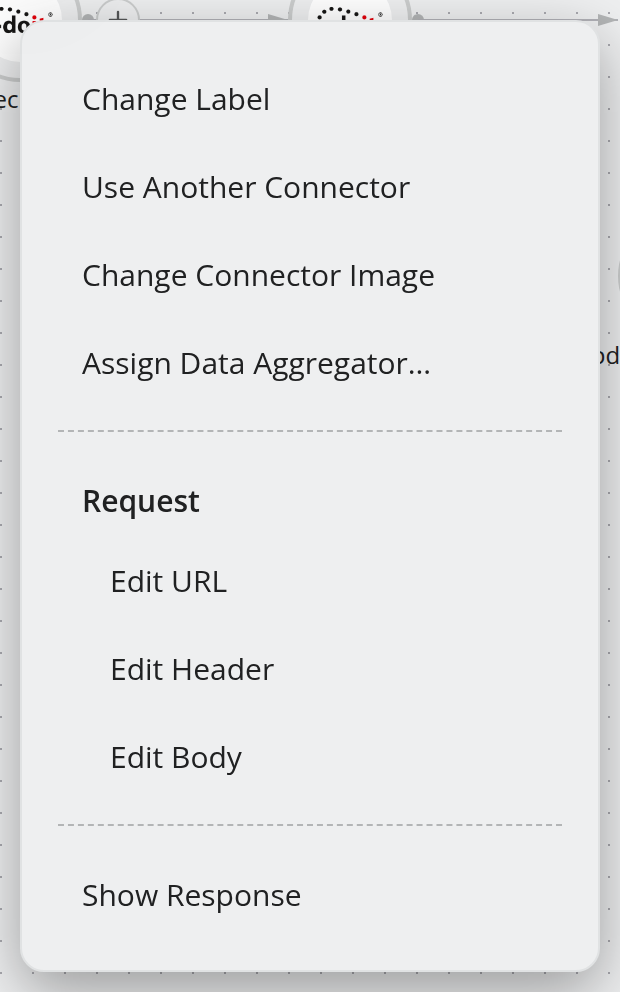
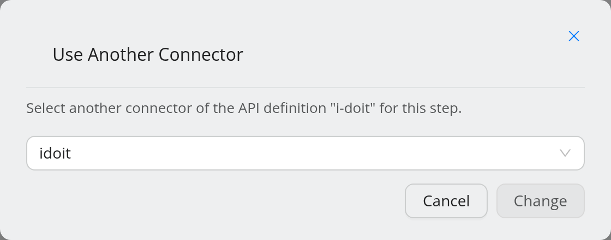
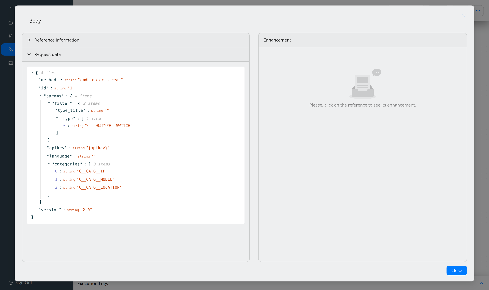
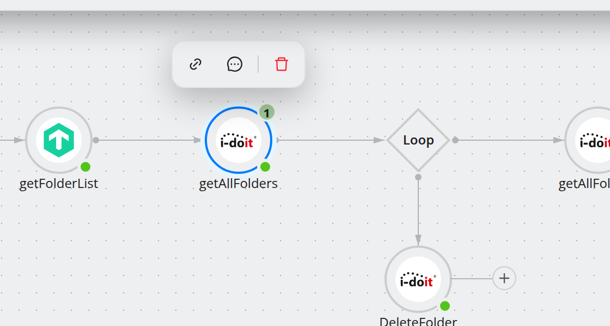

##################
Build a workflow
##################

.. contents::
   :local:

Assumes you have connectors for the systems involved
(:doc:`../concepts/connectors-and-invokers`). For a guided end-to-end example
including the setup, see :doc:`../start/first-workflow` — or let the
:ref:`workflow tutorial <start-guided-tours>` walk you through one on the canvas.

Open the editor
===============

``Alt+W``, or **Create Workflow** in the top bar, or **Workflows → Create**. To
edit an existing one, use the pencil icon in the workflow list. The **Duplicate**
icon next to it copies a workflow in one click — see :ref:`guide-duplicate-workflow`.

The editor replaces the application header with its own; the navigation sidebar
stays. Five areas:

* the **header** — title, description, command palette, schedules pill, Save, and
  the header menu,
* the **canvas** — the graph, with the canvas controls at the top left,
* the **minimap** — bottom right, an overview of the whole workflow *(5.2)*,
* the **step drawer** — slides in from the right when you add a step,
* the **Execution Logs** panel — collapsed until a test run produces output.

The canvas controls hold zoom in and out and, from 5.2, the two field-link
buttons — see :doc:`trace-field-links`.

Add steps
=========

Hover a node and use the **+** handle on its right or bottom edge. The drawer opens
with *Choose your next step* and tells you where the step will land.

.. list-table::
   :header-rows: 1
   :widths: 26 74

   * - Option
     - Use it for
   * - **Use Connector**
     - The normal case. Pick a connector, then one of its methods.
   * - **Add HTTP Request**
     - An endpoint you do not want to model as an API definition. See
       :doc:`call-any-api`.
   * - **Add Logic Block**
     - Branching (``If``) or repetition (``Loop``). See :doc:`branch-and-loop`.
       *(Called "Add Operator" up to 5.1.)*
   * - **Trigger Workflow**
     - Fire-and-forget another workflow. See :doc:`chain-workflows`.

The search box at the top searches connectors, logic blocks and methods at once.

Configure a step
================

Double-click a node, or right-click it for the context menu:

* **Change Label** — a readable name of your own.
* **Use Another Connector** — move the step to another connector *(5.2)*, see
  below.
* **Change Connector Image** — set the connector's logo from here *(5.2)*. This
  changes the connector itself, so every workflow using it shows the new image,
  and it needs the permission to update connectors.
* **Assign Data Aggregator…** — attach a data aggregator. Unassigning removes it
  from this step only; the aggregator itself stays available elsewhere.
* **Request → Edit URL / Edit Header / Edit Body**
* **Show Response** — the response definition (body, header, status).

For a connector method the HTTP method is read-only — it comes from the API
definition. For a simple HTTP request you choose it. On an IF or LOOP block the
menu offers **Open Configuration** instead.

References go directly into the URL field; the separate query-parameter editor of
earlier versions is gone.

Move a step to another connector
--------------------------------

.. note::
   **New in 5.2.**

**Use Another Connector** re-points the step at a different connector of the
**same API definition** — typically from a staging to a production system. The
method, request, references and transformations stay as they are; only the
connector, and with it the credentials, change.

The list offers only connectors of the step's API definition; **Change** stays
disabled until you pick a different one. The change is recorded in the change
history and can be undone.

Map the data
============

Open **Body** on the receiving step. The body is a JSON tree (or XML, or GraphQL —
see :doc:`call-any-api`). Select a field, then insert a reference to an earlier
step's response.

A field must hold either plain text **or** references — mixed values are
rejected.

Prefer plain references over scripts; only add a **transformation** (called
*enhancement* up to 5.1) where the value genuinely needs computing.
:doc:`../concepts/data-mapping` covers the rules, including arrays, loop iterators
and the ``VAR_0`` / ``RESULT_VAR`` contract. To see all links of a workflow at
once, use the field links lens — :doc:`trace-field-links`.

Read the canvas
===============

* **Colour + number badge** — steps sharing them call the same method on the same
  connector.
* **Aggregator badge** — a data aggregator is attached; click it to configure.
* **Comment badge** — the step has a note; click to show or hide it. *(5.1)*
* **Asynchronous badge** — a Trigger Workflow step, which does not wait.
* **Status dot** — the result of the connector test, see
  :doc:`../concepts/connectors-and-invokers`. From 5.2 a failing dot pulses;
  hovering it shows a pencil that opens the connector wizard on the
  *Credentials* step, so a rejected password can be fixed without leaving the
  editor.
* **Red outline** — a validation error from the last save or test start. It clears
  on the next attempt, when you edit the node, or with ``Esc``.
* **Green line** — a jump: this step continues at a later one, skipping what is
  between them. *(5.1)* See :doc:`skip-steps-with-joints`.

.. _guide-minimap:

The minimap
===========

.. note::
   **New in 5.2.**

The card in the bottom-right corner shows the whole workflow in miniature, with
the number of steps in its header.

.. image:: ../img/workflow/OC5_minimap.png
   :align: center
   :width: 320

* **Dots** are steps, coloured by connector (the legend names them); logic blocks
  are diamonds, the start node a ring.
* The **rectangle** is what the canvas currently shows. Drag it to pan, or click
  anywhere on the map to jump there.
* **Red rings** mark steps that need attention. The pager below the map —
  *6 steps need attention* — steps through them with **‹** and **›**, left to
  right and top to bottom; the step name centres the canvas on it, and the
  chevron shows the error details.
* The **zoom** buttons and *Fit the workflow to the screen* sit at the bottom.

A step needs attention when the last save rejected it, the last test run failed
there, its connector test fails, one of its field links is broken, or it is an IF
or LOOP block without a condition.

The chevron in the header collapses the card; the browser remembers that. While the
field links lens is on, its legend takes the minimap's place.

.. _guide-select-copy:

Select, move and copy several steps
===================================

.. note::
   **New in 5.2.**

.. list-table::
   :header-rows: 1
   :widths: 30 70

   * - Do
     - Effect
   * - ``Shift`` + drag on empty canvas
     - Selects every step inside the box.
   * - ``Ctrl`` + click a step
     - Adds it to the selection, or removes it.
   * - ``Ctrl`` + click an IF or LOOP
     - Selects the block together with everything in its scope. A block caught in
       a selection box brings its scope along too.
   * - Drag a selected step
     - Moves the whole selection.
   * - ``Ctrl`` + drag
     - Copies the selection instead of moving it.
   * - ``Ctrl+C``, then select a step and ``Ctrl+V``
     - Pastes the copies after that step. On an IF or LOOP you are asked whether
       to paste **In scope** or **After block**.
   * - ``Ctrl+D``
     - Duplicates the selected step next to it.
   * - ``Delete`` or ``Backspace``
     - Deletes the whole selection after one confirmation.

On macOS use ``⌘`` wherever ``Ctrl`` is written.

.. image:: ../img/workflow/OC5_multi-select.png
   :align: center
   :width: 1000

References between steps that are copied together are re-pointed to the copies,
and a jump is kept if its target was copied as well. If a move or copy would leave
a reference that cannot be read from its new place, a *Dependency conflict*
dialog tells you how many steps are affected before anything is cleared.

The node toolbar is hidden while more than one step is selected.

The node toolbar
================

.. note::
   **New in 5.1.**

Selecting a single node shows a small toolbar on it:

.. list-table::
   :header-rows: 1
   :widths: 24 76

   * - Icon
     - Action
   * - **Link**
     - *Add jump* from this step to a later one. Disabled, with the reason in its
       tooltip, when no step can be the target. See :doc:`skip-steps-with-joints`.
   * - **Unlink**
     - *Remove jump* this step carries.
   * - **Comment**
     - Attach a note to this step. See :doc:`annotate-a-workflow`. The icon is
       gone once the step has one.
   * - **Delete**
     - Delete the step, and everything nested inside it. If other steps read from
       it, the confirmation lets you re-point those references — see
       :ref:`guide-delete-remap`.

Take back a change
==================

.. note::
   **New in 5.1.**

``Ctrl+Z`` undoes the last canvas change and ``Ctrl+Shift+Z`` (or ``Ctrl+Y``)
redoes it — covering node edits, request configuration, references, conditions
and edges, not just node placement. **Header menu → Change History** lists every
change of the session and jumps the canvas to any of them.

See :doc:`undo-and-history`, which also explains how this differs from Version
History.

Find things in a large workflow
===============================

``Ctrl+F`` *(5.2)* opens the command palette already scoped to the workflow, with
``search`` typed in — just type your term. (The long way still works: type
``workflow`` in the palette to lock the scope, then ``search <term>``.) The search
is fuzzy and matches method names, URLs, headers, query parameters, request and
response bodies, and operator conditions. Matches are highlighted yellow on the
canvas and the best one is centred; ``Esc`` clears them.

For a large workflow, the :ref:`minimap <guide-minimap>` is the other way around.

Edit everything at once
=======================

**Header menu → Edit as JSON** *(5.2)* opens the whole workflow as JSON, with live
validation. See :doc:`edit-as-json`.

Save
====

``Ctrl+S``, or **Save**. Each save creates a version and asks for a comment.
Leaving with unsaved changes asks for confirmation — including on tab close and
reload.

.. _guide-duplicate-workflow:

Duplicate a workflow
====================

.. note::
   **New in 5.2.**

The **Duplicate** icon in the workflow list copies the workflow on the server
straight away — no dialog — and opens the copy in the editor. The copy is named
``<title> (copy)``, or ``(copy 1)``, ``(copy 2)`` … if that is taken; a notice
suggests giving it a proper title. Duplicating needs the permission to create
workflows.

Where to go next
================

* :doc:`debug-a-workflow` — run it and read the logs.
* :doc:`trace-field-links` — see which step reads which field.
* :doc:`skip-steps-with-joints` — skip steps without a logic block.
* :doc:`annotate-a-workflow` — leave notes for whoever opens it next.
* :doc:`undo-and-history` — undo, change history, version history.
* :doc:`schedule-and-notify` — run it regularly.
* :doc:`reuse-with-templates` — reuse it elsewhere.
