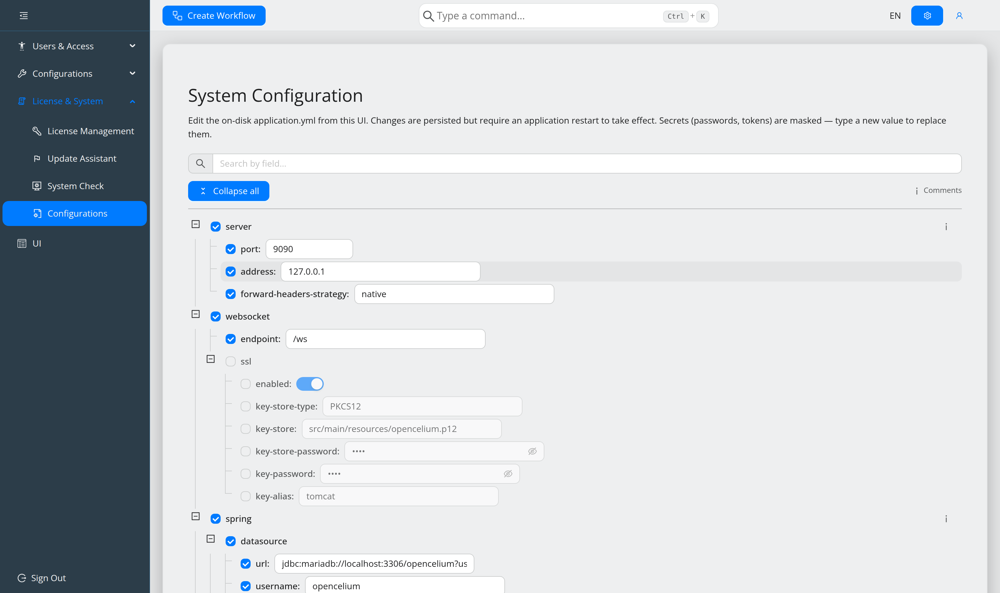

.. _guide-configure-system:

##########################
Configure the system
##########################

.. contents::
   :local:

Since 5.0 ``application.yml`` can be edited from the interface, so a configuration
change no longer needs shell access. The full key reference is
:doc:`../reference/configuration`.

Open it
=======

**License & System → Configurations** (admin menu, ``Alt+M``). The palette
equivalent is ``update system-config``.

The page requires the **master password**. If none is configured it says so; set
``opencelium.connector.master-password`` in the file directly and restart, then the
UI is available for everything else.

How the editor works
====================

The file is a tree of nodes, each with a path, a value and a status.

* **Checkbox = active or commented out.** Unticking a node comments it out on save;
  ticking uncomments it. The change **cascades**: disabling a section disables its
  contents, enabling a nested key enables the parent keys it needs, and disabling
  the last active child of a section comments the section out too.
* **Comments are preserved.** Nodes whose YAML carries a comment show an info icon —
  hover it. This is how the inline documentation of ``application_default.yml``
  stays available in the UI.
* **Secrets are masked.** Passwords and tokens are not sent to the browser in
  clear; type a new value to replace one.
* **Search** filters by field name. *Expand all* / *Collapse all* fold the tree.
* **Reset** discards your edits and reloads from the server.

.. warning::
   Changes are written immediately but take effect only after a **restart**. The
   page shows a *Restart required* notice after saving.

Backups
=======

Every write is backed up first, to ``<file>.bak.<epochMillis>``. Location and
retention are themselves configuration:

.. code-block:: yaml

   opencelium:
     config:
       file-path: ./application.yml
       backup:
         directory: runtime/backup/application
         keep: 10

These are convenience snapshots. For real backups see
:doc:`../operations/backup-and-restore`.

Editing a single value from the palette
=======================================

``system config <query>`` searches the configuration and edits one value in place —
quicker than the full page when you know what you are changing.

Editing the file directly
=========================

Still perfectly valid:

.. code-block:: sh

   /opt/opencelium/src/backend/src/main/resources/application.yml
   systemctl restart opencelium

Use this for the master password itself, and whenever the UI is not reachable.

Appearance
==========

The **UI** entry (``/ui/config``) holds the theme, stored per user. The palette
equivalent is ``ui theme``. Light and dark are supported everywhere, including the
workflow canvas and the log viewer.
