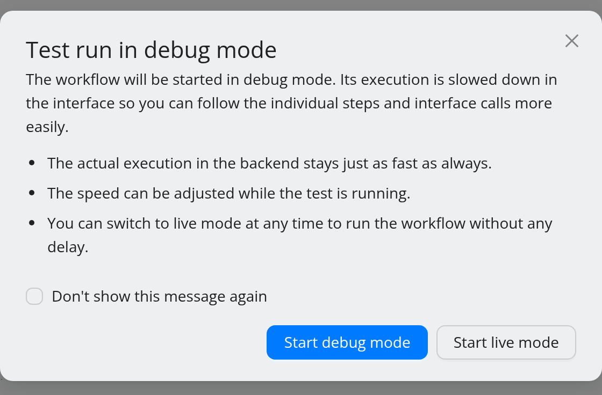
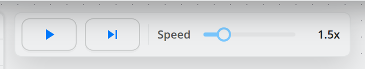
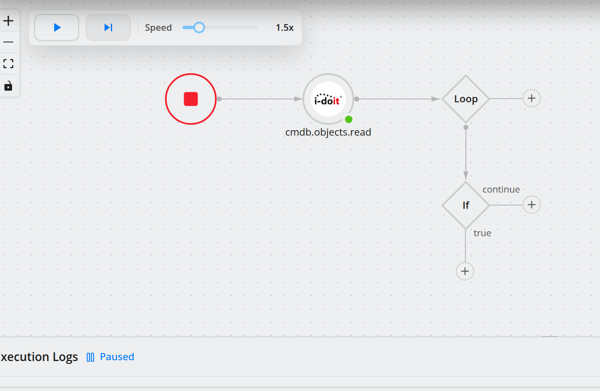
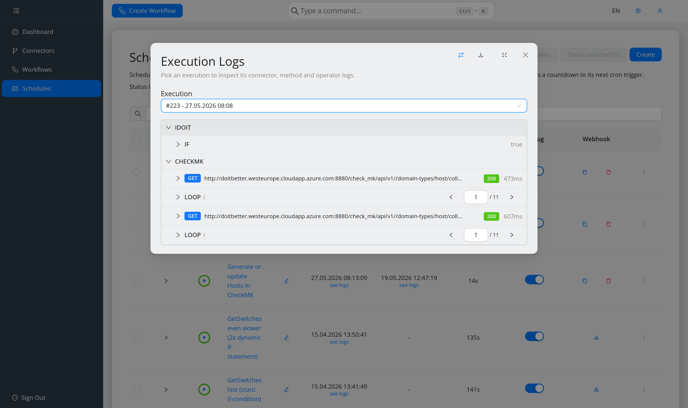

##################
Debug a workflow
##################

.. contents::
   :local:

Test run
========

From the editor header, start a **test run**. It executes the workflow in its
**current editor state** — no need to save first — and streams logs into the panel
at the bottom.

Constraints, all deliberate:

* one test at a time per workflow (``CONCURRENT_TEST_IS_FORBIDDEN`` otherwise),
* the run survives a page reload and is resumed when you return,
* leaving the editor asks for confirmation, then terminates the run,
* at least one step is required.

.. note::
   **New in 5.1.** Starting a test asks which mode to run in — **debug** or
   **live**. Debug mode is described in the next section.

   *Don't show this message again* dismisses the dialog for good, and every later
   run then starts in **debug** mode, whichever button you dismissed it with.
   Live is deliberately kept a per-run decision: use the **Live** toggle in the
   logs panel, which also works mid-run.

.. _guide-debug-mode:

Debug mode
==========

.. note::
   **New in 5.1.**

In debug mode the run is replayed at a pace you can actually follow. The canvas
lights each step as the run reaches it and animates a dot travelling the edge
into it, and the logs panel fills in step by step alongside.

.. important::
   Only the **presentation** is slowed down. The backend executes the workflow at
   full speed from the moment you press *Test run*, exactly as a scheduled run
   would — so the timings in the log are real, and a slow replay never makes an
   API call time out.

Because the backend finishes first on any short workflow, the replay is normally
running behind the real execution. That is expected; **Jump to live** on the
Start node applies everything still buffered and snaps the canvas to the run's
actual state.

The debug panel
---------------

While a run is playing, a small panel in the top-left of the canvas carries the
controls:

.. list-table::
   :header-rows: 1
   :widths: 24 76

   * - Control
     - What it does
   * - **Pause**
     - Freezes the replay exactly where it is. The backend keeps running to
       completion regardless — lines simply queue up until you resume.
   * - **Step forward**
     - Applies exactly one more line and stays paused. Available only while
       paused and while something is still buffered.
   * - **Speed**
     - Scales the replay between 0.5× and 5×. It takes effect immediately, even
       on a step already being animated. The default is 1.5×.

The panel is hidden while the editor is idle and in Live mode — in neither case
is there a paced replay to control.

While the replay is paused, the logs panel expands down to the step you paused on
and scrolls it into view, so pausing and reading the tree are the same gesture.
The logs header shows **Paused**, and the Start node turns into a stop button for
as long as the run is alive.

Stepping through a loop
-----------------------

Loops are where a slow replay stops being enough: watching iteration 340 arrive
one step at a time is not debugging. Pause inside a loop and the loop node offers
two ways forward:

* **Jump to next iteration** — fast-forwards through the rest of the current
  iteration and re-pauses the moment the loop starts the next one, or finishes.
* **Jump forward to an iteration** — the iteration counter on the loop node
  becomes an input. Type a number and the replay fast-forwards until the loop
  reaches that iteration, or ends before it.

Both are **forward only**: an applied line is gone, so an iteration you have
already passed cannot be revisited without re-running the test.

Live mode
---------

The **Live** toggle in the logs panel header turns pacing off entirely: every log
line and canvas update appears the instant it arrives, with no animation. Use it
when you want the outcome rather than the choreography — a long run, a rerun of
something you have already watched, or a failure you just want the trace for.

Switching to Live mid-run flushes whatever is buffered immediately. Pause, step
and speed have no meaning in Live mode and their panel disappears.

Read the log tree
=================

The tree mirrors the workflow. Expand a step to get its call:

* HTTP method, endpoint URL, status code and execution time,
* request and response headers,
* request and response body.

The copy icon puts a header, body or URL on the clipboard.

Loop iterations are grouped, with a pager (``2 / 12``) that also jumps to a
specific index. Entries are marked ``ERROR``, ``WARNING`` or ``INFO``.

When a run fails the viewer takes you to the failure rather than making you hunt:
red trace dots, nested loops paged to the failing iteration, and the error shown on
the step instead of in the request/response section.

Panel controls: fullscreen, clear, minimise.

Historical runs
===============

Scheduled executions use the same viewer. In the schedule list, **Last Success**
and **Last Fail** carry a **see logs** link. It opens the *Execution Logs* dialog,
which first asks you to pick an execution from a drop-down — the retained runs of
that schedule — and then renders its tree.

.. note::
   Logs only exist for schedules with logging enabled (**Debug** column).
   Retention defaults to the 2 most recent successful and 3 most recent failed runs
   per workflow, configurable under ``log.retention.per-connection`` — see
   :ref:`ref-configuration`.

Errors before execution
=======================

Some problems are caught at save or test-start and reported against the node, which
is outlined in red:

.. list-table::
   :header-rows: 1
   :widths: 38 62

   * - Message
     - Cause
   * - ``OPERATOR_EXPRESSION_IS_EMPTY``
     - An ``If`` or ``Loop`` has no condition.
   * - ``CONNECTOR_NOT_FOUND``
     - A step references a deleted connector.
   * - ``CONCURRENT_TEST_IS_FORBIDDEN``
     - A test or schedule for this workflow is already running.

Field type mismatches during binding are reported as readable messages rather than
a stack trace.

Joints are validated at the same point. The editor normally prevents an illegal
one from being drawn at all, so these codes mostly surface when a workflow is
built through the API:

.. list-table::
   :header-rows: 1
   :widths: 38 62

   * - Code
     - Cause
   * - ``JUMP_SOURCE_IS_OPERATOR``
     - An ``If`` or ``Loop`` cannot start a joint.
   * - ``JUMP_TARGET_IS_OPERATOR``
     - An ``If`` or ``Loop`` cannot be the target of a joint.
   * - ``JUMP_TARGET_INSIDE_OPERATOR``
     - The target sits inside an operator body the source is not part of.
   * - ``JUMP_ESCAPES_LOOP``
     - The source is inside a loop and the target is outside it.
   * - ``JUMP_BACKWARD``
     - The target does not run after the source.
   * - ``JUMP_TARGET_NOT_FOUND``
     - The target does not exist in this workflow.
   * - ``JUMP_TO_SELF``
     - Source and target are the same step.

Each violation names the source and target as well as the rule, so the editor can
highlight both ends rather than just report a message.

Support bundles
===============

When you need support to look at a run, generate a **support bundle** from the
schedule's **Support logs** action. It runs the workflow, collects the logs, and
stores them with the invoker files as a ZIP.

Because logs contain real payloads, you choose what leaves your system:

.. list-table::
  :header-rows: 1
  :widths: 20 20 20 20 20

  * - Level
    - URL
    - Headers
    - Request
    - Response
  * - **Light**
    - masked
    - visible
    - visible
    - visible
  * - **Medium**
    - masked
    - masked
    - visible
    - visible
  * - **Strict**
    - masked
    - masked
    - masked
    - visible
  * - **Custom**
    - free
    - free
    - free
    - free

Or toggle each section individually with its eye icon. You are notified when
collection starts and again — over the WebSocket — when the file is ready.

Bundles are listed under **Configurations → Support Files**, where a green status
means a success archive exists and red means only a failure archive was produced.

If nothing streams
==================

An empty log panel and a dashboard reporting *Connection lost* both point at the
same thing: ``/ws`` is not proxied correctly. See
:doc:`../operations/troubleshooting`.

Where to go next
================

* :doc:`skip-steps-with-joints` — a joint is only visible on the canvas during a
  run, which makes debug mode the way to confirm one fires.
* :doc:`undo-and-history` — take back the change the run just proved wrong.
* :doc:`schedule-and-notify` — run it regularly once it works.
