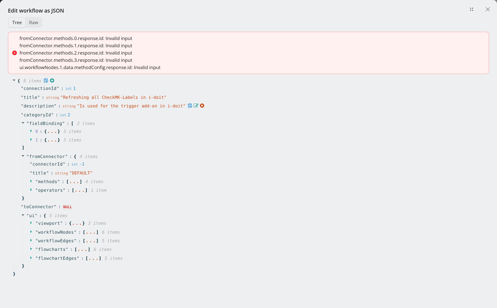
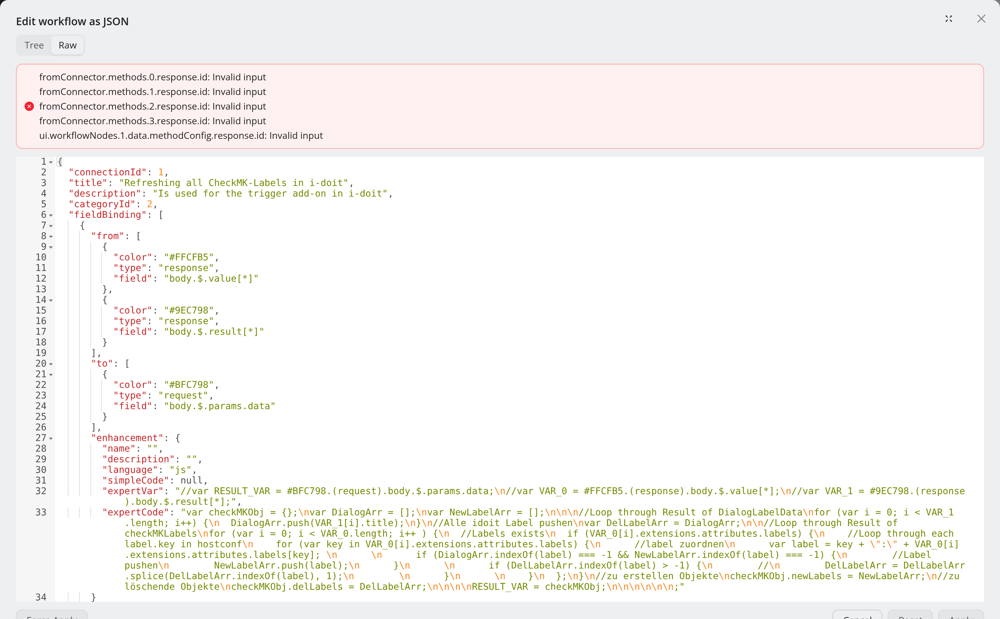

.. _guide-edit-as-json:

#######################
Edit a workflow as JSON
#######################

.. contents::
   :local:

.. note::
   **New in 5.2.**

Some changes are faster in text than on the canvas: renaming a field path in
twenty places, copying a block of steps between workflows, or reviewing exactly
what a workflow contains. **Header menu → Edit as JSON** opens the whole workflow
— steps, edges, references, title, description and category — as one JSON
document.

*The Tree view. Validation problems are listed in the red box above the editor.*

Two views
=========

The switch at the top selects the view:

* **Tree** (default) — a collapsible tree; edit values in place, add or remove
  keys.
* **Raw** — the JSON as text in a code editor, for search and replace or pasting
  larger pieces.

Validation
==========

The JSON is checked while you type: syntax first, then the workflow schema, then
the rules the editor itself enforces — every method has a known connector, the
title is not taken, references point at steps that exist and can be read from
where they are used, jumps are legal, node ids are unique, and there is exactly
one start node. Problems are listed in a red box above the editor, one per line;
in the Raw view the offending lines are also marked in the gutter.

Apply, Reset, Force Apply
=========================

.. list-table::
   :header-rows: 1
   :widths: 22 78

   * - Button
     - Effect
   * - **Apply**
     - Replaces the workflow on the canvas with the JSON. Enabled once something
       changed and nothing is wrong. Asks first, because it also clears the undo
       history of the session.
   * - **Reset**
     - Throws away your JSON edits and shows the current workflow again.
   * - **Cancel**
     - Closes the dialog; asks first if there are unsaved JSON changes.
   * - **Force Apply**
     - Applies the JSON despite validation errors, as long as it parses. Use it
       only when you know the validator is wrong about your case — the result can
       be a workflow the editor cannot run or save cleanly.

Applying does **not** save. The workflow is marked as changed; review it on the
canvas and **Save** as usual, which creates a new version you can roll back to.

.. note::
   The dialog is disabled while a test run is in progress. Users who may only
   read the workflow can open it to inspect the JSON, but see only **Cancel**.

Where to go next
================

* :doc:`build-a-workflow` — the canvas, for everything else.
* :doc:`undo-and-history` — Version History, to roll back a saved state.
* :doc:`reuse-with-templates` — moving workflows between instances.
