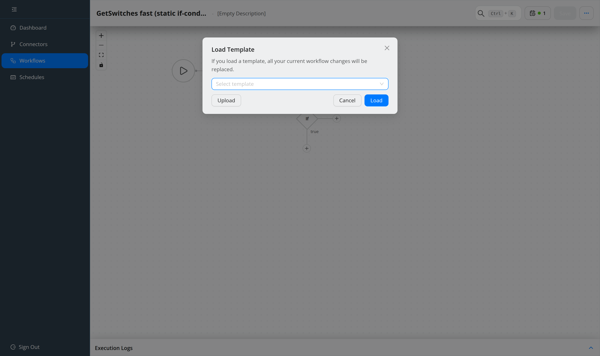

.. _guide-templates:

########################
Reuse with templates
########################

.. contents::
   :local:

A **workflow template** is a stored workflow you apply to create new ones —
including in a different environment. Templates were called *business templates*
before 5.0.

Save one
========

In the editor, **Save as Template** from the header menu, then give it a name.
Everything is stored: steps with their connectors, operators, references and
enhancements.

Since 5.0 each method also carries the **name of its invoker**. That is what makes
a template portable: connector IDs mean nothing in another environment, invoker
names do.

Apply one
=========

**Load Template** from the header menu, then pick it. The short description is
shown before you apply.

.. warning::
   Loading replaces the current graph. If the workflow already has a title and
   description you are asked whether to replace those too; they are overwritten
   silently only when both are still empty.

Mapping connectors between environments
=======================================

When a template's connectors cannot be resolved locally, the **Map template
connectors** dialog opens and asks which local connector each one should use. For
each entry it shows the invoker hint and which methods use it, and it lets you
create a missing connector on the spot.

This is the normal path when moving a template from staging to production.

Move templates between systems
==============================

Templates are JSON.

* **Download** — from the templates list, from the workflow list row action, from
  the editor header menu (once saved), or from a specific entry in Version
  History.
* **Upload** — from the templates list, from the *Load Template* dialog, or with
  ``upload workflow-template`` in the command palette. ZIP archives of several
  templates work too.
* **On the server** — drop the JSON into
  ``src/backend/src/main/resources/templates``; it is picked up automatically.

Subscribers can have templates synchronised from the Service Portal
automatically — see :doc:`../reference/configuration` under
``opencelium.online-services``.

Older templates
===============

Template structure has changed across versions. Older templates are converted on
read, in memory; the stored file is only rewritten when saved again. On the
templates page you can also convert one explicitly, or all of them at once.

Editing a template
==================

There is no template editor. You can change the JSON on the server, but a small
mistake breaks loading with no useful error. Load it into a workflow, edit there,
and save as a new template.
