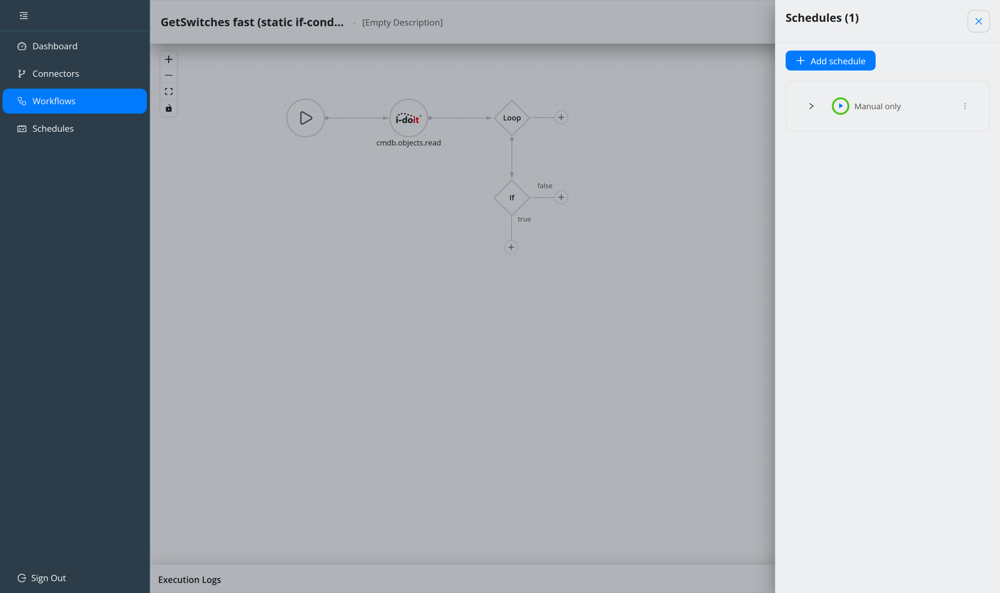
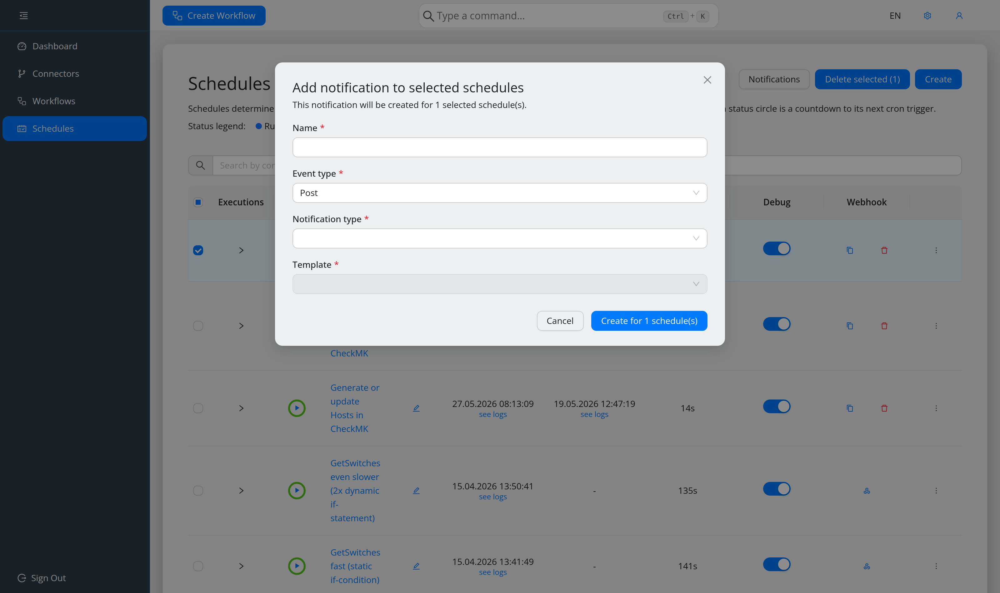

######################
Schedule and notify
######################

.. contents::
   :local:

Create a schedule
=================

Either from the workflow editor — the **schedules pill** in the header, **Add
schedule**, already scoped to the open workflow — or from **Schedules → Create**.

A schedule needs:

* a **title** (first step, mandatory) — it identifies the schedule in the list,
* a **workflow** (mandatory),
* **logs**, off by default,
* a **cron expression**, optional.

``Ctrl+Enter`` advances and submits.

.. note::
   Schedules can only be attached to a **saved** workflow. Until the first save the
   drawer says so.

Leave logging off unless you need it, and switch it on from the list's **Debug**
column when you do — see :doc:`debug-a-workflow`.

Cron expressions
================

The generator builds the common cases: pick values from the lists and it previews
the next runs. You can also type an expression directly; it is validated as you
type. From the schedule list, the cron chip is clickable and edits the expression
inline without the full wizard.

OpenCelium uses Quartz, so an expression is 6 or 7 fields: second, minute, hour,
day of month, month, day of week, and optionally year.

.. code-block::

   0 0 12 * * ?        every day at 12:00
   0 15 10 * * ? *     every day at 10:15
   0 0/5 14,18 * * ?   every 5 min, 14:00-14:55 and 18:00-18:55

More examples are in the `Quartz tutorial
<https://www.quartz-scheduler.org/documentation/quartz-2.2.2/tutorials/crontrigger.html>`_.

.. note::
   Only one schedule per workflow runs at a time. A second start is refused.

Webhooks
========

A webhook lets an outside system trigger the workflow by calling a URL. Use the
schedule's **Generate webhook URL** action, then the copy icon to take the URL.

The workflow can read the webhook's query parameters or payload — see
:doc:`../concepts/data-mapping`.

.. warning::
   Removing a webhook invalidates the URL immediately and cannot be undone.

Notifications
=============

First create a **notification template** under **Configurations → Notification
Templates**: a name, a type (*Email*, *Slack* or *Teams*), and a subject and body.
Templates can reference ``{USER_NAME}``, ``{USER_SURNAME}``, ``{USER_TITLE}``,
``{USER_DEPARTMENT}``, ``{CONNECTION_ID}``, ``{CONNECTION_NAME}``,
``{SCHEDULER_ID}``, ``{SCHEDULER_TITLE}`` — and any aggregator arguments.

.. note::
   ``CONNECTION_ID`` and ``CONNECTION_NAME`` mean the **workflow**; the reference
   names were kept so existing templates keep working.

Then attach a notification to the schedule. It needs a name, an event type, a
notification type, a template, and either recipients (e-mail) or a URL (webhook).

.. list-table::
   :header-rows: 1
   :widths: 16 84

   * - Event
     - Fires
   * - **pre**
     - before the schedule runs
   * - **post**
     - after it ran
   * - **alert**
     - on failure

To apply the same notification to many schedules, select them with their
checkboxes and use the **Notifications** bulk action: configure once, created for
each. The result message reports how many succeeded and how many failed.

.. note::
   A **data aggregator** only takes effect for **post** notifications. Attaching
   one and then using *pre* or *alert* silently produces nothing — see
   :doc:`../concepts/data-mapping`.

E-mail needs ``spring.mail`` configured, otherwise nothing is sent and
:ref:`ref-system-check` reports Email as *Down*.

Channel payloads
================

The subject and body are wrapped into the payload the channel expects. The
templates are files you can adapt, in
``src/backend/src/main/resources/notification/``:

* ``default.json`` — plain ``${subject}`` / ``${text}``,
* ``slack.json`` — a Slack *blocks* payload,
* ``teams.json`` — a Teams adaptive card (schema 1.4).
