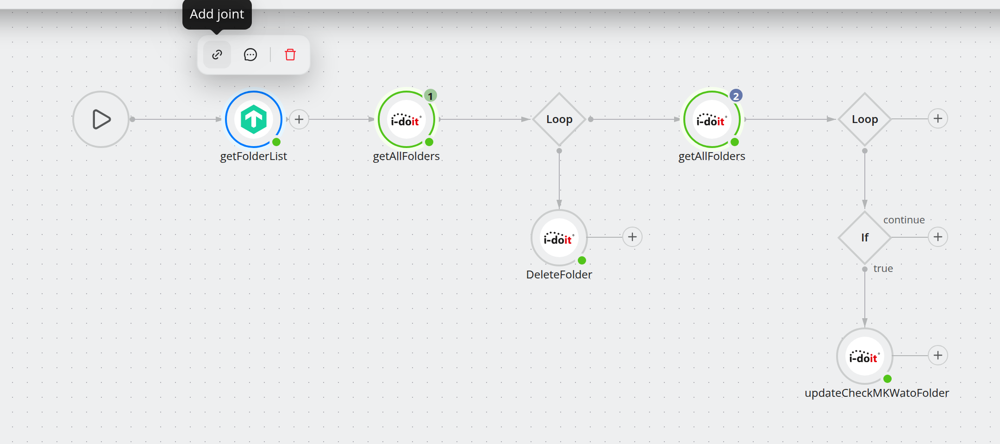
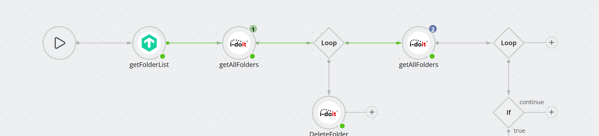
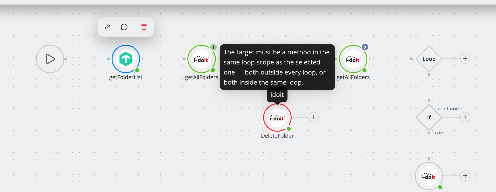

.. _guide-joints:

######################
Skip steps with joints
######################

.. contents::
   :local:

.. note::
   **New in 5.1.**

A **joint** connects one step directly to a later step. When the engine reaches
the source step, it runs it and then continues at the joint's target — every step
in between is skipped.

Before 5.1 the only way to pass over a step was to wrap it in an ``If`` operator
and invert the condition, which meant an operator per skipped step and a canvas
that no longer read like the process it described. A joint expresses the same
thing as one line on the canvas.

Add a joint
===========

#. Select the method the joint should start from.
#. In the node toolbar that appears, click the **link** icon (*Add joint*).
#. The canvas enters target-picking mode: legal targets are highlighted, and
   hovering an illegal one explains why it cannot be used.
#. Click the target.

*Target-picking mode.* The source is ringed blue; the two methods that may
receive the joint are ringed green. The steps inside the loop, the operators and
the Start node are not candidates and stay unmarked.

``Esc`` leaves target-picking mode without creating anything.

The joint is drawn as a green line with an arrow head, using the same geometry as
every other edge. Hover it to reveal a delete button at its midpoint, or select
the source node again and use the **unlink** icon in its toolbar.

*The finished joint.* The green line leaves ``getFolderList`` and runs past
``getAllFolders`` and the loop straight into the second ``getAllFolders``: when
the joint is taken, everything it passes is skipped. Because a sequence is laid
out on one row, the joint follows the same line as the edges it overtakes.

A method carries **at most one** joint. To point it somewhere else, remove the
existing one first.

.. note::
   Removing a joint can invalidate references. If steps downstream read data from
   methods that only run because of this joint, the confirmation dialog says how
   many are affected — those references are cleared when you confirm.

What is a legal target
======================

The editor and the server enforce the same rules, so a joint that the canvas
accepts is a joint that will save and run.

.. list-table::
   :header-rows: 1
   :widths: 34 66

   * - Rule
     - Why
   * - Both ends must be **methods**
     - An ``If`` or ``Loop`` operator can be neither the source nor the target of
       a joint. Aim at the method inside the branch instead.
   * - The target must run **after** the source
     - A joint points forward only. It is a skip, not a goto — there are no
       backwards jumps and therefore no accidental infinite loops.
   * - Both ends must share a **loop scope**
     - Either both outside every loop, or both inside the very same one. A loop
       is a ceiling in both directions: a step inside it cannot jump out, and
       nothing outside can jump in.
   * - A joint may **leave** an ``If``, but not **enter** one
     - A step may escape outward through the conditions enclosing it, up to that
       loop ceiling. Landing inside a branch it is not part of would run a step
       whose guarding condition was never evaluated.

Hovering an illegal target outlines it in red and names the rule it breaks:

The full set of messages:

.. list-table::
   :header-rows: 1
   :widths: 40 60

   * - Message
     - Meaning
   * - *Only a method can be the target of a joint.*
     - You aimed at an operator or the Start node.
   * - *A joint can only point forward, to a method that runs after the selected
       one.*
     - The target runs before the source, or is the source itself.
   * - *The target must be a method in the same loop scope as the selected one.*
     - One end is inside a loop the other is not in.
   * - *A joint cannot jump into a condition the selected method is not itself
       inside.*
     - The target sits in an ``If`` branch the source does not belong to.
   * - *This joint would skip …, whose response this method uses.*
     - The target reads data from a step the joint would skip. See below.

References across a joint
=========================

The editor refuses a joint that would skip a method whose response the target
consumes, because the result is almost never what you wanted: the step runs
without the data it was written against.

The engine is more forgiving than the editor here. If such a situation arises
anyway — a joint that was legal when it was drawn, over a step that later became
a reference source — the run does not fail. A reference to a method that did not
execute resolves to an **empty value**, and the run reports it.

Joints and the graph
====================

* Moving nodes around can make a joint illegal — for instance by dragging the
  target into a loop. The editor removes joints that no longer hold and tells you
  how many went, rather than saving a workflow that cannot run.
* Deleting the target deletes the joint with it.
* A joint is **not** an edge in the graph. It does not change a step's ``index``
  and does not affect where new steps land when you add them.

During a test run
=================

The travelling dot follows the joint on the transitions where the engine actually
took it. This is the only place the jump becomes visible: the log never records
"a jump happened", the skipped steps are simply absent from it. Watching the run
in debug mode is therefore the quickest way to confirm a joint fires when you
expect — see :doc:`debug-a-workflow`.

How it is stored
================

You do not need this to use the editor, only to work against the API.

The joint lives on the **source method** as ``jump``, whose value is the target's
hierarchical ``index``:

.. code-block:: json

   { "index": "1_0", "name": "getObjects", "methodType": "CONNECTOR",
     "jump": "1_2" }

The property was called ``jumpTo`` in pre-release builds; documents using the old
name are still read. Omitting ``jump`` means the method has no joint. See
:doc:`../reference/api`.

Where to go next
================

* :doc:`branch-and-loop` — the operators a joint complements.
* :doc:`../concepts/workflow-model` — where joints sit in the model.
* :doc:`debug-a-workflow` — watch one being taken.
