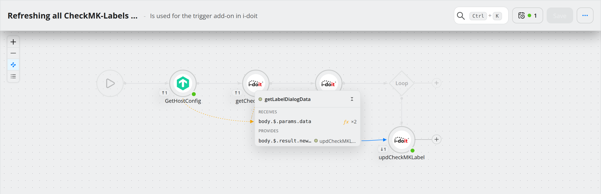
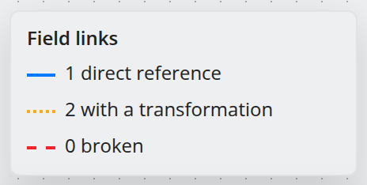
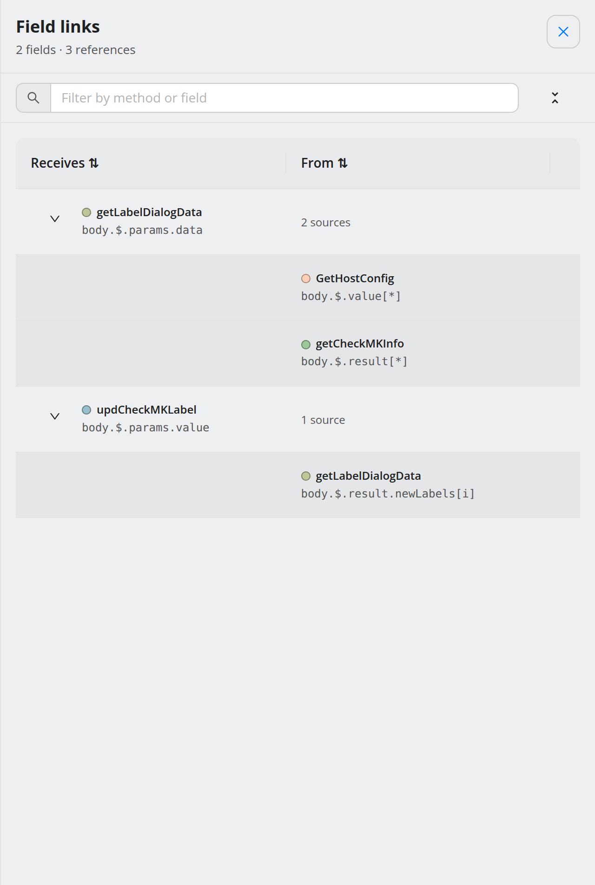
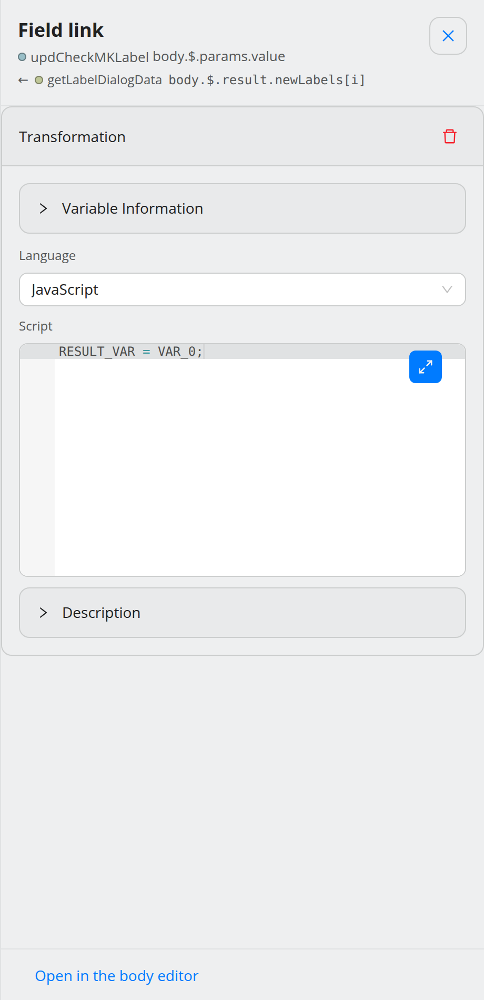
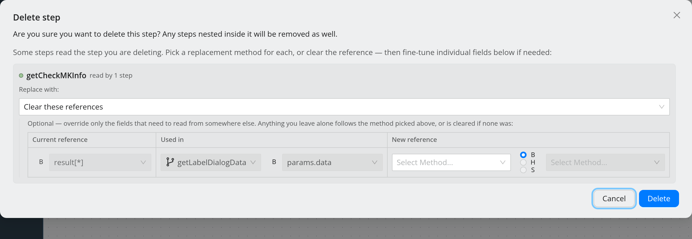

.. _guide-field-links:

#################
Trace field links
#################

.. contents::
   :local:

.. note::
   **New in 5.2.**

A **field link** is one field of a step that takes its value from an earlier
step's response — a reference in a request body or header, with or without a
transformation script in between (see :doc:`../concepts/data-mapping`). In a
workflow of any size these links are what breaks first, and they are invisible
on the plain canvas. 5.2 makes them visible in two ways, both in the canvas
controls at the top left, below the zoom buttons:

.. list-table::
   :header-rows: 1
   :widths: 30 70

   * - Button
     - Shows
   * - **Show field links** (the lens)
     - Arcs between the steps on the canvas.
   * - **Show the list of field links**
     - A searchable table in a side panel.

Both are view-only, so they are available in read-only mode as well. They are
independent of each other; either can be open on its own.

The lens on the canvas
======================

Switching the lens on fades the normal flow edges, swaps the minimap for a
legend, and puts a small badge under every step that takes part in a link:

* ``↓n`` — *n* request fields of this step are filled from other steps,
* ``↑n`` — *n* fields of this step's response are read by other steps,
* ``!n`` — *n* of its links are broken.

**Hover** a step to preview its links; **click its badge** to pin them. A pinned
step shows a card with what it *receives* and what it *provides*, field by field
— ``ƒx`` marks a field that goes through a script — and arcs to the steps at the
other end. Every other step is dimmed. Click empty canvas to let go.

An arc runs from the step that **provides** the value to the step that **reads**
it, with the arrowhead at the reader. Its style tells you the kind of link:

.. list-table::
   :header-rows: 1
   :widths: 30 70

   * - Arc
     - Meaning
   * - Solid blue
     - A direct reference: the value is copied as it is.
   * - Dotted orange
     - A transformation: a script computes the value from one or more references.
   * - Dashed red
     - Broken: the step it names is gone, or it cannot be read from here (for
       example a loop iterator used outside its loop), or the script lacks the
       variable.

Where two steps are joined by several links, one arc with a count stands for all
of them; click it to fan it out into one arc per field.

The legend in the bottom-right corner counts each kind. It only draws links in
request **bodies and headers**; references in a URL or in an IF/LOOP condition are
counted as *not shown*.

The list of field links
=======================

The list shows every receiving field with the step and path it reads from. Fields
with several sources expand to show them; **Expand all / Collapse all** does that
for every row. Broken links sort to the top with the reason — *Not readable
here*, *Method missing*, *Script variable missing*. The filter box searches step
names and field paths.

Clicking a row opens that link in the drawer, pins the step on the canvas and
scrolls it into view. ``Esc`` or a click outside closes the list.

Edit a link
===========

Clicking an arc or a row opens the **Field link** drawer: the receiving step and
field at the top, the source or sources below.

* For a **transformation** the drawer holds the script editor — the same one as
  in the body editor — and **Delete transformation**.
* For a **direct reference** there is nothing to edit yet. **Create
  transformation** wraps the reference in a script you can then change.
* **Open in the body editor** jumps to the field in the step's body or header
  editor, where the reference itself can be changed or removed.

Edits here are ordinary canvas changes: they show up in the change history, can
be undone with ``Ctrl+Z``, and are stored with the next **Save**.

.. _guide-delete-remap:

Delete a step without losing its references
===========================================

When you delete a step that other steps read from, the confirmation lists those
references and lets you decide what happens to them.

For every method that is going away:

#. **Replace with** — pick another method to read from instead. Only methods that
   every affected step can actually read are offered. The default, **Clear these
   references**, removes them as before; nothing is re-pointed unless you choose
   it.
#. **Per field** (optional) — the table lists each reference with where it is
   used. In **New reference** you can point a single field at a different
   method, response part and path. That matters when the replacement's response
   is shaped differently: ``body.$.id`` on the old method may be
   ``body.$.user.id`` on the new one. The **×** resets a field to the
   method-wide choice.
#. **Rewrite the condition** — for a reference held in an IF or LOOP condition,
   opens the condition editor on a copy, offering only references that survive
   the delete.

Nothing changes until you press **Delete**; **Cancel** leaves the workflow as it
was. If any references were cleared, a **References cleared** notification names
the affected steps for a few seconds, with an **Undo** that restores the steps and
the links exactly as they were.

.. tip::
   Deleting several selected steps at once works the same way — one confirmation
   covers all of them. See :ref:`guide-select-copy`.

Where to go next
================

* :doc:`../concepts/data-mapping` — references, transformations, ``VAR_0`` and
  ``RESULT_VAR``.
* :doc:`build-a-workflow` — the minimap and the other canvas aids.
* :doc:`undo-and-history` — taking back a change.
