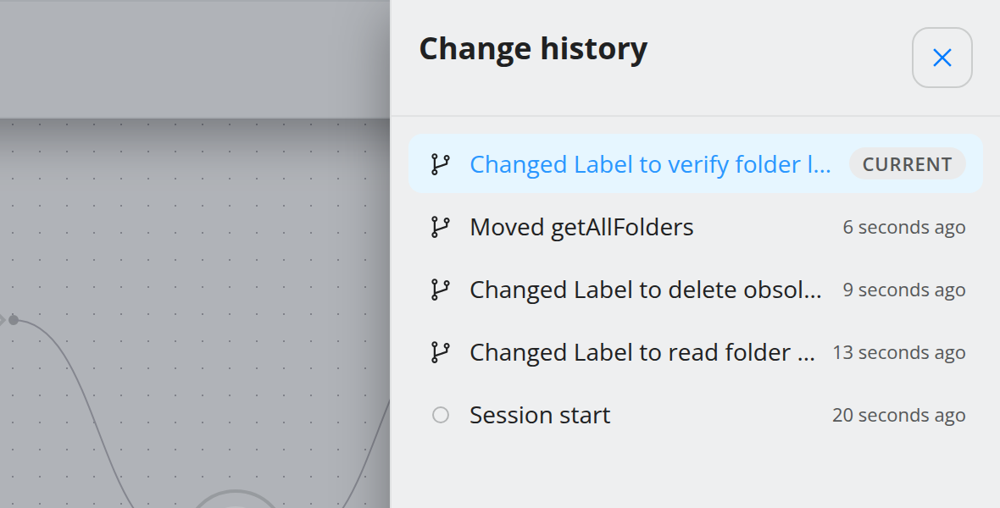
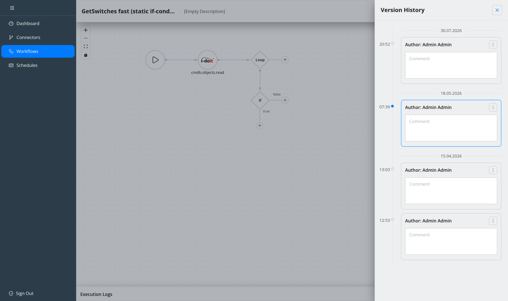

.. _guide-undo-and-history:

#######################
Undo and history
#######################

.. contents::
   :local:

.. note::
   **Undo/redo and Change History are new in 5.1.** Version History existed
   before and is unchanged.

The editor keeps two different histories, and picking the wrong one is the usual
source of confusion:

.. list-table::
   :header-rows: 1
   :widths: 22 39 39

   * -
     - **Change History**
     - **Version History**
   * - Covers
     - Edits made since you opened the editor
     - States that were **saved** on the server
   * - Lives
     - In the browser, for this session
     - In the database, permanently
   * - Survives a reload
     - No
     - Yes
   * - Granularity
     - One entry per edit
     - One entry per save
   * - Reach it with
     - ``Ctrl+Z`` / **Change History**
     - **Version History**

Rule of thumb: *Change History* takes back what you did in the last few minutes;
*Version History* goes back to how the workflow looked yesterday.

Undo and redo
=============

.. list-table::
   :header-rows: 1
   :widths: 30 70

   * - Shortcut
     - Action
   * - ``Ctrl+Z`` / ``⌘+Z``
     - Undo the last canvas change.
   * - ``Ctrl+Shift+Z`` / ``Ctrl+Y``
     - Redo the change that was undone.

Undo covers everything you author, not just node placement: adding, deleting and
moving nodes, edge changes, labels, request configuration (URL, headers, body),
references and enhancements, operator conditions and groups, aggregator
assignment, and the connector a step calls. Undoing a deleted step also brings
back the references that were cleared along with it.

Some deliberate details:

* **Bursts collapse into one entry.** Dragging four nodes at once, or a dialog
  that writes configuration and bindings together, is one undo — not four.
* **Selection is not a change.** Clicking around, panning, zooming and resizing
  the browser window never land on the stack.
* **Text fields keep their own undo.** Inside a text input or the script editor,
  ``Ctrl+Z`` is the browser's undo for that field, as you would expect.
* **The stack is bounded** at 100 entries for a very long session.
* **Loading resets it.** Opening a workflow, applying a template or restoring a
  version replaces the whole canvas, so the stack starts again from that state —
  undo can never splice two unrelated workflows together.
* Undo is unavailable while the editor is read-only or a test run is executing.

Change History
==============

**Header menu → Change History** opens a panel listing every recorded change of
the current session, newest first. Each row names what changed, when, and shows
the icon of the step it concerns — for a connector method, the connector's own
logo.

Rows read like the edits themselves:

.. code-block:: text

   Edited Body of createHost
   Added Header Reference in createHost
   Deleted getObjects
   Moved 3 nodes
   Edited Condition in LOOP
   Session start

Clicking a row jumps the canvas straight to that state, however many steps away
it is — an undo or redo of arbitrary depth in one move. The row you are currently
on is marked **Current**; rows below it are undos, rows above it redos.

The panel closes with its close button or ``Esc``. A session in which nothing has
been edited yet shows *No changes in this session yet*.

.. note::
   Change History is not saved anywhere. Reloading the page, or leaving the
   editor, clears it. If a state matters, save it — that is what versions are
   for.

Version History
===============

Every save creates a **version** with an author, a timestamp and a comment.
Renaming a workflow, editing its description or assigning a category saves
automatically with a generated comment such as
*Changing Workflow Name to idoit2CheckMK*.

**Header menu → Version History** opens the timeline.

From a version you can:

* **open** it — the canvas is replaced by that state,
* **download it as a template** — see :doc:`reuse-with-templates`,
* **copy its snapshot id**, for support or for the API,
* **edit its comment**,
* **delete** it from the history.

Opening a version while you have unsaved changes warns you first. The version
that is currently active is marked as such and cannot be deleted.

.. note::
   Restoring a version replaces the canvas wholesale, so it also clears the
   in-session Change History. Undo cannot step back "through" a restore.

Where to go next
================

* :doc:`build-a-workflow` — the editing surface itself.
* :doc:`reuse-with-templates` — turning a version into a reusable template.
* :doc:`../reference/shortcuts` — the full shortcut list.
