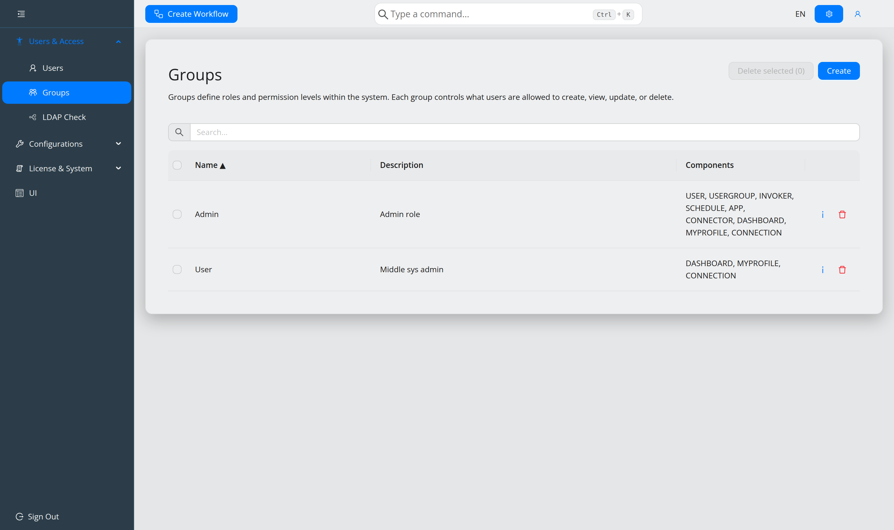
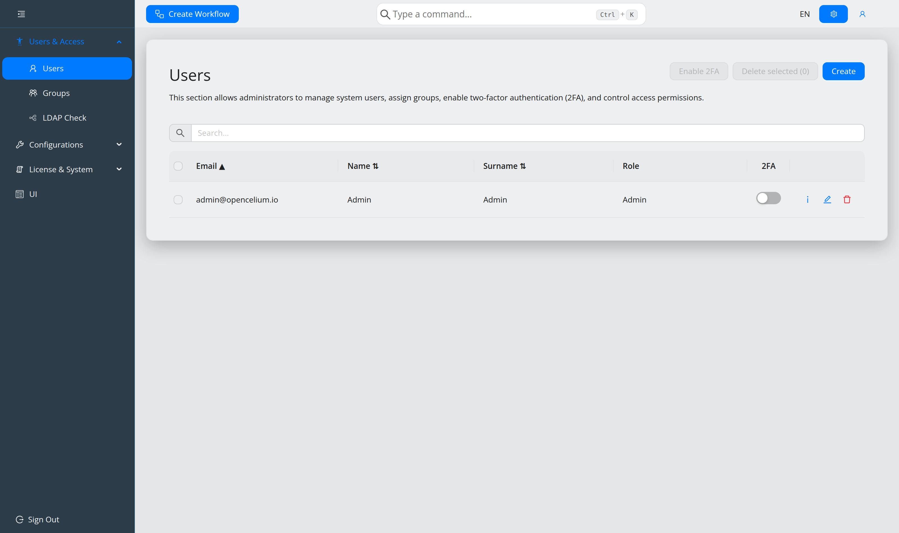
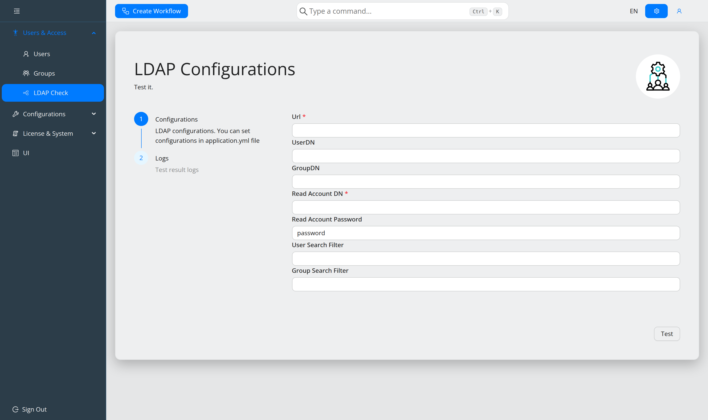

#########################
Users and permissions
#########################

.. contents::
   :local:

Permissions are granted per **group**, never per user. A user gets exactly the
rights of their group. The component and action matrix is in
:doc:`../reference/permissions`.

Create a group first
====================

**Users & Access → Groups → Create**. Two steps:

* **Role Details** — name (mandatory), description, optional icon.
* **Permissions** — select the components the group may touch, then tick the
  actions per component. At least one is required; the *admin* column ticks a whole
  row.

Effect in the interface: missing **READ** hides a component's menu entry
altogether; missing CREATE/UPDATE/DELETE hides only those actions. The command
palette follows the same rules.

Then create users
=================

**Users & Access → Users → Create**. Three steps:

* **User Details** — title, name, surname, department, organization, phone, image.
* **Credentials** — e-mail (the username, max 255 characters) and password
  (8–64 characters).
* **Role** — the group.

.. note::
   The signed-in user cannot delete themselves.

Two-factor authentication
=========================

Toggle 2FA per user in the **2FA** column of the user list, or for several users at
once by selecting them and using **Enable 2FA**.

At the next login the user scans the QR code with an authenticator app, then enters
the generated code as a second step.

LDAP
====

For central user management, configure ``spring.security.ldap`` — see
:ref:`ref-configuration`. Users then sign in with their directory credentials, and
``group-role-mapping`` maps directory groups onto OpenCelium groups, with
``default-role`` as the fallback.

Test it under **Users & Access → LDAP Check**, which shows the effective
configuration and the test log.

.. warning::
   In 5.0 this block is ``spring.security.ldap``. Before 5.0 it was
   ``spring.data.ldap``. An unchanged 4.x file silently stops authenticating.

For failures, raise ``logging.level.org.springframework.security.ldap`` to
``DEBUG`` and watch ``journalctl -xe -u opencelium -f``.

Passwords
=========

Users change their own password in the profile dialog; it logs them out
immediately.

A forgotten password is reset from the login page, which mails a reset link. The
new password needs 8–16 characters with an uppercase letter, a lowercase letter, a
number and a special character. This requires ``spring.mail`` to be configured —
without it the page says password reset is unavailable.

Sessions
========

A ``401`` or ``403`` signs the user out automatically, closes open dialogs, and
remembers the route so they return to it after signing in again.
