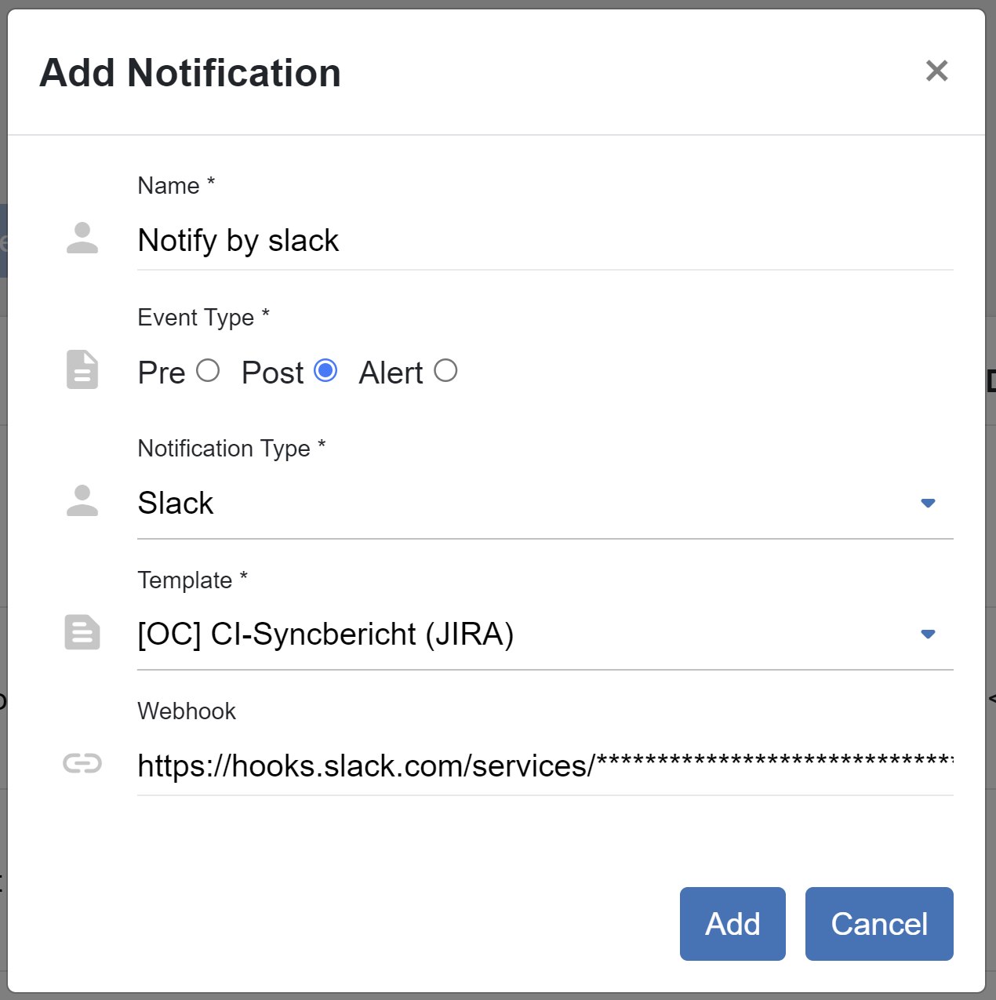

##################
Data Aggregator
##################

*Aggregator* is a feature that provides a possibility to notify a user after the
triggered connection (this happens in *Schedules*).

**You, as an admin, want to manage aggregator in the OpenCelium.**

Please, open the *Admin Panel* and click on *Data Aggregator*. It will show you
the list of aggregators: *name, *arguments* and *archived* status.

|data_aggregator_list|

The archive status means what aggregators should be disabled and invisible in the system.
You can switch it clicking on the status. If you want to see the archived aggregators then
toggle the switcher.

|data_aggregator_archive_switcher|

**You, as an admin, want to create an aggregator in the OpenCelium.**

You can create an aggregator inside of the *Admin Panel*/*Data Aggregator* or directly in
*Connections* menu. Click on *Add Aggregator*. Here, you need to provide a *name*, *arguments* and the *script*.
*Arguments* are used inside of the notification it self. You should assign to them an accumulated
value inside of the script section.

|data_aggregator_form|

**You, as an admin, want to use an aggregator in the OpenCelium.**

First of all, you need to apply the aggregator to the method. Please, open the needed connection and apply aggregator
to the method. You can do it in two ways: setting *Methods* inside of the data aggregator form

|data_aggregator_methods|

or after selecting a method inside of the *Details* panel.

Second thing, go to the *Notification Template* and bring aggregator's *arguments* inside of the *body*.

|notification_template_form|

The last step, go the *Schedules* and create a notification with a *post* event type.

|schedule_notification_add_form|

.. |data_aggregator_form| image:: ../img/data_aggregator/form.png
   :align: middle

.. |data_aggregator_methods| image:: ../img/data_aggregator/methods.png
   :align: middle
   :width: 400
.. |data_aggregator_archive_switcher| image:: ../img/data_aggregator/archive_switcher.png
   :width: 120
   :align: middle

