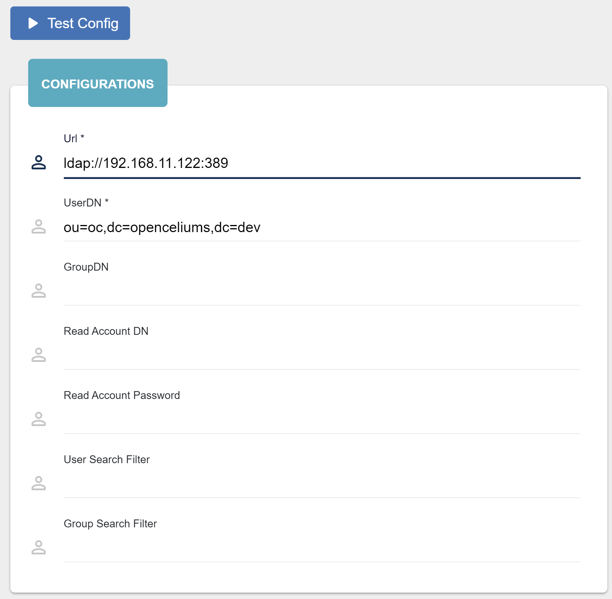
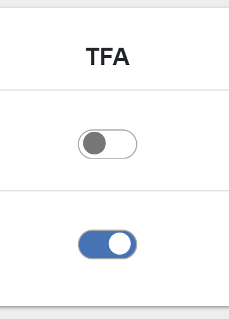
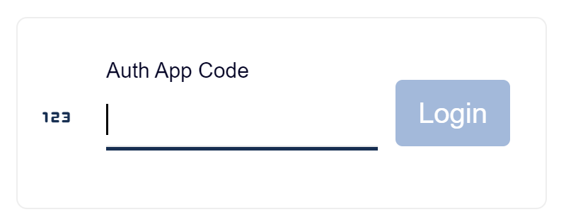

##################
Authentication
##################

Our application provides multiple authentication mechanisms to ensure secure access:

Local Database
"""""""""""""""""

Users can authenticate via credentials stored in a local database (MariaDB). This method requires
users to provide a username and password which are securely hashed and stored in the database.
Only Admin has rights to manage users.

TOTP
"""""""""""""""""

For enhanced security, the app supports Time-based One-Time Password (TOTP) authentication.
After entering their username and password, users are required to provide a time-sensitive,
six-digit code generated by an authenticator app (e.g., Google Authenticator, Authy).

|image4|

This two-factor authentication (2FA) mechanism adds an extra layer of protection by verifying
the identity of users beyond their password.

Admin can activate 2FA for a user toggling the switcher on the *Users* page in *Admin Panel*.

|image2|

There is also a possibility to activate 2FA for many users checking them on the left side and pressing
button *Enable 2FA*.

LDAP
"""""""""""""""""

Our app can also integrate with enterprise-level LDAP (Lightweight Directory Access Protocol)
directories for authentication. Users can log in using credentials from a centralized LDAP server,
which allows for easier user management in corporate environments.

To establish the LDAP authentication you need to configure the *application.yml* file.
Under *spring* -> *security*, please set the required parameters:

.. code-block:: yaml

   ldap:
      # LDAP server URL
      urls: ldap://ldap.forumsys.com:389

      # User search base
      user-search-base: dc=example

      # Group search base
      group-search-base: dc=example

      # LDAP manager credentials
      username: cn=read-only-admin,dc=example,dc=com
      password: password

      # Where to search for roles/groups
      group-search-filter: (uniquemember={0})

      # User search filter
      user-search-filter: (uuid={0})

      # Maps groups between LDAP and the application
      group-role-mapping:
        - ldap-group: ou=mathematicians,dc=example,dc=com
          oc-role: Admin
        - ldap-group: ou=scientists,dc=example,dc=com
          oc-role: User

      # Default role if no mapping is found between LDAP and the application
      default-role: User

      # Activate or deactivate logs during authentication
      show-logs: true

      # Timeout for LDAP authentication (in milliseconds)
      timeout: 30000

.. warning::
    After updating the application.yml file, please build and restart the server.

Now you can check the ldap connection in *Admin Panel* -> *LDAP Check* and see the logs
on the right side.

|image1|

