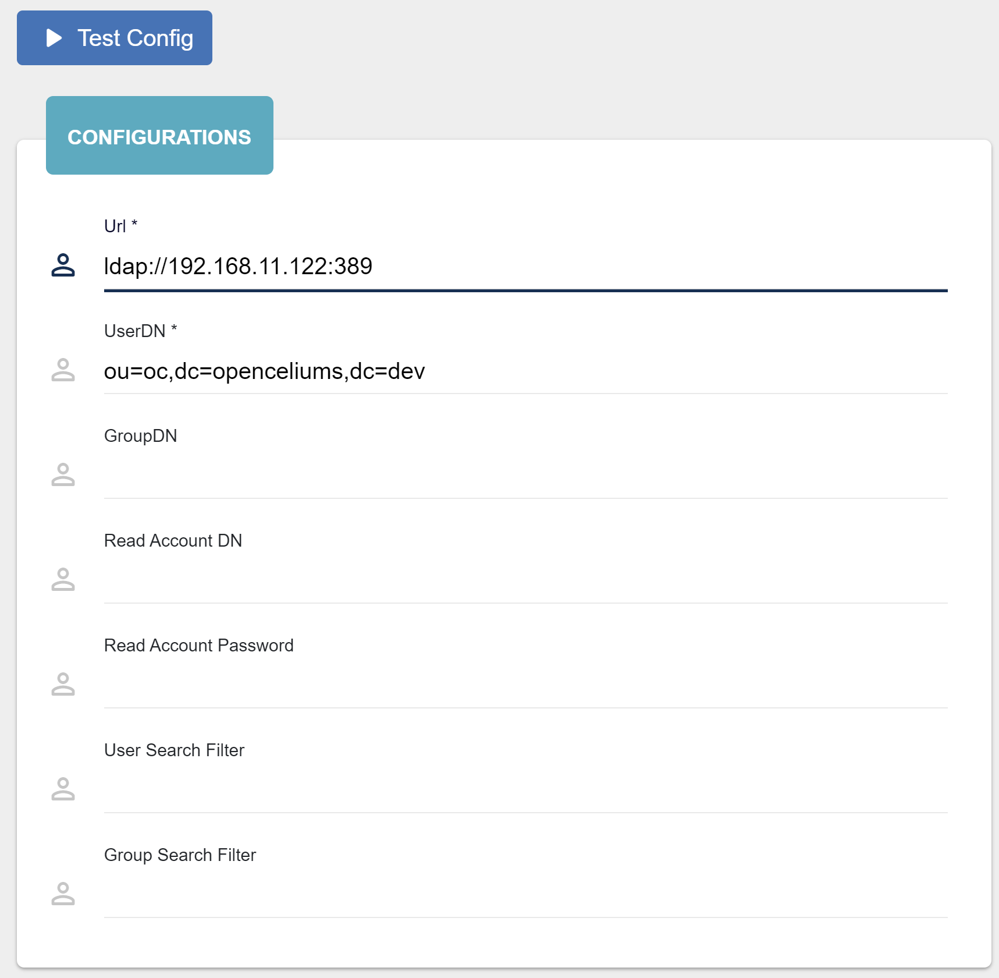
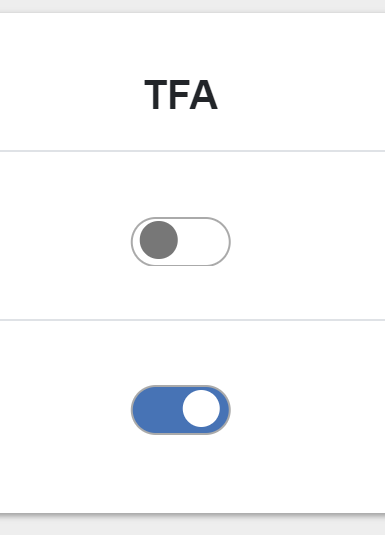
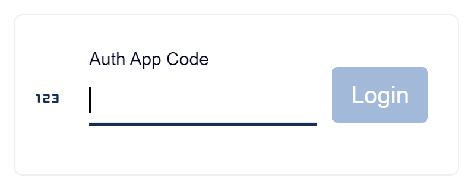

##################
Authentication
##################

Our application provides multiple authentication mechanisms to ensure secure access:

Local Database
"""""""""""""""""

Users can authenticate via credentials stored in a local database (MariaDB). This method requires
users to provide a username and password which are securely hashed and stored in the database.
Only Admin has rights to manage users.

TOTP
"""""""""""""""""

For enhanced security, the app supports Time-based One-Time Password (TOTP) authentication.
After entering their username and password, users are required to provide a time-sensitive,
six-digit code generated by an authenticator app (e.g., Google Authenticator, Authy).

|image4|

This two-factor authentication (2FA) mechanism adds an extra layer of protection by verifying
the identity of users beyond their password.

Admin can activate 2FA for a user toggling the switcher in the *2FA* column on the
**Users & Access → Users** page.

|image2|

There is also a possibility to activate 2FA for many users checking them on the left side and pressing
button *Enable 2FA*.

LDAP
"""""""""""""""""

Our app can also integrate with enterprise-level LDAP (Lightweight Directory Access Protocol)
directories for authentication. Users can log in using credentials from a centralized LDAP server,
which allows for easier user management in corporate environments.

To establish the LDAP authentication you need to configure the *application.yml* file.
Under *spring* -> *security*, please set the required parameters:

.. warning::
    In 5.0 this section lives under ``spring.security.ldap``. Earlier versions
    read it from ``spring.data.ldap``. If you carry an ``application.yml`` from
    4.x over unchanged, the old block is ignored and LDAP logins stop working —
    move it to ``spring.security.ldap``.

.. code-block:: yaml

   ldap:
      # LDAP server URL
      urls: ldap://localhost:7389

      # User search base
      user-search-base: ou=User,ou=group,dc=domain,dc=com

      # Group search base
      group-search-base: ou=Groups,ou=group,dc=domain,dc=com

      # LDAP manager credentials
      username: uid=super_user,ou=User,ou=group,dc=domain,dc=com
      password: PASSWORD

      # Where to search for roles/groups
      # Usually, the unique identifier for OpenLDAP is uniqueMember={0},
      # while for Active Directory, it is member={0} but check your LDAP settings
      group-search-filter: (member={0})      

      # User search filter
      # Usually, the unique identifier for OpenLDAP is mailPrimaryAddress={0},
      # while for Active Directory, it is mail={0} but check your LDAP settings
      user-search-filter: (mailPrimaryAddress={0})

      # Maps groups between LDAP and the application
      group-role-mapping:
        - ldap-group: cn=AdminLdap, ou=Groups,ou=group,dc=domain,dc=com
          oc-role: Admin
        - ldap-group: cn=UserLdap,ou=Groups,ou=group,dc=domain,dc=com
          oc-role: User

      # Default role if no mapping is found between LDAP and the application
      default-role: User
      # Timeout for LDAP authentication (in milliseconds)
      timeout: 30000

.. warning::
    After updating the application.yml file, please restart the opencelium service.

.. code-block:: sh

        systemctl restart opencelium

.. note::
    Usually, group-role-mapping for OpenLDAP requires lowercase letters for cn, ou and dc,
    while, Active Directory requires capital letters for CN, OU and DC

Now you can check the LDAP connection in the admin menu under
**Users & Access → LDAP Check**. The page shows the effective *Configurations*
and the *Logs* of the test. The command-palette shortcut is ``check ldap``.

For login using LDAP credentials, please have a look into OpenCelium Logs for troubleshooting:

.. code-block:: sh

	journalctl -xe -u opencelium -f

LDAP debug logging is switched on in ``application.yml``:

.. code-block:: yaml

   logging:
     level:
       org:
         springframework:
           security:
             # Activate or deactivate logs during LDAP authentication
             ldap: DEBUG # OFF or DEBUG

.. note::
    This path also changed in 5.0 — it was
    ``logging.level.org.springframework.data.ldap`` before.

