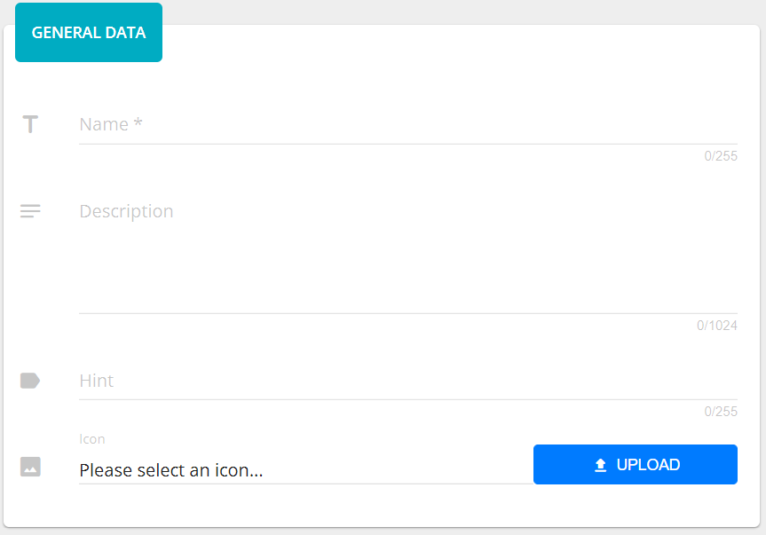
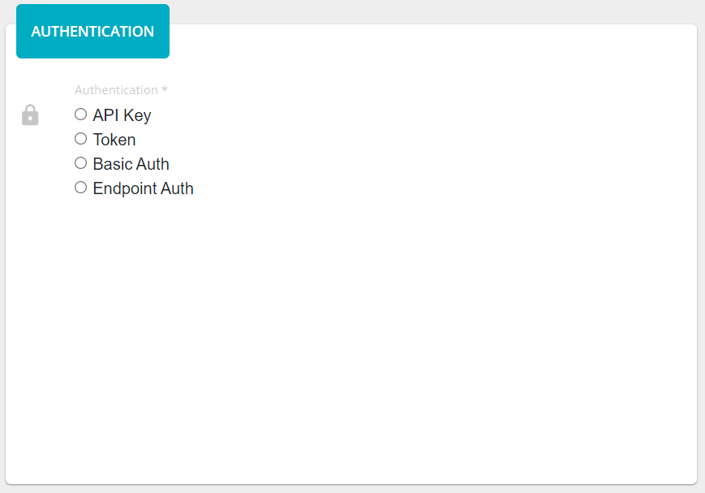
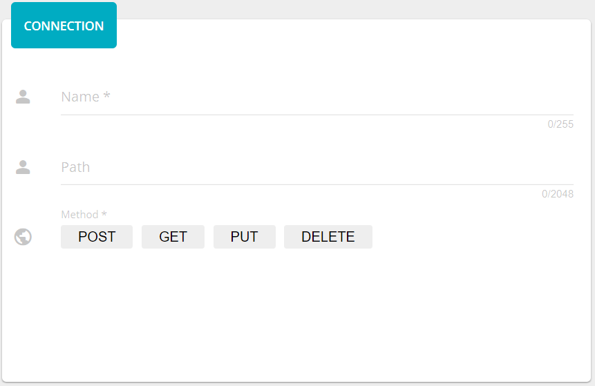
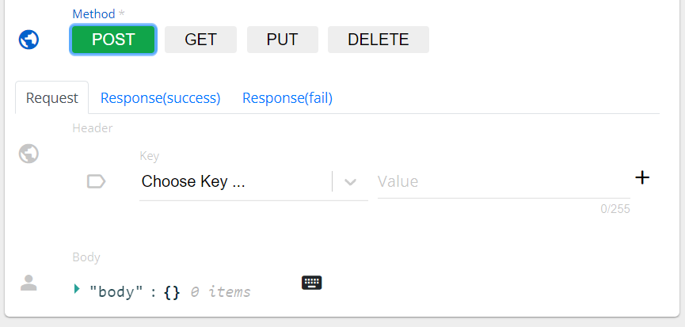
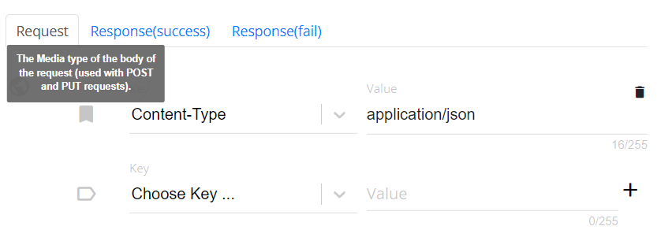
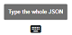
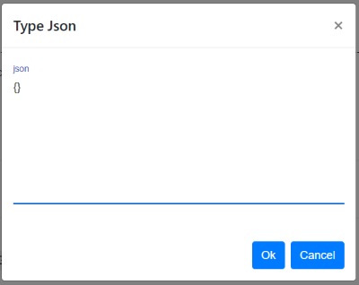
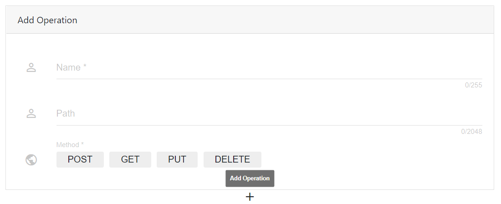

##################
Invoker (only for subscribers)
##################

Invoker can be managed both from UI and from server directly. Let us consider the Add Invoker use case.

**You, as an admin, want to add an invoker in the OpenCelium.**

To add an invoker directly to the server, go to the root folder of the application and find there
*src/main/resources/invoker* folder. Paste the invoker file (*xml* format) and restart the project.

There is also an option to add an invoker from UI. Go to *Admin/Invokers* page. There is a button *+ Add Invoker*.
|image0| Press on it. Provide a *Name*, *Description*, and a *Hint*. The *Hint* will be displayed and helpful, when you create
a *Connector*.

|image1|

Choose an *Authentication Type*. Right now 4 types are available: *API key*, *Token*, *Basic* and *Endpoint* Authentication.

|image2|

After, you need to provide information about the method that will be used as a test connection.

|image3|

A *Name* is a required and unique field. A *Path* of each request can be different. The main url is *{url}*. Type it and
provide endpoint if it is necessary. Choose a *Method* and enter a *Request* and a *Response* (*Success*/*Error*)
data in the appeared tabs.

|image4|

You can see hints for *Headers* if mouse is over the corresponded icon.

|image5|

The *Body* can be input throw the engine or click on this icon |image6| and paste the json string inside the popup window.

|image7|

The last but not least step you add operations that will be used during *Connection* creation. Just provide information
(similar to the previous step) and click on plus icon.

|image8|

