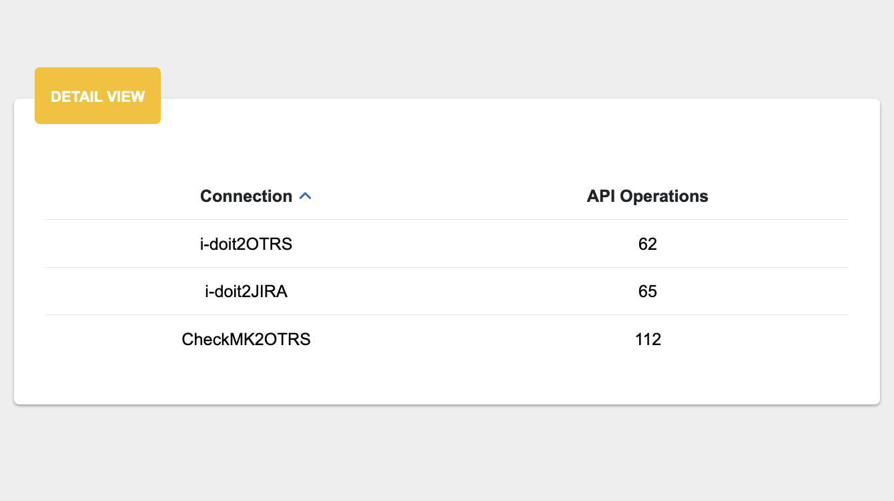
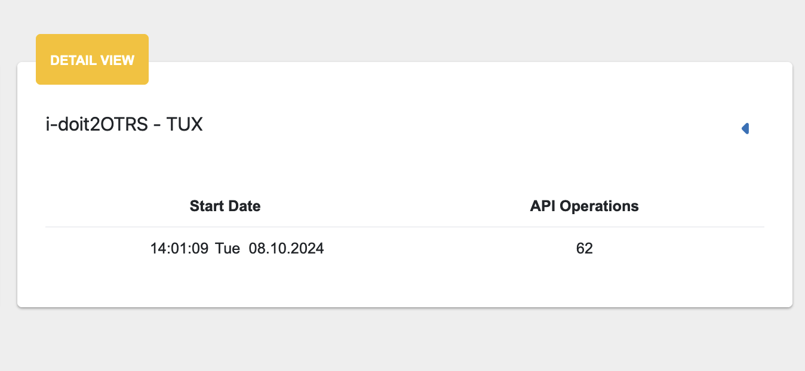

##################
License Management
##################

Starting from v4.2 OpenCelium has license management. The license limits the amount
of API requests in schedules. When user installs the application, automatically it has
Free License with 10.000 API calls per month. If you update the OpenCelium from the
previous version, then you do not have any license and it should be activated on the
License Management page. You can find it in *Admin Panel*.

|image1|

This page provide you such information like *status*, *expiration date*, *current API calls
amount*.

The *Detail View* section is used to track the activity of API requests in terms of the number of operations executed
between different services. You can see a list of connections that was triggered by schedule.
*API Operations* column shows the summarized number of API operations has performed.

|image5|

Clicking on the corresponded connection, you can see the history of each execution: its time and
number of calls.

|image6|

There are two ways of activating the licenses: online and offline. If the switcher on the
*Profile* page is on, the license management works automatically, otherwise you need to
upload the license manually.

|image3|

Offline
=========

To upload the license, first of all you need to generate an *Activation Request*
pressing on the button above of the *License Management* page. It will generate
a text file with information about your machine. This file should be uploaded on the
Service Portal, *Licenses* page. After successfully uploading you can download
the license file and upload it in OpenCelium.

|image2|

After that you will see updated information about your subscription.

Online (only for subscribers)
=========

The online process required the valid configuration inside of the *application.yml* file,
otherwise *Activate License* button will be disabled.

|image4|

It has two settings: *base_url* and *token*.

The *base_url* should be already set, if not then you can define it with: *https://service.opencelium.io/*.

The *token* is the personal api token to make requests to Service Portal. You can generate it
in your Service Portal account, in *Profile*.

.. note::
    After updating the application.yml file, please restart OpenCelium!

.. code-block:: sh

	service opencelium restart

Now, you can choose your license and activate it.

