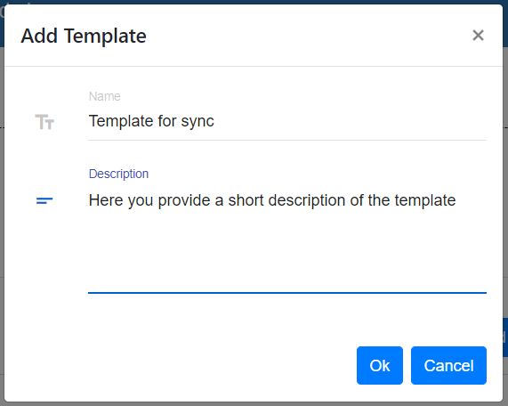
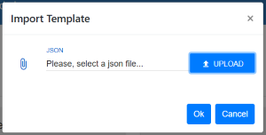
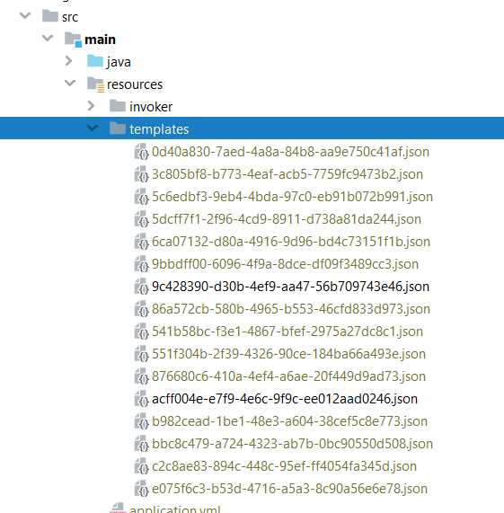
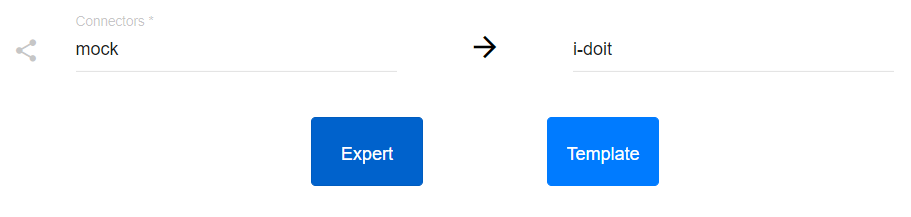
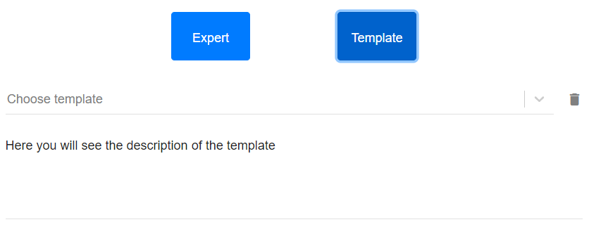
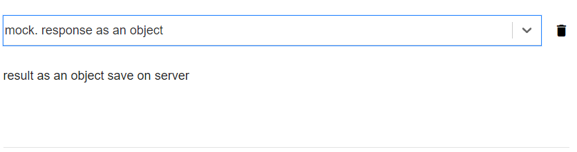

##################
Business Template
##################

Business Templates can be managed both from UI and from server directly. Let us consider the next use cases.

**You, as a user, want to have a template in the OpenCelium.**

That can happen in several ways: Add Template or Import Template. To add a template you go firstly in *Add Connection*
form. After selecting connectors and adding at lease one method the *Add Template* button will be enabled.

Provide a name, a short description and click on the *Ok* button.

|add_template_dialog|

To import an existing template from UI go to the *Admin* page and open the *Templates* item. There you will see
an *+ Import* button. Click on it and upload your template (*json* format). Clicking on *OK* your template will be imported.

|import_template_dialog|

There is also an opportunity to import a template via server. Go to the root folder and find there *src/main/resources/templates* folder.

|template_backend_placement|

Copy your template and paste it in this folder. The templated will be catched by the system automatically.

**You, as a user, want to download the template from OpenCelium.**

Go to the *Admin* page and click on the *Templates* card. Here you see all existing templates.
Each template has its correspondence *Download* icon. Click on it to get the template in *json* format |download_icon|.

**You, as a user, want to use the template in OpenCelium.**

The template itself we need during the adding of connection. Go to *Connection* page and press on *+ Add* button.
Provide required information and go further clicking on the arrow. Now you should see two choices of mode:
*Expert* and *Template*.

|choose_mode_form|

Clicking on the *Template* the system loads all existing templates to the corresponded connectors.

|choose_template|

Selecting one of it you will see its short description.

|selected_template|

Click on the arrow again to use the template.

**You, as a user, want to upgrade the template in OpenCelium.**

Starting from OpenCelium 1.3 version, there is a changed structure inside on the template. It means,
to use the older templates in a new version, you need to upgrade them. There are two ways to perform that.
First, you can go to the *Templates* page using *Admin*, as it is described above. There you can upgrade one
specific template clicking on the icon |list_upgrade_icon| or pressing on the *Convert All* button to convert all
templates to the latest version.

Second option is to convert the template directly when you use it in *Connections*. If the template has older
version it will be disabled and with conversion icon |list_upgrade_icon| clicking on it, you will convert the template.

**You, as a user, want to change the template in OpenCelium.**

There is no way to change the template via UI for now, but you can change it directly on the server in
*src/main/resources/templates* folder in *json* file. But strongly recommended to not do it! Slightly
wrong changes in the file (json syntax, logic error) or saving with the incorrect encoding brings you
to the error on the *Add Connection* page. We recommend you to create a new template as it is described above.

**You, as a user, want to delete the template from OpenCelium.**

The template can be for sure deleted. You can find the deletion in two places: *Admin/Templates*
or *Connections/Add*. The first place shows you a list of all templates and a corresponded *Delete*
functionality for each template. The second deletion is on the second form section of adding connection,
when you choose the *Template Mode*.

