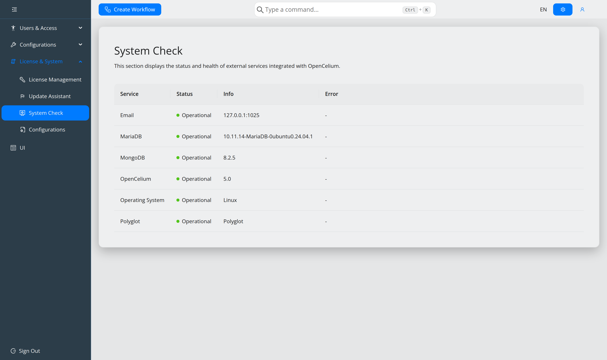

.. _ops-monitoring:

##########
Monitoring
##########

.. contents::
   :local:

.. _ref-system-check:

System Check
============

**License & System → System Check** reports the health of everything OpenCelium
depends on.

.. list-table::
   :header-rows: 1
   :widths: 24 76

   * - Service
     - Notes
   * - **OpenCelium**
     - The application itself; the Info column shows the running version.
   * - **MariaDB**
     - Users, groups, connectors, schedules, license tracking.
   * - **MongoDB**
     - The workflow documents.
   * - **Email**
     - Performs a real SMTP connection test. *Down* until ``spring.mail`` is
       configured and reachable.
   * - **Polyglot**
     - The ``polyglot-engine`` service for Python and Ruby enhancements. *Down*
       unless you deploy it — harmless if you do not use those languages.
   * - **Operating System**
     - Host information.

Each row reports *Operational*, *Down* or *Unknown*, plus an info and an error
column, so a failing component names its own reason.

The command palette shortcut is ``check system``. The underlying endpoint is
``/actuator/health``, which requires the ``Admin`` authority.

Dashboard
=========

The dashboard is the operational overview. Metrics stream over the WebSocket, so
values update without reloading; each tile carries a small dot reporting the
state of that connection (*Live*, *Connecting*, *Connection lost — data may be
stale*).

* **Tiles** — Executions, Failure rate, Avg runtime, Run time, Logs. A tile with
  no data shows ``—`` rather than a misleading zero.
* **Executions & failures** — per-day counts, seven days by default.
* **Resource usage** — host CPU and memory.
* **Top workflows** — highest all-time execution count with failure rate.

.. image:: ../img/dashboard/OC5_dashboard.png
   :align: center
   :width: 1000

.. note::
   *Attention required*, *Recent activity* and *System health* are laid out but
   marked **Coming soon**. They are placeholders in 5.0 and do not show live
   data.

If the dot says the connection was lost, the usual cause is a reverse proxy that
does not forward ``/ws`` — see :ref:`ref-configuration`.

Logs on the host
================

.. code-block:: sh

   journalctl -xe -u opencelium -f

``opencelium.debug_mode`` raises verbosity. Execution logs themselves are in the
UI, not on disk — see :doc:`../guides/debug-a-workflow`.

Netdata
=======

A Netdata template for host-level dashboards ships in ``files/oc-mode.html``.
Deploy it next to your Netdata installation to mirror the example layout.
