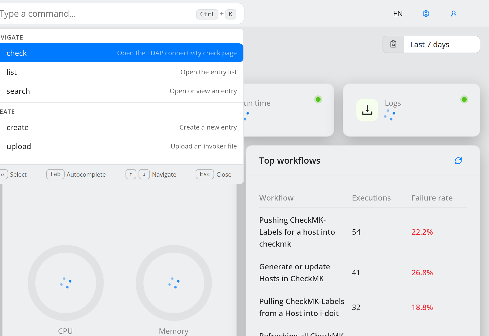
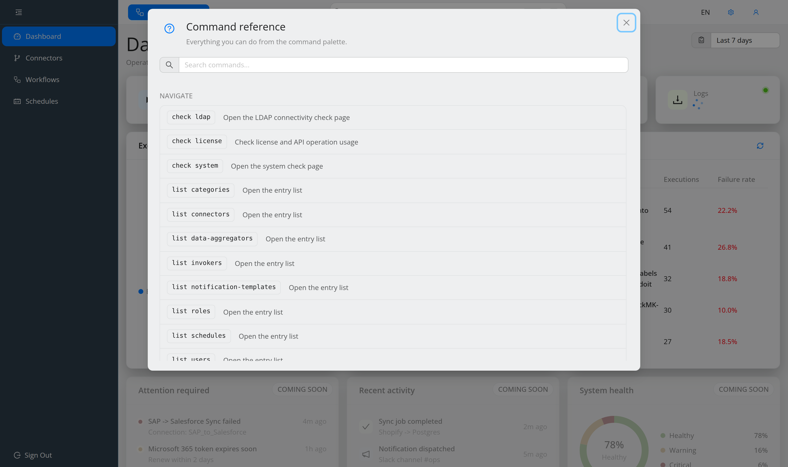

.. _ref-command-palette:

###############
Command palette
###############

.. contents::
   :local:

New in 5.0, the **command palette** is a global command interface. Instead of
navigating through menus, you type what you want to do and OpenCelium executes
it — opening a list, creating an entity, updating a value, downloading a
template, or searching the workflow you have open.

Opening the palette
"""""""""""""""""""

* Press ``Ctrl+K`` (``⌘+K`` on macOS) anywhere in the application. The palette is
  the input in the middle of the top bar.
* In the workflow editor the palette is embedded in the header as a collapsed
  icon with a hotkey pill. It expands when focused and switches to modal mode.

.. list-table::
   :header-rows: 1
   :widths: 20 80

   * - Key
     - Action
   * - ``Ctrl+K``
     - Open the command palette.
   * - ``↑`` / ``↓``
     - Navigate the suggestions.
   * - ``↵``
     - Select the highlighted suggestion.
   * - ``Tab``
     - Autocomplete the highlighted suggestion.
   * - ``⌫``
     - Exit a locked scope (on an empty input).
   * - ``Esc``
     - Close the palette.

.. note::
   Because a command only runs when a suggestion is **highlighted**, typing a
   complete command such as ``help`` empties the suggestion list and pressing
   ``↵`` then does nothing. Type a prefix, let the palette highlight the entry,
   and confirm with ``↵`` or ``Tab``.

.. note::
   The palette respects your permissions. Commands for components you may not
   read are not offered.

How commands are built
""""""""""""""""""""""

Commands read like short sentences and are completed step by step. With an empty
input the palette offers the verbs; each further word narrows the command down.

The general shape is::

   <verb> <entity> [by <field> <value>]

.. list-table::
   :header-rows: 1
   :widths: 14 40 46

   * - Verb
     - Example
     - Description
   * - ``list``
     - ``list users``
     - Opens the entry list of an entity. Takes the **plural** noun.
   * - ``search``
     - ``search user by email jane@example.com``
     - Opens an entry in view mode.
   * - ``create``
     - ``create user``
     - Opens the create wizard.
   * - ``update``
     - ``update schedule by id 12``
     - Opens an entry in update mode.
   * - ``delete``
     - ``delete connector by title Jira``
     - Deletes an entry after a confirmation.
   * - ``upload`` / ``download``
     - ``download invoker by name i-doit``
     - Exchange invoker and workflow-template files.
   * - ``check``
     - ``check license``
     - Opens a check page.
   * - ``system`` / ``ui``
     - ``ui theme dark``
     - System and appearance actions.
   * - ``help``
     - ``help``
     - Opens the command reference.

Values are resolved against a live, cached list, so the palette can complete
existing names for you. Suggestions are grouped — the reference dialog uses
**Navigate**, **Create**, **Manage**, **System** and **General**; the palette
itself additionally shows a **Recent** group and, in the editor, a pinned
**Workflow** group.

If a typed command resolves to nothing, the palette says *No results found*
instead of showing an empty dropdown.

Wizards opened from the palette in the workflow editor suppress the
recommendation tags on their success screen, so you stay in your editing flow.

Which entity supports which lookup
""""""""""""""""""""""""""""""""""

The ``by <field>`` part differs per entity. This is the complete matrix as
offered by the palette:

.. list-table::
   :header-rows: 1
   :widths: 24 12 12 12 12 28

   * - Entity
     - list
     - create
     - search
     - delete / update
     - ``by`` fields
   * - ``category``
     - yes
     - yes
     - yes
     - yes / yes
     - ``id``, ``name``
   * - ``connector``
     - yes
     - yes
     - yes
     - yes / yes
     - ``id``, ``title``
   * - ``data-aggregator``
     - yes
     - yes
     - yes
     - — / yes
     - ``id``, ``name``
   * - ``invoker``
     - yes
     - yes
     - yes
     - yes / —
     - ``name``
   * - ``notification-template``
     - yes
     - yes
     - yes
     - yes / yes
     - ``id``, ``name``
   * - ``role`` (the *Groups* page)
     - yes
     - yes
     - yes
     - yes / yes
     - ``id``, ``name``
   * - ``schedule``
     - yes
     - yes
     - yes
     - yes / yes
     - ``id``, ``workflow.title``
   * - ``user``
     - yes
     - yes
     - yes
     - yes / yes
     - ``email``, ``id``
   * - ``workflow``
     - —
     - —
     - —
     - — / yes
     - ``id``, ``title``
   * - ``workflow-template``
     - yes
     - —
     - —
     - yes / —
     - ``id``, ``name``, ``templateId``

.. note::
   Workflows are deliberately not created, listed or deleted from the palette —
   use **Workflows** in the main menu, the **Create Workflow** button, or
   ``Alt+W``. ``update workflow by id|title`` opens the workflow editor.
   Workflow templates are not *created* from the palette either; they are
   uploaded, or saved from the workflow editor
   (see :ref:`guide-templates`).

System commands
"""""""""""""""

.. list-table::
   :header-rows: 1
   :widths: 40 60

   * - Command
     - Description
   * - ``check license``
     - Check license and API operation usage.
       Aliases: ``check ops``, ``check subscription``, ``check usage``.
   * - ``check system``
     - Open the system check page, see
       :ref:`ref-system-check`. Aliases: ``system check``,
       ``check health``, ``check status``.
   * - ``check ldap``
     - Open the LDAP connectivity check page.
   * - ``update system-config``
     - Update the on-disk application configuration, see
       :ref:`guide-configure-system`. Requires the master password; the
       palette tells you when none is configured.
   * - ``system config <query>``
     - Search the configuration and edit a single value in place.
   * - ``ui theme <theme>``
     - Change the application theme. Alias: ``ui design``.
   * - ``system ui``
     - Open the UI settings page.
   * - ``upload workflow-template`` / ``upload invoker``
     - Upload a template or invoker file.
   * - ``download workflow-template by name|templateId <value>``
     - Download a workflow template file.
   * - ``download invoker by name <name>``
     - Download an invoker file.
   * - ``help``
     - Open the command reference dialog.

The command reference
"""""""""""""""""""""

``help`` opens **Command reference** — *Everything you can do from the command
palette*. The dialog is generated from the live command tree, so it always
matches the commands your installation and your permissions actually offer. It
has its own search field and lists the palette's keyboard shortcuts.

This is the authoritative list for your installation; the tables above describe a
default 5.0 setup.

Workflow scope
""""""""""""""

Inside the workflow editor the palette has a pinned **Workflow** section. Typing
``workflow`` locks the palette to that scope (shown as a chip), from where
``workflow search <term>`` performs a fuzzy search across the open workflow.
``⌫`` on an empty input leaves the scope again.
See :ref:`concept-workflow` for what exactly is searched and how matches are
highlighted.

Global hotkeys
""""""""""""""

.. list-table::
   :header-rows: 1
   :widths: 20 80

   * - Shortcut
     - Action
   * - ``Ctrl+K`` / ``⌘+K``
     - Open the command palette.
   * - ``Alt+M``
     - Toggle between the main menu and the admin menu.
   * - ``Alt+W``
     - Create a new workflow.
   * - ``Ctrl+Enter``
     - Advance or submit the current step in an entity wizard.
   * - ``Ctrl+S``
     - Save the workflow (in the workflow editor).
