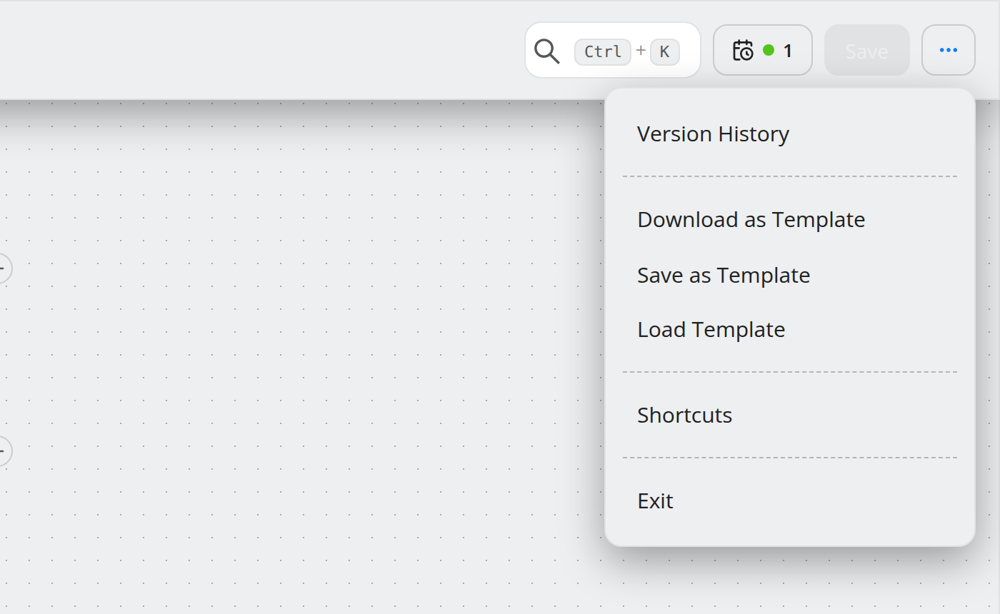

.. _ref-screens:

#######
Screens
#######

.. contents::
   :local:

A map of the interface. The guides explain what to *do*; this page says where
things are.

Layout
======

* **Sidebar** (left) — navigation, collapsible to icons, with **Sign Out** at the
  bottom.
* **Top bar** — Create Workflow, the command palette, the language toggle
  (EN/DE), the menu switcher, and the profile icon.
* **Content**, with a subscription alert strip above it when the license needs
  attention.

There are **two menus**, switched with the menu switcher or ``Alt+M``; the last
page you visited in each is restored. Entries you cannot read are hidden entirely.
Every leaf is a real link, so ``Ctrl``/``⌘``/middle-click opens a new tab.

Main menu
=========

.. list-table::
   :header-rows: 1
   :widths: 22 78

   * - Entry
     - Page
   * - **Dashboard**
     - Operational overview — see :ref:`ops-monitoring`.
   * - **Connectors**
     - Connector list and wizard.
   * - **Workflows**
     - Workflow list; the editor opens from here.
   * - **Schedules**
     - Schedule list, executions, webhooks, notifications, support logs.

Admin menu
==========

.. list-table::
   :header-rows: 1
   :widths: 24 76

   * - Group
     - Entries
   * - **Users & Access**
     - Users, Groups, LDAP Check
   * - **Configurations**
     - Invokers, Workflow Templates, Data Aggregator, Notification Templates,
       Categories, Support Files
   * - **License & System**
     - License Management, Update Assistant, System Check, Configurations
   * - *(top level)*
     - UI

.. note::
   **External Applications** and the 3.x **Migration** card no longer exist.
   Component health is now :ref:`ref-system-check`; the Neo4j migration was
   retired with the 4.x line.

Lists
=====

Every list behaves the same: title and subtitle, a search field naming what it
searches, sortable columns, per-row *view / update / delete* icons with tooltips,
row checkboxes enabling bulk actions, and expandable sub-rows where a row has
detail.

Destructive actions confirm first. The confirm dialog focuses **Cancel** and shows
a loading state, so a slow delete cannot fire twice.

Wizards
=======

Create, update and view all use one wizard: named steps with their own header and
subtitle, per-step validation, conditional sections, step actions such as *Test
connection* that can gate the submit, ``Ctrl+Enter`` to advance, and a success
screen recommending follow-ups.

Workflow editor
===============

Its own header replaces the application header. See
:doc:`../guides/build-a-workflow` for the areas and
:ref:`ref-shortcuts` for the canvas shortcuts.

Header menu entries: Assign Category, Version History, **Change History**,
Download as Template, Save as Template, Load Template, Shortcuts, Exit.

Panels and overlays, and what opens each:

.. list-table::
   :header-rows: 1
   :widths: 30 70

   * - Surface
     - Opened by
   * - **Step drawer** (right)
     - The **+** handle on a node.
   * - **Execution Logs** (bottom)
     - A test run; collapsed until there is output.
   * - **Version History** (right)
     - Header menu → Version History.
   * - **Change History** (right)
     - Header menu → Change History. *(5.1)*
   * - **Schedules** (right)
     - The schedules pill in the header.
   * - **Node toolbar**
     - Selecting a node. Carries *add joint*, *remove joint*, *add comment* and
       *delete*. *(5.1)*
   * - **Debug controls** (on canvas)
     - A test run in debug mode: pause, step forward, speed. *(5.1)*

.. note::
   **New in 5.1.** The canvas gained two things that are not steps: **joints**,
   drawn in green between two method nodes
   (:doc:`../guides/skip-steps-with-joints`), and **comment boxes**, anchored
   notes that minimise to a badge on their step
   (:doc:`../guides/annotate-a-workflow`).

Messages
========

Actions produce toasts, with the specific backend code where one exists
(``CONNECTOR_NOT_FOUND``, ``OPERATOR_EXPRESSION_IS_EMPTY``,
``CONCURRENT_TEST_IS_FORBIDDEN``) rather than a generic failure. Long-running work
reports over the WebSocket. Panels are wrapped in error boundaries, so one failing
card shows a recoverable fallback instead of blanking the page.

.. note::
   The global search field of earlier versions is gone; the command palette
   replaced it. There is no notification drawer in 5.0.

Profile
=======

Three sections: **User Details**, **Update Password** (which logs you out), and
**Permissions**.

A themed **404** page is shown for unknown routes inside the app shell.
