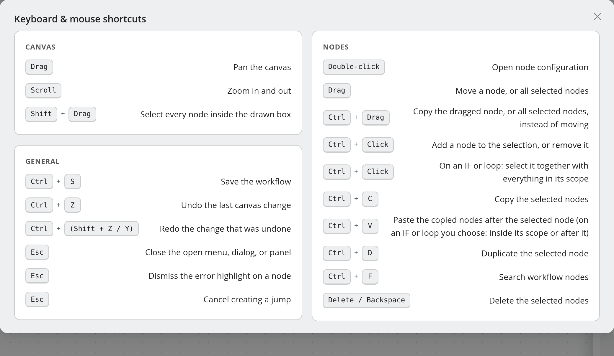

.. _ref-shortcuts:

#########
Shortcuts
#########

Global
======

.. list-table::
   :header-rows: 1
   :widths: 22 78

   * - Shortcut
     - Action
   * - ``Ctrl+K`` / ``⌘+K``
     - Open the command palette.
   * - ``Alt+M``
     - Toggle between the main menu and the admin menu.
   * - ``Alt+W``
     - Create a new workflow.
   * - ``Ctrl+Enter``
     - Advance or submit the current step of a wizard.

Command palette
===============

.. list-table::
   :header-rows: 1
   :widths: 22 78

   * - Key
     - Action
   * - ``↑`` / ``↓``
     - Move through the suggestions.
   * - ``↵``
     - Select the highlighted suggestion.
   * - ``Tab``
     - Autocomplete the highlighted suggestion.
   * - ``⌫``
     - Leave a locked scope, on an empty input.
   * - ``Esc``
     - Close the palette.

.. note::
   A command only fires while a suggestion is **highlighted**. Typing a command
   out in full empties the list, and ``↵`` then does nothing — type a prefix and
   let the palette highlight the entry.

Workflow editor
===============

This is the list the editor shows under **Header menu (…) → Shortcuts**, titled
*Keyboard & mouse shortcuts*. On macOS every ``Ctrl`` below is ``⌘`` — the dialog
shows it that way, too.

Canvas
------

.. list-table::
   :header-rows: 1
   :widths: 26 74

   * - Shortcut
     - Action
   * - Drag
     - Pan the canvas.
   * - Scroll
     - Zoom in and out.
   * - ``Shift`` + drag
     - Select every node inside the drawn box. *(5.2)*

Nodes
-----

.. list-table::
   :header-rows: 1
   :widths: 26 74

   * - Shortcut
     - Action
   * - Double-click
     - Open the node's configuration.
   * - Drag
     - Move a node, or all selected nodes.
   * - ``Ctrl`` + drag
     - Copy the dragged node, or all selected nodes, instead of moving them.
   * - ``Ctrl`` + click
     - Add a node to the selection, or remove it. On an IF or LOOP: select it
       together with everything in its scope. *(5.2)*
   * - ``Ctrl+C``
     - Copy the selected nodes. *(5.2)*
   * - ``Ctrl+V``
     - Paste the copied nodes after the selected node. On an IF or LOOP you choose:
       inside its scope or after it. *(5.2)*
   * - ``Ctrl+D``
     - Duplicate the selected node. *(5.2)*
   * - ``Ctrl+F``
     - Search the workflow's nodes. *(5.2)*
   * - ``Delete`` / ``Backspace``
     - Delete the selected nodes, after one confirmation.

General
-------

.. list-table::
   :header-rows: 1
   :widths: 26 74

   * - Shortcut
     - Action
   * - ``Ctrl+S``
     - Save the workflow.
   * - ``Ctrl+Z``
     - Undo the last canvas change. *(5.1)*
   * - ``Ctrl+Shift+Z`` / ``Ctrl+Y``
     - Redo the change that was undone. *(5.1)*
   * - ``Esc``
     - Close the open menu, dialog or panel; dismiss the error highlight on a
       node; cancel creating a jump.

The keyboard shortcuts act on the canvas only. They are ignored while the cursor
is in a text field or a code editor, while an editing dialog is open, in
read-only mode and while a test run is in progress.

.. note::
   ``Ctrl+Z`` inside a text field — a URL, a body, a script — is the browser's own
   undo for that field, not the canvas undo. See :doc:`../guides/undo-and-history`.

The field links lens, the field links list and the minimap have no shortcuts of
their own; ``Esc`` closes the field links list.
