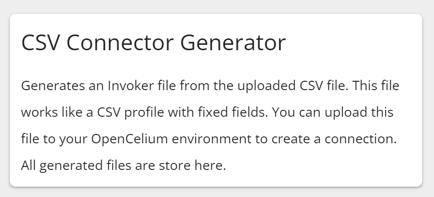

##################
csv2api
##################

.. note::
	csv2api is a subscription connector. Make sure that you have already got your subscription. If in doubt, contact our support support@opencelium.io.

Installation
"""""""""""""""""

.. code-block:: sh
        :linenos:

        root@shell> cd /opt/services
        root@shell> git clone https://github.com/opencelium/csv2api.git

Please read default documentation here https://github.com/opencelium/csv2api#how-to-start

Usage
"""""""""""""""""

First of all add a connector to your db.

|image0|

After that you can use it in a connection. Add a GetDataSources process to make a request to retrieve data from csv.

|image1|

Additional Service
"""""""""""""""""

User **with subscription** has an access to Service Portal. There is a tool for easy conversion
a csv file into an invoker file.

|image2|

In general data section you need to provide a name, an authentication type and a csv file.

|image3|

There is also a list of already converted files as a history. You can make such manipulations there, like:
download, edit or delete.

|image4|

.. |image0| image:: ../img/services/csv2api/0.png
   :align: middle

