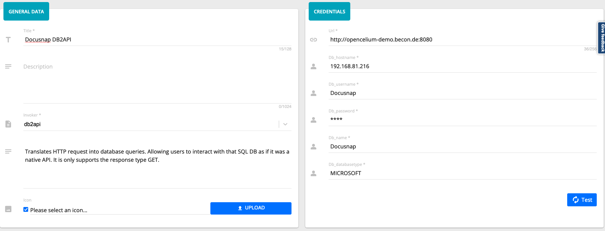
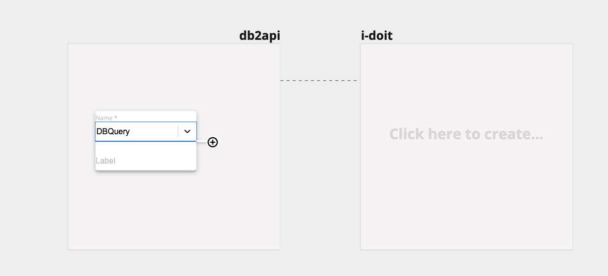
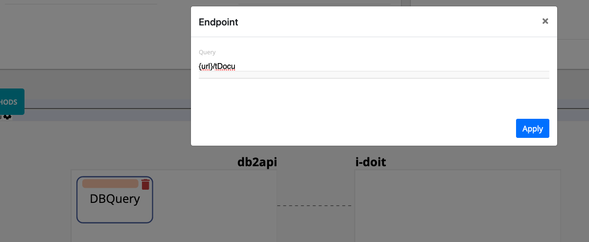
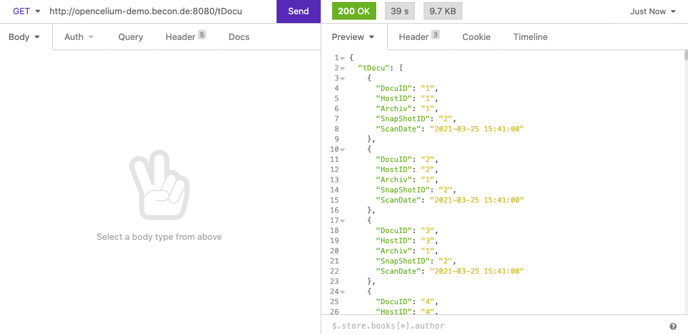

##################
db2api
##################

.. note::
	db2api is a subscription connector. Make sure that you have already got your subscription. If in doubt, contact our support support@opencelium.io. 

Installation
"""""""""""""""""

.. code-block:: sh
        :linenos:

        root@shell> cd /opt/services
        root@shell> git clone https://github.com/opencelium/db2api.git

Please read default documentation here https://github.com/opencelium/db2api#user-content-installation

Usage
"""""""""""""""""

First of all add a connector to your db.

|image0|

After that you can use it in a connection. Add a DBQuery process to start a request.

|image1|

Add an endpoint to get the right table.

|image2|

.. note::
        Use a rest client tool, to execute the api request to determine, to see how the response will be look like.

|image3|

Please read more about the search options here  here https://github.com/opencelium/db2api#user-content-usage

Supported Databases
"""""""""""""""""
- MICROSOFT
- MYSQL
- POSTGRESQL
- ORACLE (untested)
- XERIAL (untested)

Services
"""""""""""""""""

Use the oc command to start the service.

- start_db2api
- stop_db2api

FAQ
"""""""""""""""""

**SQL Server does not support TLSv1 or TLSv1.0**
Go to folder java/security and in file java.security find option jdk.tls.disabledAlgorithms and delete TLSv1

