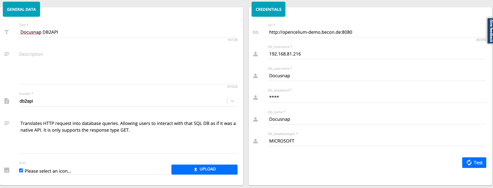
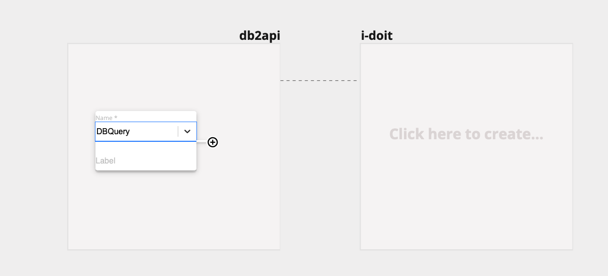
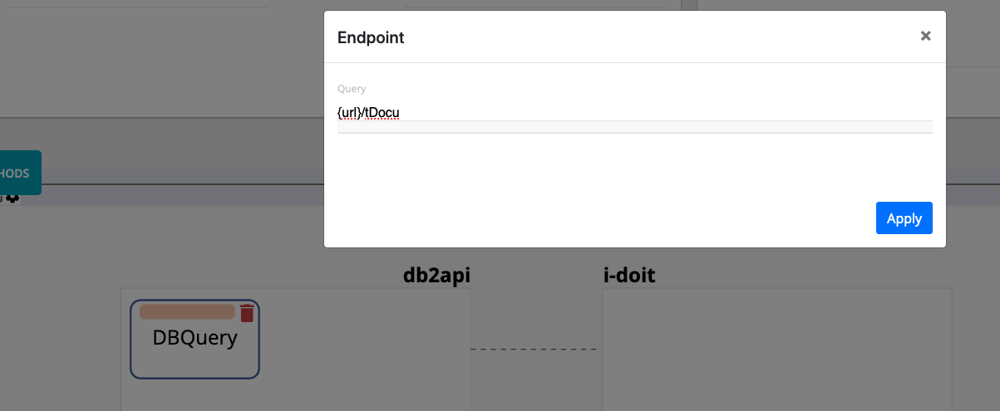
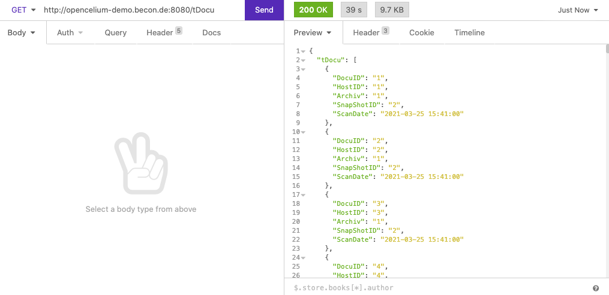

##################
db2api
##################

Installation
"""""""""""""""""

.. code-block:: sh
        :linenos:

        root@shell> cd /opt/services
        root@shell> git clone https://github.com/opencelium/db2api.git

Please refer to the official documentation: https://github.com/opencelium/db2api?tab=readme-ov-file#installation-tested-on-ubuntu-server-24043-lts

Usage
"""""""""""""""""

First of all add a connector to your target database.

|image0|

After that you can use it in a connection. Add a DBQuery process to start a request.

|image1|

Add your database query into the request body.

|image2|

.. note::
        Use a rest client tool to execute the api request. Thus you determine and see how the response will be look like.

|image3|

Please read more about the search options here https://github.com/opencelium/db2api?tab=readme-ov-file#api-endpoints

Supported Databases
"""""""""""""""""
- MICROSOFT
- MYSQL
- POSTGRESQL
- ORACLE
- XERIAL
- MongoDB
- Redis

Read the whole list here https://github.com/opencelium/db2api?tab=readme-ov-file#supported-db-engines

Testing with POSTMAN
"""""""""""""""""

Get here the POSTMAN Collection for testing
https://raw.githubusercontent.com/opencelium/db2api/refs/heads/main/conf/DB2API.postman_collection.json

FAQ
"""""""""""""""""

**SQL Server does not support TLSv1 or TLSv1.0**
Go to folder java/security and in file java.security find option jdk.tls.disabledAlgorithms and delete TLSv1

