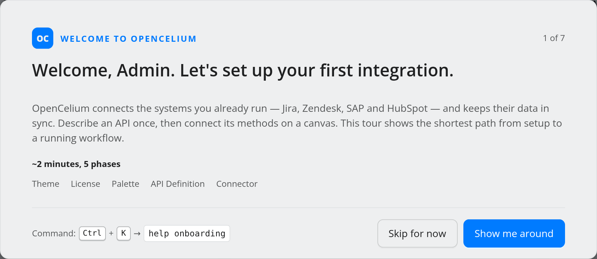
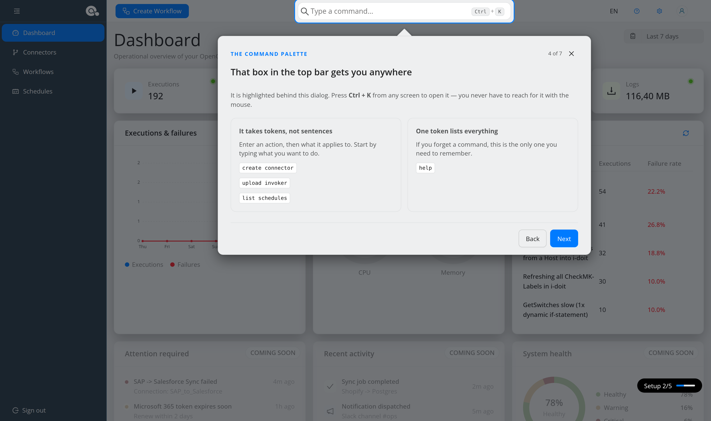
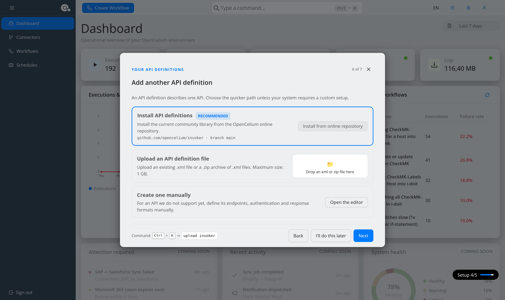
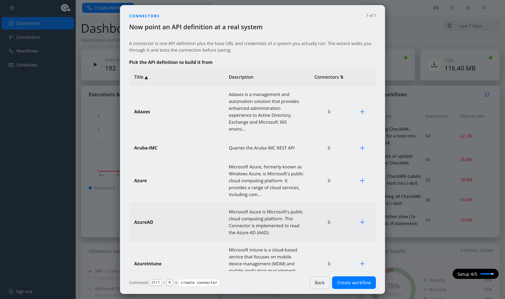
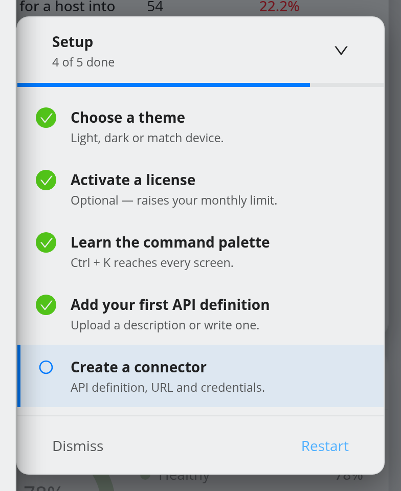
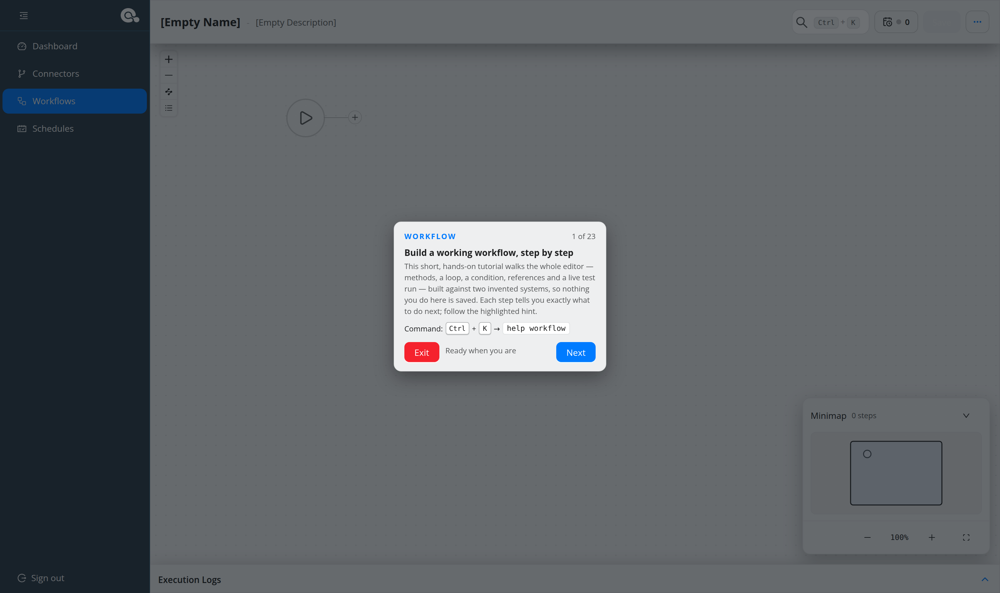
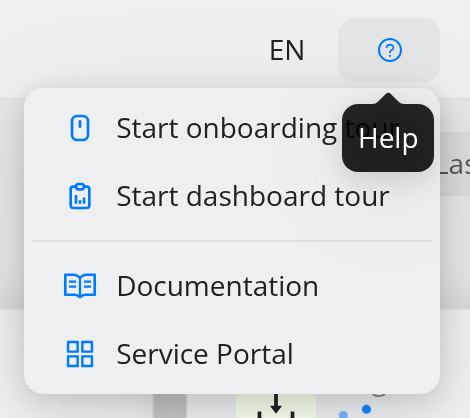

.. _start-guided-tours:

#############################
Guided tours and the tutorial
#############################

.. contents::
   :local:

.. note::
   **New in 5.2.**

OpenCelium 5.2 ships three guided tours for administrators. They run inside the
real application, point at the real controls, and can be restarted at any time.

.. list-table::
   :header-rows: 1
   :widths: 24 40 36

   * - Tour
     - What it covers
     - Start it with
   * - **Onboarding tour**
     - Theme, license, command palette, API definitions, first connector.
     - Starts by itself at the first sign-in; **Help → Start onboarding tour**;
       palette ``help onboarding``.
   * - **Workflow tutorial**
     - Building, debugging and scheduling a complete workflow.
     - The onboarding tour's last button; palette ``help workflow`` in the
       workflow editor.
   * - **Dashboard tour**
     - The top bar and every dashboard widget.
     - **Help → Start dashboard tour**; palette ``help dashboard``.

.. note::
   The tours are shown to users with a role named **admin** (in any letter
   case). Other users neither see them nor the setup checklist.

   Tour progress is stored in the **browser** (local storage), not on the server.
   A new browser, a private window or cleared site data shows the onboarding tour
   again.

The onboarding tour
===================

It starts on the dashboard the first time an administrator opens the
application. **Show me around** begins, **Skip for now** postpones it; the
counter at the top right shows where you are, and ``Enter`` or ``→`` advances
the information steps.

.. list-table::
   :header-rows: 1
   :widths: 6 28 66

   * - #
     - Step
     - What you do
   * - 1
     - Welcome
     - An overview of the five phases.
   * - 2
     - Choose your theme
     - Light, dark, or follow the device. Same as ``ui theme`` in the palette.
   * - 3
     - Your license
     - Shows the free plan's monthly limit and links to the license page. The
       tour pauses there and resumes once a license is activated.
   * - 4
     - The command palette
     - Spotlights the palette; pressing ``Ctrl+K`` advances.
   * - 5
     - How an integration is built
     - API definition → connector → workflow, in that order.
   * - 6
     - Your API definitions
     - Install them from the online repository, upload a file (``.xml`` or
       ``.zip``, up to 1 GB), or open the editor. Skipped if you lack the
       permission to create API definitions.
   * - 7
     - Connectors
     - Pick an API definition and create a connector in a panel docked beside
       the tour. **Create workflow** ends the tour and starts the workflow
       tutorial.

Step 6 offers three ways to get API definitions. On an instance that already has
some, it lists them instead; **Add another API definition** brings up the options.

**Install from online repository** downloads the definitions from
`github.com/opencelium/invoker <https://github.com/opencelium/invoker>`_ (branch
``main``). It needs internet access from the server and online services switched
on — see :ref:`ref-config-online-services`. If either is missing, the button is
disabled and its tooltip says why.

The setup checklist
-------------------

While the tour is open — and after it, until you dismiss it — a **Setup** pill
sits in the bottom-right corner of every page except the workflow editor. It
expands into the checklist of the five milestones: choose a theme, activate a
license (optional), learn the command palette, add an API definition, create a
connector.

From here **Resume** continues a paused tour and **Restart** begins it again.
**Dismiss** hides the checklist for good in this browser; the tour can still be
started from the Help menu.

The workflow tutorial
=====================

The tutorial builds a working integration on the real canvas, step by step: a
customer list, a loop over it, a lookup per customer, a condition, a create call
with two references, then change history, version history, a debug test run, and
a schedule.

It works against two **invented** connectors — *Tutorial CRM* and *Tutorial
Support Desk* — answered by a simulated backend in the browser. Nothing you do in
it is saved: **Save** is hidden, the test run is replayed rather than executed,
and schedules exist only in memory. Notifications and support logs, which need a
real schedule, say so instead of failing.

Most steps advance by themselves once the canvas sees you did what was asked;
those it cannot detect have a **Next** button. The red **Exit** ends the
tutorial at any point and resets the canvas. The pill can be dragged out of the
way by its grip.

Start it again from the workflow editor of a new workflow with ``help workflow``
in the command palette. Reloading the page ends it.

The dashboard tour
==================

Twelve short steps: the top bar first — *Create Workflow*, the command palette,
the language switch, the Help menu, the main/admin menu switch, your profile —
then the dashboard's header, live counters, the executions & failures chart,
resource usage, the busiest workflows and the cards that are not wired up yet.
Steps whose widget you are not permitted to see are left out. Leaving the
dashboard ends the tour.

The Help menu
=============

The **?** icon in the top bar opens the Help menu.

.. list-table::
   :header-rows: 1
   :widths: 30 70

   * - Entry
     - Action
   * - **Start onboarding tour**
     - Goes to the dashboard and restarts the onboarding tour. Administrators
       only.
   * - **Start dashboard tour**
     - Starts the dashboard tour. Administrators only.
   * - **Documentation**
     - Opens this documentation in a new tab.
   * - **Service Portal**
     - Opens the `OpenCelium Service Portal <https://service.opencelium.io>`_
       for subscribers.

The page footer carries the same links as icons — documentation, GitHub, the
OpenCelium website and the Service Portal — next to the version number.
