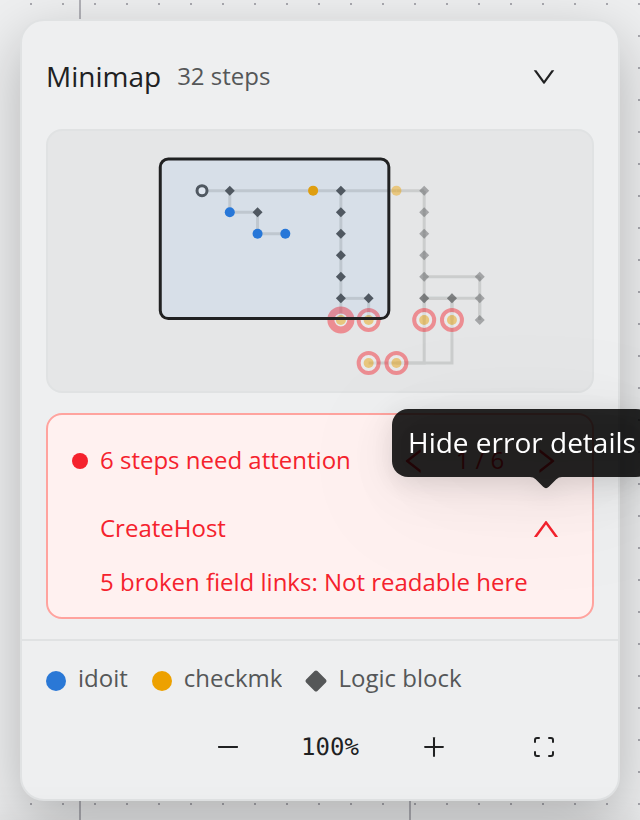
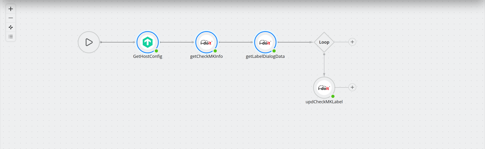

.. _start-whats-new-5-2:

####################
What is new in 5.2
####################

.. contents::
   :local:

5.2 is about finding your way — in the product and in large workflows. A first
login now walks you from an empty instance to a running workflow, the editor shows
which step reads which field, a minimap points at the steps that need attention,
and deleting a step no longer silently throws away the references other steps
held on it.

The workflow model is unchanged from 5.1 and no ``application.yml`` key moved.
From 5.1 the upgrade is a package update, see :doc:`../operations/updating`.
Upgrading from 4.x? Read :doc:`upgrade-to-5` first.

New names in the interface
==========================

5.2 renames several things in the user interface so the words describe what the
user sees rather than how the backend stores it. Nothing is migrated — only the
labels changed — and this documentation uses the new names from 5.2 on.

.. list-table::
   :header-rows: 1
   :widths: 30 30 40

   * - Up to 5.1
     - From 5.2
     - Where you see it
   * - Invoker
     - **API definition**
     - Admin menu **API Definitions**, connector wizard, onboarding tour.
   * - Joint
     - **Jump**
     - Node toolbar *Add jump* / *Remove jump*.
   * - Enhancement
     - **Transformation**
     - Body editor, field link drawer.
   * - Field binding
     - **Field link**
     - The field links lens on the canvas.
   * - Operator (IF / LOOP)
     - **Logic block**
     - *Add Logic Block* in the step drawer, minimap legend.
   * - Groups
     - **Roles**
     - Admin menu **Users & Access → Roles**.
   * - Configure Aggregator
     - **Assign Data Aggregator…**
     - Node context menu.
   * - Connection test
     - **Connector test**
     - Connector wizard, status dot on connector nodes.
   * - Login
     - **Sign in**
     - Sign-in page, *Sign out* in the sidebar.

.. note::
   The **command palette tokens did not change**. You still type
   ``upload invoker`` or ``download invoker by name i-doit``; only the
   descriptions next to them say *API definition*. The REST API and the files on
   disk keep the old names as well (``/invoker``, ``src/backend/.../invoker``).

Onboarding tour and workflow tutorial
=====================================

The first time an administrator signs in, a short tour sets up the instance:
theme, license, the command palette, API definitions and a first connector. Its
last button opens the editor and starts a hands-on **workflow tutorial**, which
builds a complete workflow — loop, condition, references, a debug test run and a
schedule — against two invented systems, so nothing is saved.

.. image:: ../img/start/OC5_onboarding-welcome-card.png
   :align: center
   :width: 640

A **Setup** checklist in the bottom-right corner keeps track of what is still
open, and the new **Help** menu in the top bar restarts the tours. A separate
**dashboard tour** explains the top bar and the dashboard widgets.

See :doc:`guided-tours`.

API definitions from the online repository
==========================================

API definitions can be installed straight from the public OpenCelium repository
on GitHub (`opencelium/invoker <https://github.com/opencelium/invoker>`_) — from
the onboarding tour, or with the palette command ``install online-invokers``.
Existing files are updated, new ones added, and definitions you only have locally
are left alone.

This, the Service Portal, the license activation, Gravatar pictures and the online
Update Assistant are gated by one switch, ``opencelium.online-services.active``.
See :ref:`ref-config-online-services`.

Field links: who reads what
===========================

Two new buttons in the canvas controls answer the question *where does this
field get its value from, and who depends on this response?*

* The **field links lens** draws an arc from every step that provides a value to
  every step that reads it — blue for a direct reference, dotted orange where a
  transformation script sits in between, dashed red where the link is broken.
* The **field links list** shows the same as a searchable table, broken links on
  top.

Clicking a link opens it in a drawer, where the transformation script can be edited
or a direct reference turned into a transformation.

.. image:: ../img/workflow/OC5_field-links-lens.png
   :align: center
   :width: 1000

See :doc:`../guides/trace-field-links`.

Deleting a step keeps its references
====================================

Deleting a step that other steps read from used to clear every one of those
references. The delete confirmation now lists them and lets you **re-point** them
at another method — for the whole method at once, or field by field, including the
conditions of IF and LOOP blocks. What you leave alone is cleared, and a
notification afterwards offers **Undo**.

.. image:: ../img/workflow/OC5_delete-remap.png
   :align: center
   :width: 1000

See :ref:`guide-delete-remap`.

Minimap with an attention pager
===============================

The bottom-right corner of the canvas shows a **minimap** of the whole workflow,
coloured by connector. Steps with a problem — a rejected save, a failed test run,
a failing connector test, a broken field link or an unconfigured logic block — get
a red ring, and a pager steps through them one by one.

See :ref:`guide-minimap`.

Select, copy and move several steps
===================================

* ``Shift`` + drag draws a selection box, ``Ctrl`` + click adds or removes single
  steps. Selecting an IF or LOOP block selects everything inside it.
* Dragging moves the whole selection; ``Ctrl`` + drag copies it.
* ``Ctrl+C`` / ``Ctrl+V`` copy and paste the selection, ``Ctrl+D`` duplicates a
  step, ``Delete`` removes the whole selection after one confirmation.
* References between copied steps are re-pointed to the copies.
* ``Ctrl+F`` searches the workflow.

See :ref:`guide-select-copy` and :doc:`../reference/shortcuts`.

Edit a workflow as JSON
=======================

**Header menu → Edit as JSON** shows the whole workflow as JSON, as a tree or as
raw text, validates it as you type, and replaces the workflow on **Apply**.
**Force Apply** exists for the cases the validator cannot judge.

See :doc:`../guides/edit-as-json`.

Smaller editor improvements
===========================

* **Use Another Connector** in a node's context menu moves a step to another
  connector of the same API definition — from staging to production, say —
  without rebuilding it.
* **Change Connector Image** sets a connector's logo straight from the canvas.
* The **IF condition** dialog reorders conditions and groups by drag and drop.
* A failing connector's status dot **pulses**; hovering it shows a pencil that
  opens the connector wizard on the *Credentials* step.
* *Add jump* is disabled, with an explanation, when no step can be the target; a
  bar at the top of the canvas explains target picking and offers *Cancel*.
* A transformation's computed value is shown only while a debug run is paused.

Duplicate workflows and connectors
==================================

The workflow list's **Duplicate** icon copies a workflow in one click, names it
``<title> (copy)`` and opens it in the editor. The connector list has the same
icon; it opens the connector wizard pre-filled from the original, so credentials
can be adjusted before saving.

Profile pictures and role icons
===============================

Users and roles can carry a picture, cropped round in a shared image editor.
When an e-mail address has a `Gravatar <https://gravatar.com>`_, the user form
offers it as the profile picture. All uploads now check type and size up front;
see :ref:`ref-upload-limits`.

And the rest
============

The license page locks usage and execution statistics without an active
subscription, the wizards carry new illustrations, the footer links to the
documentation, GitHub, the website and the Service Portal, and many fixes —
among them legacy IF conditions after an upgrade from 4.8, double quotes in
request URLs and connector credentials that were stored decrypted. The complete
list is in the `changelog
<https://github.com/opencelium/opencelium/blob/prod/CHANGELOG.rst>`_.

Where to go next
================

* :doc:`guided-tours` — onboarding tour, workflow tutorial, dashboard tour.
* :doc:`../guides/trace-field-links` — the field links lens and list.
* :doc:`../guides/build-a-workflow` — minimap, multi-select, context menu.
* :doc:`../guides/edit-as-json` — the JSON editor.
* :doc:`../operations/updating` — how to install the update.
