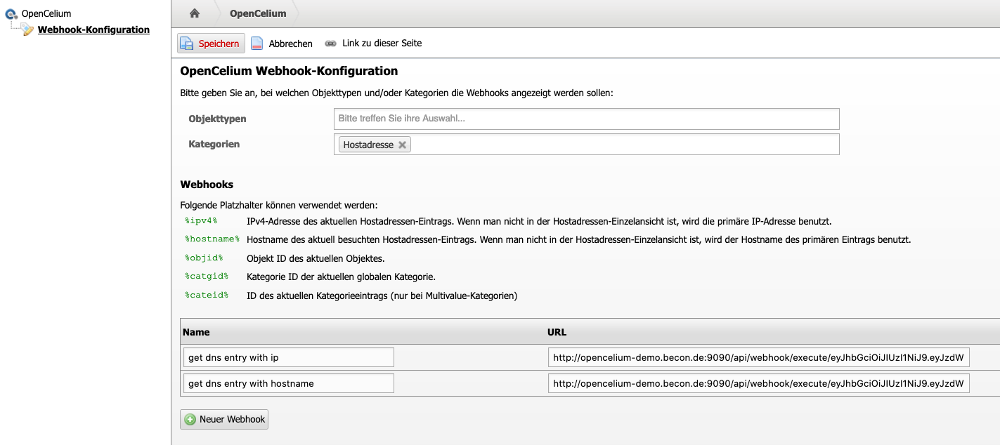
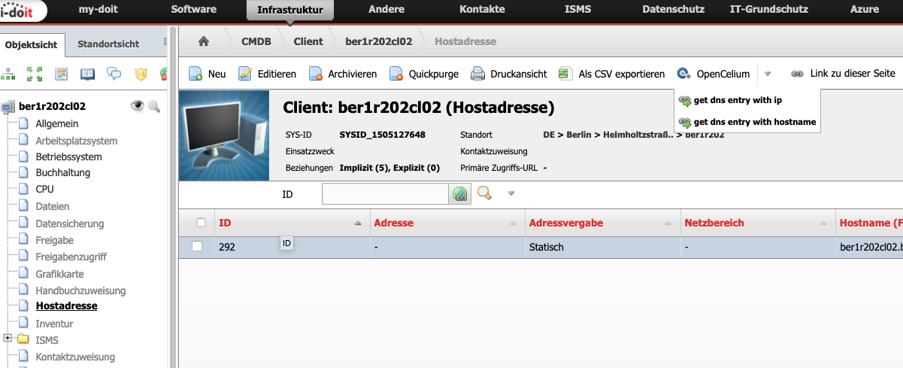

##################
i-doit
##################

OpenCelium addon
"""""""""""""""""

The opencelium addon for i-doit provides functionalities to manage opencelium webhooks inside of config items or categories.

Follow the steps of the i-doit documentation to install the addon. 

	https://kb.i-doit.com/display/de/Add-ons#Add-ons-Installation

Configure all webhooks.

|image0|

Use them in their context.

|image1|

