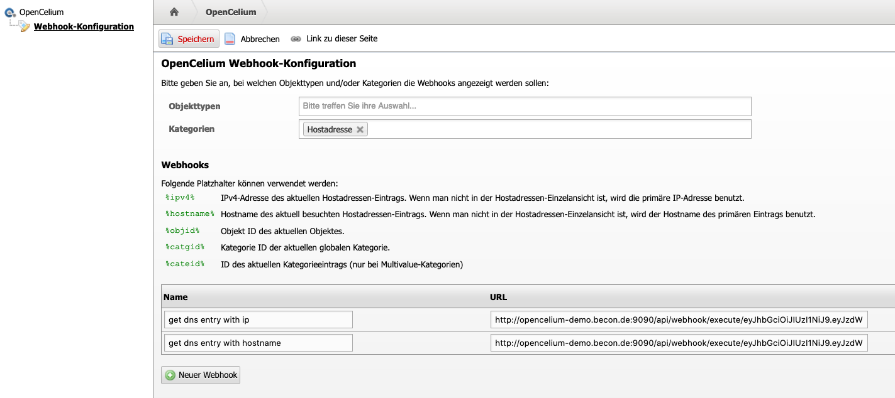
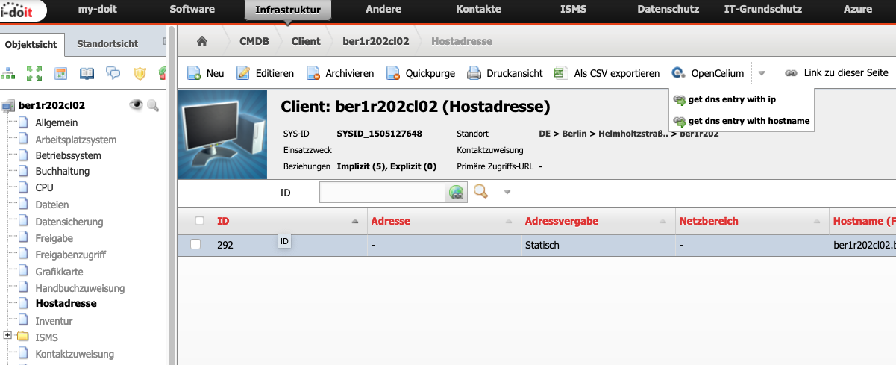
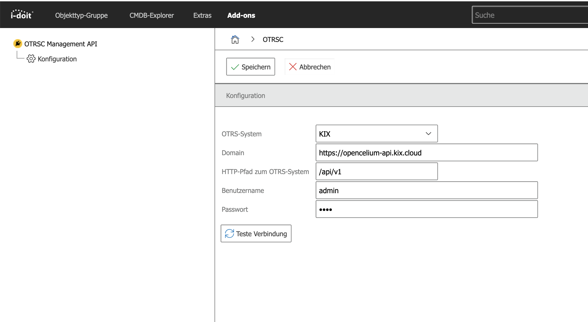
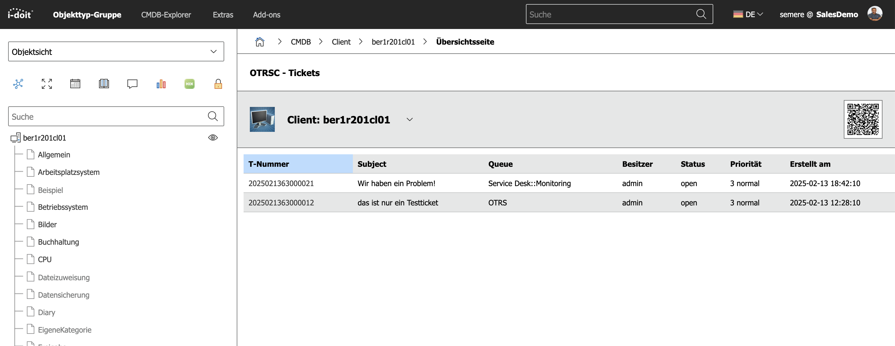

##################
i-doit
##################

OpenCelium addon
"""""""""""""""""

The opencelium addon for i-doit provides functionalities to manage opencelium webhooks inside of config items or categories.

Follow the steps of the i-doit documentation to install the addon. 

	https://kb.i-doit.com/display/de/Add-ons#Add-ons-Installation

Configure all webhooks.

|image0|

Use them in their context.

|image1|

OTRSC addon
"""""""""""""""""

With this new function, OTRS, Znuny, OTOBO or KIX tickets from the system can be displayed directly within a config item in i-doit.

Follow the steps of the i-doit documentation to install the addon. 

	https://kb.i-doit.com/display/de/Add-ons#Add-ons-Installation

**How to use?**

1. Synchronize the config items from i-doit to KIX with our predefined templates from the opencelium service portal. 
   Read here more about this https://www.opencelium.io/kix-und-idoit-mit-opencelium-verbinden/

2. Configure the ticketsystem in i-doit

|image3|

3. See the assigements of tickets to a config item

|image4|

