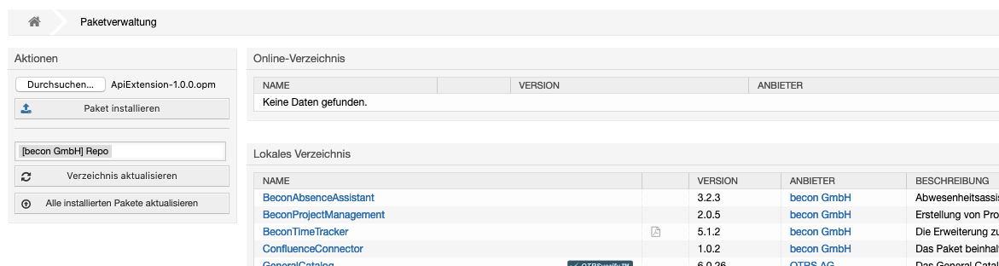
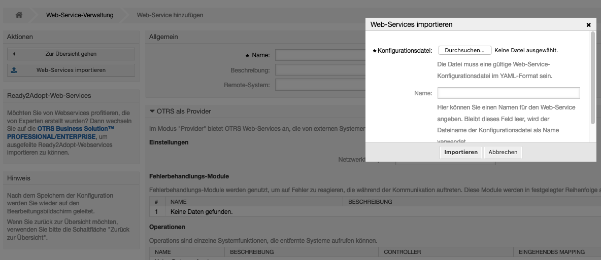
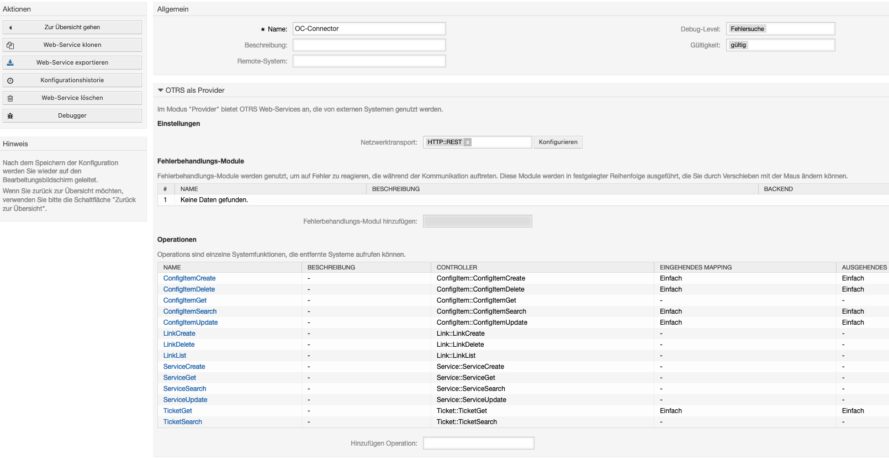

##################
OTRS
##################

ApiExtension package
"""""""""""""""""

The ApiExtension is an otrs package. Its extends the system's API functions.

See below the new operations

- Link::LinkCreate
- Link::LinkDelete
- Link::LinkList
- Service::ServiceCreate
- Service::ServiceGet
- Service::ServiceSearch
- Service::ServiceUpdate

.. note::
	Package is compatible with otrs forks like znuny and otobo. 

|image0|

OC-Connector configuration file
"""""""""""""""""

The configuration file (yml) is predefined a webservice in otrs. Its possible to add this via the otrs frontend.

First go to admin->webservice and click add, to create a new webservice.

|image1|

Now upload the yaml file.

|image2|

After that, it will open a predefined configuration. Just click on add, to save it.

|image3|

.. |image1| image:: ../img/tools/otrsconfig1.png
   :align: middle

