##################
Admin Panel
##################

The admin panel can be accessed via the gear symbol or the “Admin”
menu item in the left-hand navigation. If the menu is expanded, you
also have direct access to the most important tools. Clicking on the
three dots at the bottom of the list opens the admin panel with all
the tools.

|image_user_0|

Admin Panel includes necessary tools for working with OpenCelium.
There are:

   * Users
   * Groups
   * LDAP check
   * Support Files
   * Licence Management
   * Invokers
   * Templates
   * Data Aggregator
   * Notification Templates
   * Update Assistant
   * External Applications
   * Migration
   * Categories

Users
"""""""""""""""""

The “Users” panel contains all users who have access to OpenCelium and
shows all the necessary details and authorizations. The list shows the
user's e-mail address and group. Two-factor authentication can also be
activated for each user. The functions for viewing, editing and deleting
a user are available on the right-hand side of each list entry. Please
note that the currently logged in user cannot be deleted.

|image_user_1|

Clicking on a list entry opens the detailed view of the respective user
in edit mode, which consists of three categories:

   * User Details
   * Credentials
   * User Group

The user details contain all important information about a user, such as
title, name, surname, department, organization and phone number. The user
image is only shown if the user has uploaded an image. Otherwise a place holder
is shown instead.

|image_user_2|

The credentials consist of the user's e-mail address and the password 
fields for setting a password. All three fields are mandatory. If a password
is set, it must be between 8 and 64 characters long. The e-mail address
must be valid and a maximum of 255 characters long.

|image_user_3|

The User Group is showing the group the user belongs to. Meaning of the
user group you can find in the chapter *Groups*.

|image_user_4|

To add a new user, click on the “Add user” button in the user panel. 

|image_user_5|

An empty input mask opens in which all details must be entered. All fields
marked with an asterisk (*) are mandatory. The e-mail address must be valid
and must not be longer than 255 characters. The password must be between
8 and 64 characters long. 

|image_user_6|

Once all details are complete, the user can be added by clicking the “Add” button.

|image_user_7|

Groups
"""""""""""""""""

The “Group” panel contains all groups created in OpenCelium. A group or
user group is a group of users with certain authorizations. The list view
shows the name of a group, a description and the assigned components for
which the respective group is authorized.Group or User Group is a set of
users with defined permissions. The functions for viewing and deleting
a group are available on the right-hand side of each list entry.

|image_group_1|

Clicking on a list entry opens the detailed view of the respective group
in view mode, which consists of three categories:

   * Group Details
   * Components
   * Permissions

The group details contain name of the group and a brief description.

|image_group_2|

The category with the components shows the different components which have
been assigned to this group.

|image_group_3|

The category with the permissions shows the different permissions per component
a user within this group has. A distinction is made between Create, Read, Write
and Delete. A plus sign (+) means that the rights for the respective component
are available, whereas a minus sign (-) indicates that the rights for the component
have not been assigned.

|image_group_4|

To add a new group, click on the “Add Group" button in the group panel. 

|image_group_5|

An empty input mask opens in which all details must be entered. All fields
marked with an asterisk (*) are mandatory. Creating a new groups consists of three
parts: group details, components and permissions.

Please enter a *name* and a *description* for the new group. Additionally, you can upload
an *icon* for the new group too. The *name* is a mandatory field.

|image_group_6|

Next, you have to select the components which you want to assign to this new group. Open
the drop down list and select the desired components. In total there are the following
components available:

   * App
   * Connection
   * Connector
   * Dashboard
   * Invoker
   * Myprofile
   * Schedule
   * User
   * Usergroup

|image_group_7|

Every selected component will be listed in a row. Clicking on the "X" removes the
component again.

|image_group_8|

The section with the permissions shows a table of the permissions related to the previously
selected components. You have to set the permission for at least one component to get the
new group created. Please tick the checkboxes in order to define what a user is allowed to do
with the respective component (create, read, update, or delete). The column admin just checks all
permissions for the corresponding row.

|image_group_9|

Once all details are complete, the group can be added by clicking the “Add” button.

|image_group_10|

External Applications
"""""""""""""""""

The applications menu displays a list of software that OpenCelium connected with.
If they are installed and configured on your machine,
you can open them clicking on the card and see relations to OC. If not,
you will see the notification message, that this system is down. Also,
the corresponded item shows its status: enabled or disabled.

|image_admin_0|

For this moment, there are two items: *MongoDB* and *MariaDB*. "MongoDB" collects all required
information about connections. *MariaDB* stores the rest data of OpenCelium, like users, groups,
schedules etc.

Invokers
"""""""""""""""""

Invoker is a special configuration file to work with APIs. There you describe the authentication
part and calls that should be used in *Connection*.

|image_admin_2|

For subscribers there is also a possibility to add and to update actions. 
:ref:`Here <management-invoker>`, you can read how to manage with them.

Templates
"""""""""""""""""

These are business templates. In other words, they are connections that are saved as templates for
often use. :ref:`Here <management-business_template>`, you can read how to manage with them.

.. _admin_panel-data_aggregator:

Data Aggregator
"""""""""""""""""

Data Aggregator is a feature that provides a possibility to notify a user after the
triggered connection (this happens in *Schedules*). :ref:`Here <management-data_aggregator>`, you can read how to manage with them.

Notification Templates
"""""""""""""""""

Notification Templates are templates that are used in scheduler jobs to notify users for three event
types: *pre*, *post*, and *alert*.  :ref:`Here <management-notification_template>`, you can read how to manage with them.

.. _admin_panel-update_assistant:

Update Assistant
"""""""""""""""""

The *Update Assistant* helps you to update OpenCelium to newer version. If the system recognizes
a new version in the package cloud, it shows the message that it is available. The update process
consists of several steps, let's consider them.

The *System Check* tests your machine if everything set up. Also it notifies you to make a backup of the
system before update.

|image_update_assistant_0|

| The *Update Assistant* provides two options: 
| * **Online:** get the new versions via package cloud 
| * **Offline:** download the version and upload it offline

|image_update_assistant_1|

After choosing the right version click on the *Update OC* to finish the procedure. If you want to see logs, please
read the  :ref:`Logging <getting_started-administration-logging>` paragraph.

.. _admin_panel-migration:

Migration from 3.x to 4.x
"""""""""""""""""
Since version 4.0, OpenCelium uses MongoDB to store your connection data.
The *Migration* tool helps you to migrate your data from Neo4j to MongoDB,
in case of updating from an old OpenCelium version to 4.x.
The migration has to be done as last step after updating OpenCelium application.

Enter predefined Neo4j Url, User and Password.
See old application.yml (in your backup directory).
Click on *Migrate* to start data migration.

|image_migration_0|

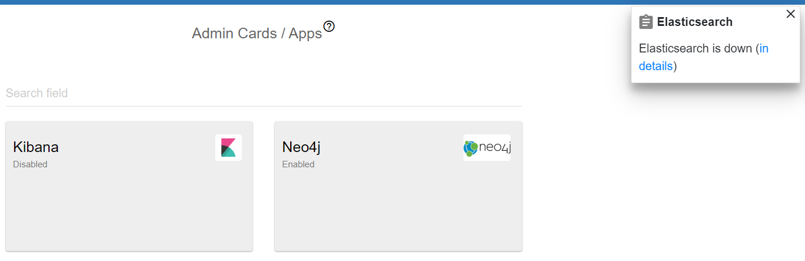
.. |image_admin_2| image:: ../img/admin/2.png
   :align: middle

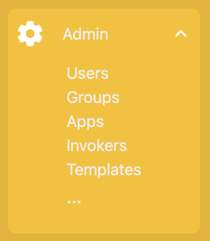
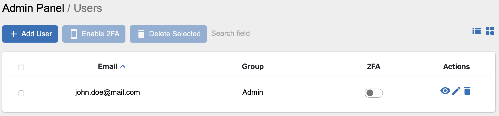
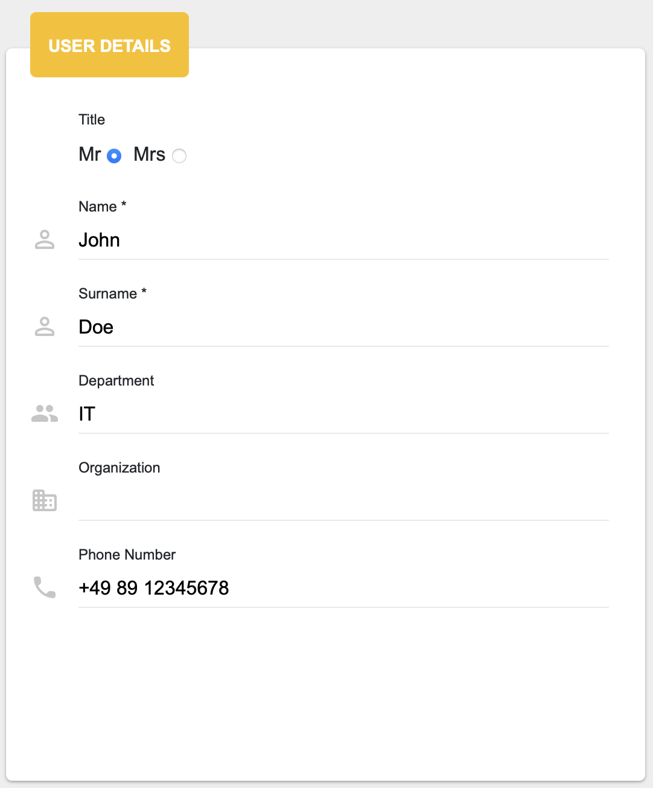
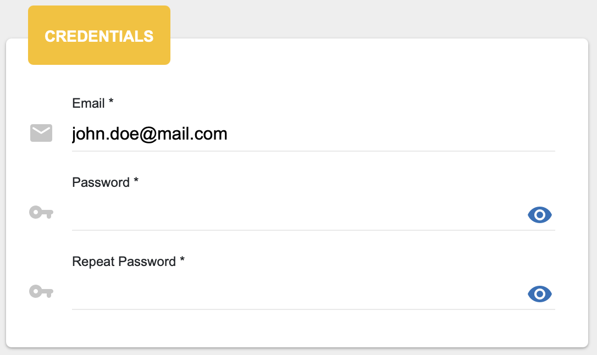
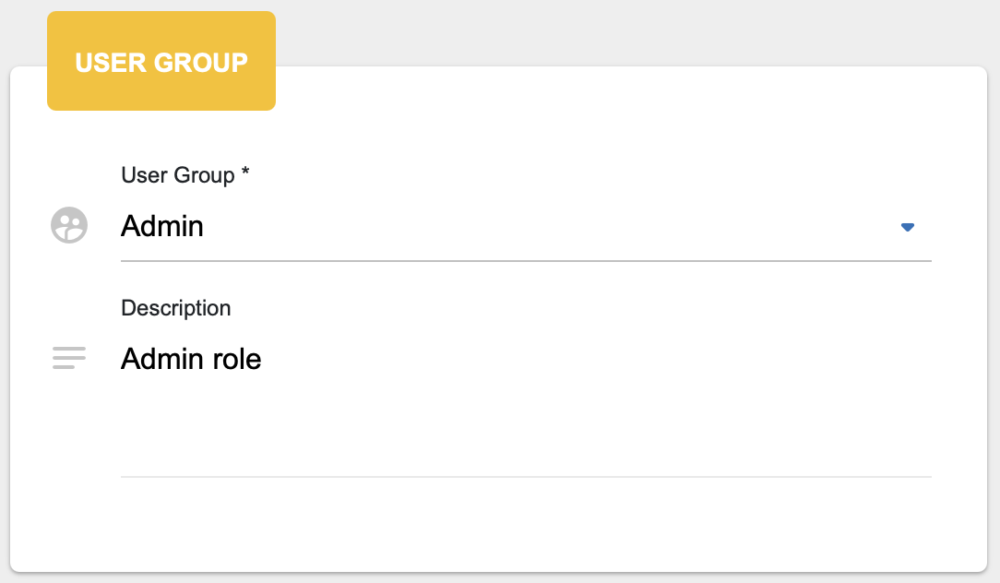

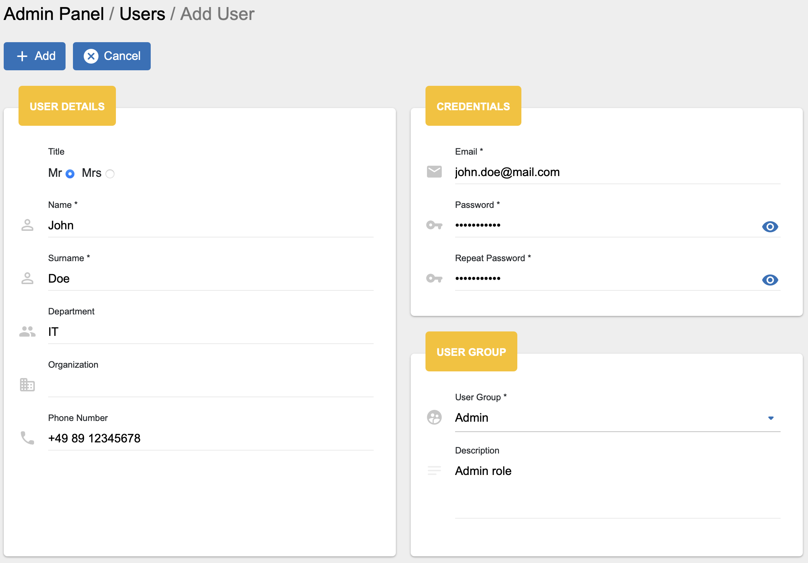

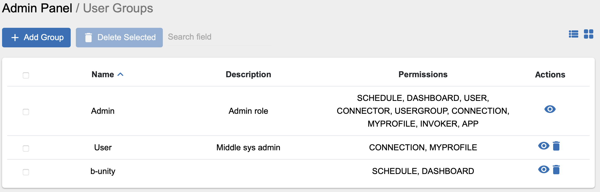
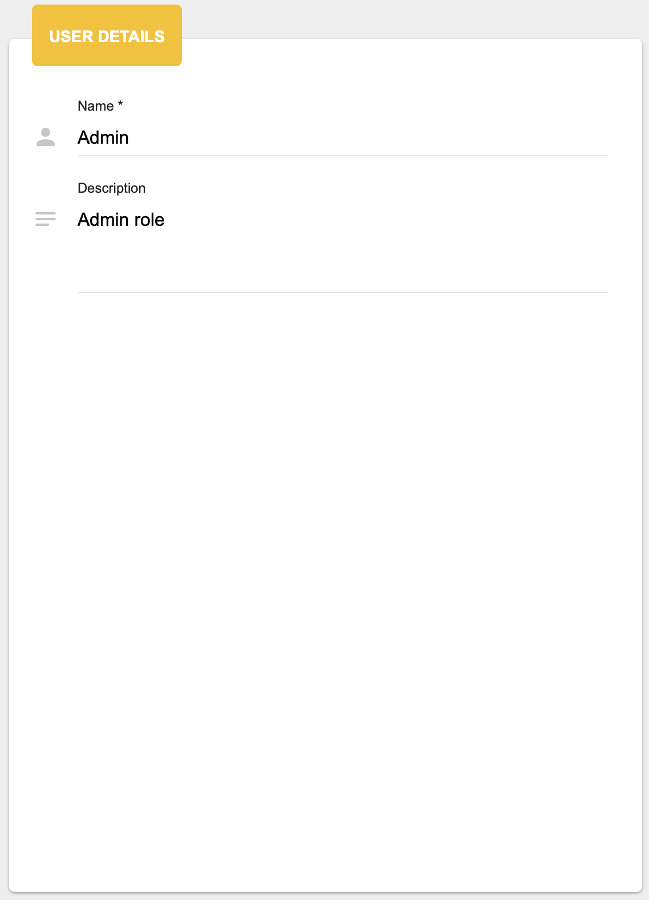
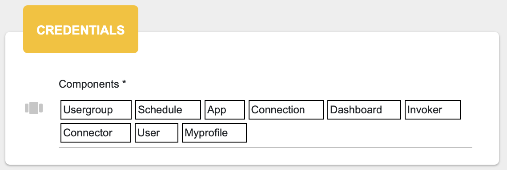
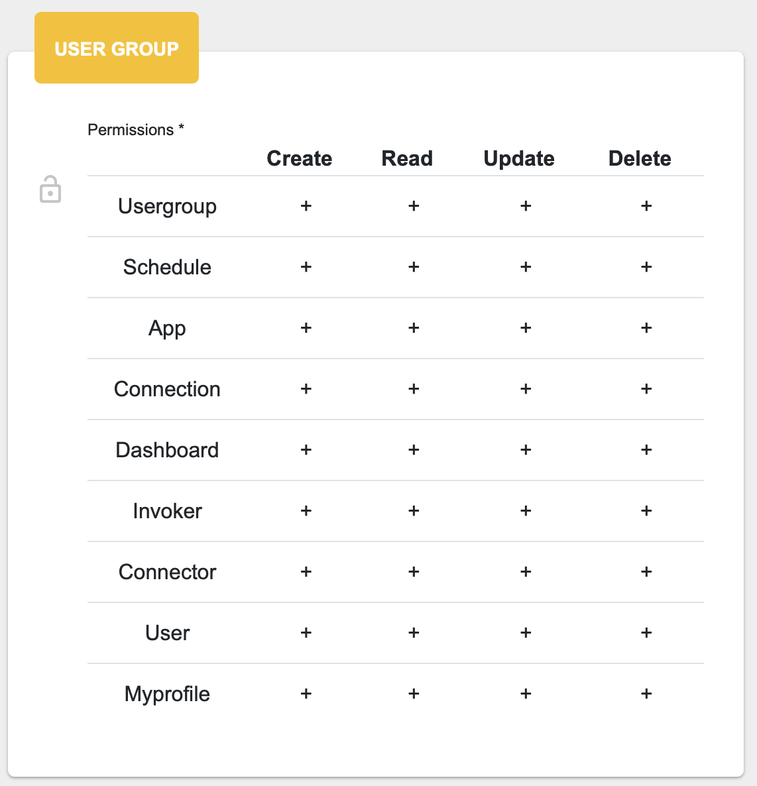
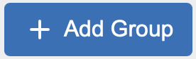
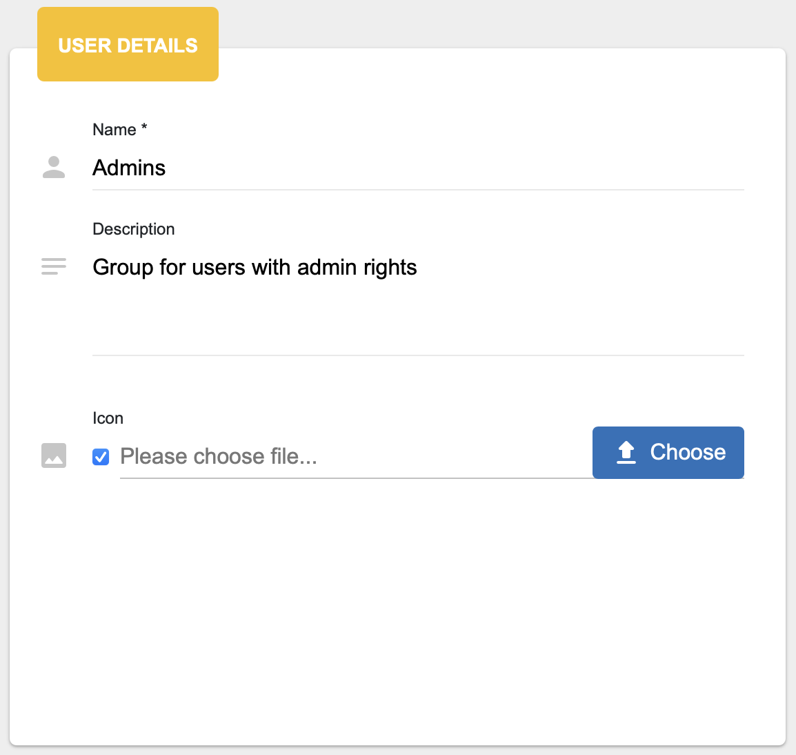
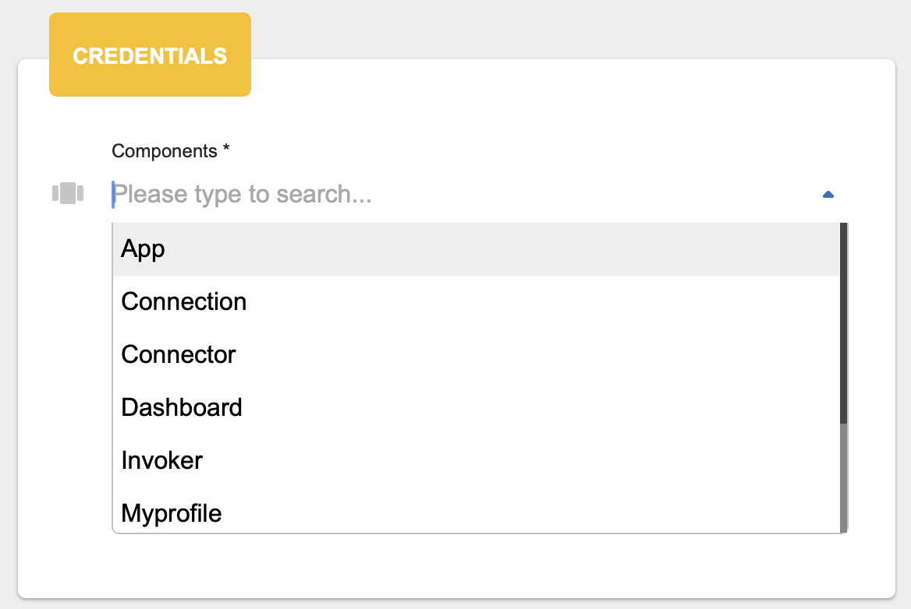
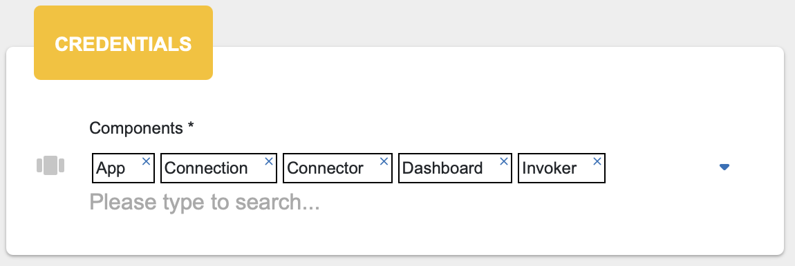
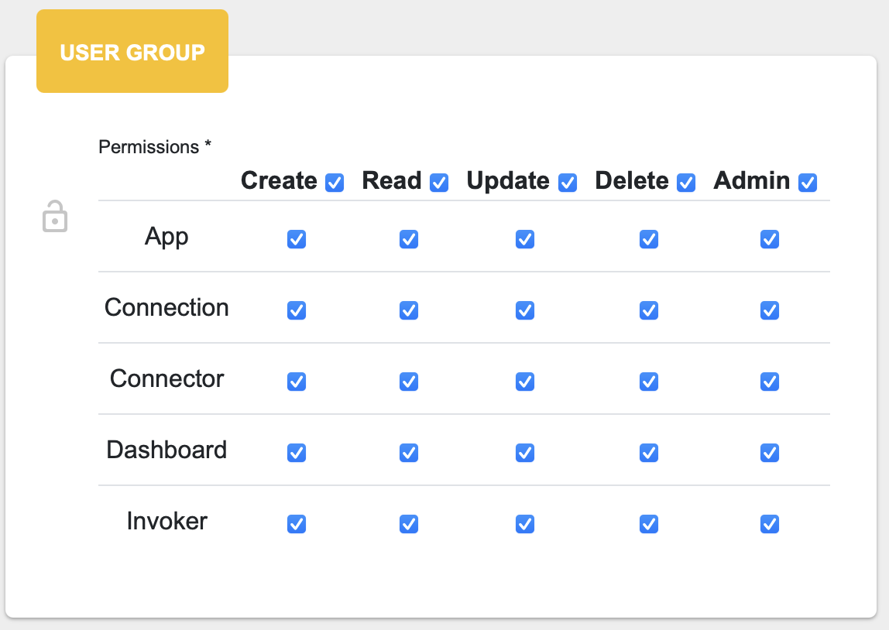
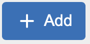

.. |image_update_assistant_0| image:: ../img/update_assistant/0.png
   :align: middle
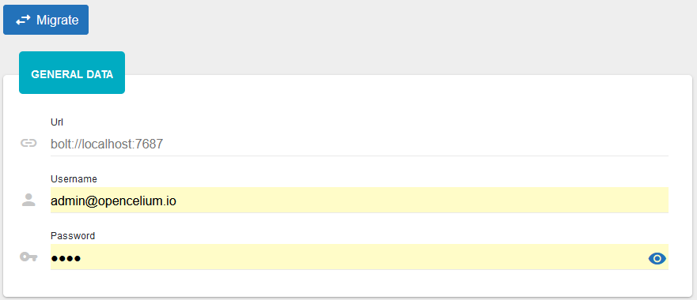
   
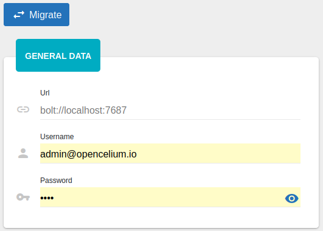
   
