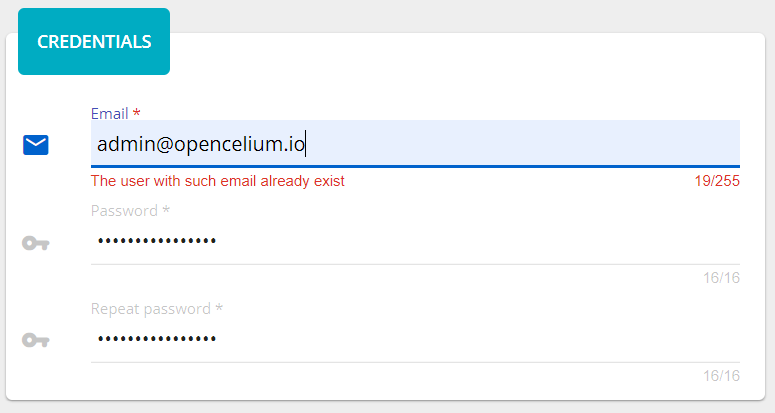

##################
Admin Panel
##################

Admin Panel includes necessary tools for working with OpenCelium.
There are: App, Users, Groups, Invokers, Templates, Notification
Templates, Update Assistant, Converter.

App
"""""""""""""""""

The applications menu displays a list of software that OpenCelium connected with.
If they are installed and configured on your machine,
you can open them clicking on the card and see relations to OC. If not,
you will see the notification message, that this system is down. Also,
the corresponded item shows its status: enabled or disabled.

|image_admin_0|

For this moment, there are two items: *Kibana* and *Neo4j*. *Kibana* lets you visualize
your scheduler jobs data. *Neo4j* is a graph database of the connections. Its UI helps
you to see the whole picture of each connection via nodes and their relations.

Users
"""""""""""""""""

Users represent directly clients of the application. List of users
shows all users of the system including the authorized user.
Each element in the grid view displays a first and a second name of
the user and his email. The list view has an email and an assigned group.
The current user logically cannot be deleted.

|image_user_0|

Going into view of the user you see more details: phone number,
department, organization, salutation, avatar, last time of the login and
the group information to which the user belongs. If the user did not
upload his avatar you will see the default image.

|image_user_1|

Adding/Updating user consists of three steps: credentials, user details
and user group. Credential step has three input fields: *email*,
*password* and *repeat password*.

|image_user_2|

The are all required fields. The *email* must be valid and the length
not more than 255 characters. Moreover, it is also a unique field in the
application.

|image_user_3|

The *password*\ ’s and *repeat password*\ ’s fields length must be
between 8 and 16 symbols. The last one should have the same value as the
*password* field.
User Details step has next fields: *name, surname, phone number,
organization, department, salutation, avatar.* *Name* and *surname* are
required fields.

|image_user_4|

User Group step has only one select field - *user group* and a readonly textarea
with a description to selected item. Meaning of the user group you can
find in the chapter *Groups*.

|image_user_5|

Groups
"""""""""""""""""

Group or User Group is a set of users with defined permissions. The grid
view displays names of groups, whereas the list view has more information,
like: description and components.

|image_group_0|

Opening view of the group you will see the description and a table of
permissions to the corresponding component.

|image_group_1|

Adding/Updating group consists of three steps: general data, components
and permissions. General data step has three input fields: *name*,
*description* and *icon*. The *name* is a required field.

|image_group_2|

Components step has one required multiselect field - *components*. There
are 9 components in total: My Profile, User, User Group, Connector,
Connection, Schedule, Dashboard, App, Invoker. You can select several values
clicking on the items and undo clicking on the **x**.

|image_group_3|

The last permissions step has a table of permissions related to
components that were chosen. It is required, so you should check at
least one permission. You check what user can do with a component:
create, read, update, or delete. The admin column just checks all
permissions for the corresponding row.

|image_group_4|

Invokers
"""""""""""""""""

Invoker is a special configuration file to work with APIs. There you describe the authentication
part and calls that should be used in *Connection*.

|image_admin_2|

For subscribers there is also a possibility to add and to update actions. `Here
<https://docs.opencelium.io/en/dev/management/invoker.html>`_, you can read more
information.

Templates
"""""""""""""""""

These are business templates. In other words, they are connections that are saved as templates for
often use. `Here
<https://docs.opencelium.io/en/dev/management/template.html>`_, you can read how to manage with them.

Notification Templates
"""""""""""""""""

Notification Templates are templates that are used in scheduler jobs to notify users for three event
types: *pre*, *post*, and *alert*. `Here
<https://docs.opencelium.io/en/dev/management/notification_template.html>`_, you can read how to manage with them.

Data Aggregator
"""""""""""""""""

Data Aggregator is a feature that provides a possibility to notify a user after the
triggered connection (this happens in *Schedules*). `Here
<https://docs.opencelium.io/en/dev/management/aggregator.html>`_, you can read how to manage with them.

Update Assistant
"""""""""""""""""

The *Available Updates* tool helps you to update OpenCelium to newer version. If the system recognizes
a new version in the git repository, it shows the message that it is available. The update process
consists of several steps, let's consider them.

The *System Check* tests your machine if everything set up. Also it notifies you to make a backup of the
system before update.

|image_update_assistant_0|

The *Update Assistant* provides you two options of the source: *Online* and *Offline*. The *Online*
gets versions from the git and in *Offline* you can upload a *zip* file with OpenCelium version.

|image_update_assistant_1|

The *Template-Update* helps you to update connection templates files and use them in a new version. After
updating you will be available to continue the process.

|image_update_assistant_2|

The *Invoker-Update* helps you to update invokers files and use them in a new version. After
updating you will be available to continue the process.

|image_update_assistant_3|

The *Connection-Migration* helps you to update connections itself and use them in a new version. After
updating you will be available to finish the process.

|image_update_assistant_4|

After all adjustments click on the *Update OC* to finish the procedure. If you want to see logs, please
read the `Administration
<https://docs.opencelium.io/en/dev/gettinginvolved/administration.html>`_ paragraph.

.. |image_admin_0| image:: ../img/admin/0.png
   :align: middle

.. |image_user_0| image:: ../img/user/image1.png
   :align: middle
.. |image_user_1| image:: ../img/user/image2.png
   :align: middle
.. |image_user_2| image:: ../img/user/image3.png
   :align: middle

.. |image_user_4| image:: ../img/user/image5.png
   :align: middle
.. |image_user_5| image:: ../img/user/image6.png
   :align: middle

.. |image_group_0| image:: ../img/group/image1.png
   :align: middle
.. |image_group_1| image:: ../img/group/image2.png
   :align: middle
.. |image_group_2| image:: ../img/group/image3.png
   :align: middle
.. |image_group_3| image:: ../img/group/image4.png
   :align: middle
.. |image_group_4| image:: ../img/group/image5.png
   :align: middle

.. |image_update_assistant_0| image:: ../img/update_assistant/0.png
   :align: middle

.. |image_update_assistant_2| image:: ../img/update_assistant/2.png
   :align: middle
.. |image_update_assistant_3| image:: ../img/update_assistant/3.png
   :align: middle
.. |image_update_assistant_4| image:: ../img/update_assistant/4.png
   :align: middle
.. |image_update_assistant_5| image:: ../img/update_assistant/5.png
   :align: middle