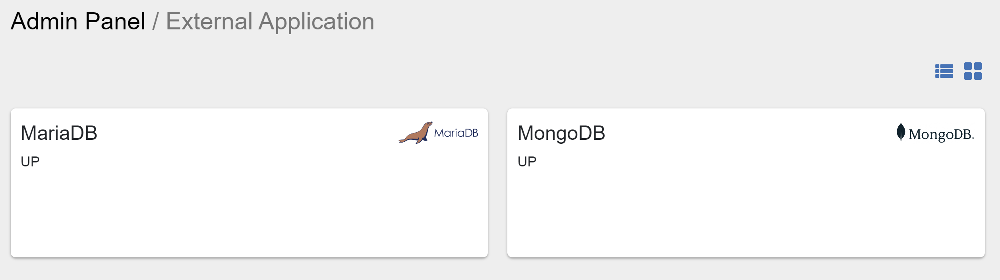
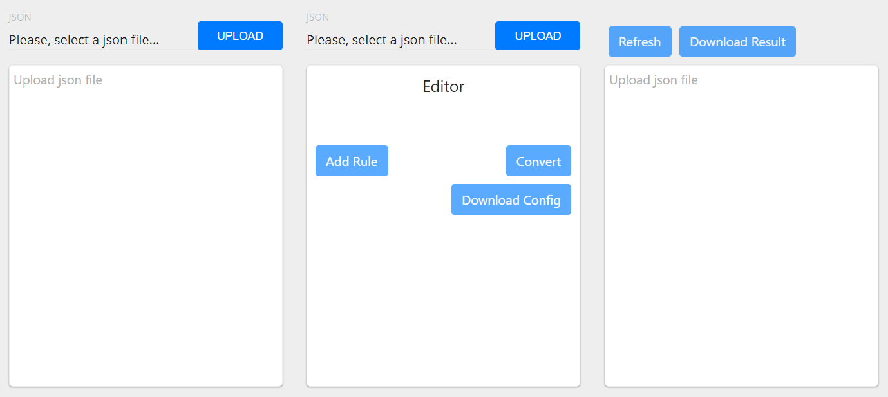

##################
Admin Panel
##################

Admin Panel includes necessary tools for working with OpenCelium.
Let us consider them.

App
"""""""""""""""""

The applications menu displays list of software that OpenCelium connected with.
If the are installed and configured on your machine,
you can open them clicking on the card and see relations to OC. If not installed,
you will see the notification message, that this system is down. Also,
the corresponded item shows its status: enabled or disabled.

|image0|

For this moment, there are two items: *Kibana* and *Neo4j*. *Kibana* lets you visualize
your scheduler jobs data. *Neo4j* is a graph database of the connections. Its UI help
you to see the whole picture of each connection via nodes and their relations.

Converter
"""""""""""""""""

The Converter is a tool for easier modification of *json*-data.

|image1|

There are 5 rules, that you should know:
*replace value* (replace old value of the property with a new one),
*remove param* (remove param from an object), *add param after selected* (add a new param),
*move to* (move value from one property to another). Moreover, if data that are selected for
the rule resides in the array, then this rule will be applied for each item (only for one level
of loop). Due to saving of rules, you can apply them whenever you need using upload button.
Clicking on the *Download Result* you will get the converted *json*-file.
This tool is good to use for template, as they are have json type.

Invokers
"""""""""""""""""

Invoker is a special configuration file to work with APIs. There you describe the authentication
part and calls that should be used in *Connection*.

|image2|

For subscribers there is also a possibility to add and to update actions. `Here
<https://docs.opencelium.io/en/prod/usecases/manage_invokers.html>`_, you can read more
information.

Notification Templates
"""""""""""""""""

Notification Templates are templates that are used in scheduler jobs to notify users for three event
types: *pre*, *post*, and *alert*. `Here
<https://docs.opencelium.io/en/prod/usecases/manage_notification_templates.html>`_, you can read how to manage with them.

Templates
"""""""""""""""""

These are business templates. In other words, they are connections that are saved as templates for
often use. `Here
<https://docs.opencelium.io/en/prod/usecases/manage_templates.html>`_, you can read how to manage with them.

.. |image2| image:: ../img/admin/2.png
   :align: middle
