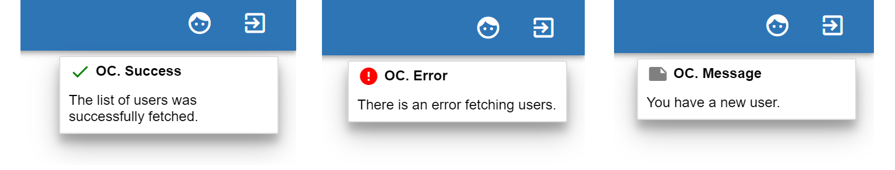

##################
Application Management
##################

The OC Application tries to keep consistency in all her parts. It means
to save persistence in the User Interface, so user does not need to get
used again and again. With each entity a man can do CRUD operations:
Create, Read, Update and Delete. After successful or rejected
fulfillment, you will be alerted with a message:

|image0|

Let us consider them. The following explanations will touch upon Users,
Groups, Connectors and Connections.

List of Elements
=========

To open list of elements click on the header in the top menu or press on
the corresponding key on the keyboard: **U** - Users, **G** - Groups,
**C** - Connectors, **N** - Connections. The list of elements
representing with cards divided with pagination. There are 4 cards for
each page.\ |image3|\ If you want to go forward, click on the page
number, or arrow on the right, or you can press on the keyboard **→**.
Going back, press the key ←, or click on the arrow on the left. Each
card contains some actions: |image4|

Due to them you can correspondingly view the element, update it or
delete. Clicking on the delete button, the application will ask you to
confirm your action. If you want to cancel your deletion, press on the
**Esc** button or click on the **CANCEL** or click on the background of
the message. The list of *Connections* has one action more: *Graph*.
Clicking on it you will be redirected to the graphical view of the
connection. You can also navigate through the list pressing **1, 2, 3,
4** on the keyboard. Each digit correspond to the card of the list.
Pressing on it, you select the card. You will see the highlighted
background of the card. After, the actions will have the underscored
letter. The letter means the key on the keyboard that you should press
to view, to update, to graph or to delete the item. For example, ***U***
to update the element. To undo the selection, just press **Esc** or
**5** on the keyboard.

View Element
=========

To view element, you need press on the *View* button. There are
information about element in details. To go back to the list, you can
click on the action on the bottom or press on the keyboard the key that
is underlined in the action word.

Add/Update Element
=========

You are on the page with list of elements. To add a new one, you need to
click on the *Add* button or press **Alt + A**. To open update element
form read the paragraph *List of Elements*. The application shows the
same forms for adding and updating the concrete element. The difference
between add and update just in data. The update process already has data
inside the fields. If you want to go back to the list of elements, just
click on the header icon below or press the corresponding key (in
details read List of Elements paragraph).

Add/Update process is a rectangle with dotted borders contains:
breadcrumb navigation, form input fields, a short description about
current filling and arrows to previous or next step. There is also a
validation message displaying with a red text, if you provide wrong data
into the fields and want to go forward. Specially for *Connections* you
can see the a number of hints in the beginning of each step. This is a
tour through the process. It explains some parts of the fields in more
details. To close it just click on the free area or on the **x** button.
To open it again click on the |image5| icon. When you complete on the
first page you can click on the arrow right to jump on the next page or
press on the keyboard **→**. Pay attention, if you are focusing on the
input form, you need to press **Esc** key to blur from the form to be
able to use arrows keys. On the next page you can use an arrow on the
left to go back also pressing on the key **→**. The last third page does
not have the arrow forward. Instead of it has Add button. Here you can
press **Enter** to finish your procedure.

