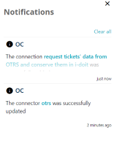

##################
Application Management
##################

The OC Application tries to keep consistency in all her parts. It means
to save persistence in the User Interface, so user does not need to get
used again and again.

Navigation
=========

On the left side you can see the menu for navigation. It displays only icons
until you mouseover it. After it expands and shows the labels. The admin item
has subitems, that can be (un)folded clicking on the arrow.

|menu|

To persist the expanding of the menu click on the menu icon |burger_icon|.

Notification System
=========

With each entity you can do CRUD operations: Create, Read, Update and Delete.
After a successful or a rejected operation, you will be alerted with a message:

|notification_alert|

This message goes to the stack in the Notification Panel. You can see
it clicking on the bell icon |bell|.

|notification_panel|

Each notification contains the type icon (info, error, warning), the timestamp
and the message itself. In case, the content is too long, you can unfold it
clicking on the arrows icon.

|notification|

Moreover, sometimes the message has a concrete name of the entity that was
in a process and clicking on it you will be redirected to its replacement.
A notification or all notifications can be easily cleared using a bin icon or
*Clear all* responsively.

List of Elements
=========

The list of data represents as a table where columns display corresponding data,
optional checkboxes for multiple actions and a column with single actions.

|list_view|

There is a possibility also to sort data (asc/desc) by name or by title |title_sort_icon|. User
has a possibility to see data in a grid view clicking on the icon |grid_icon| and setting
a number of elements pro row:

|grid_view|

The user can navigate in the grid view using keyboard arrows. The selected icon underlines
the first letter of the actions, that means pressing: *v* - opens view, *u* - opens update and
*d* - performs delete. If the amount of data does not fit to the page, here comes
a paginator for navigating |paginator|. The grid view displays an icon of the element that can
be replaced, if you mouseover the icon and click on it |upload_image_icon|. Checking items in
the list view you can apply an operation to all of them, for instance *Delete Selected*.
There can be more operations depending of the entity.

|more_multiple_actions|

The action columns provides such manipulations like: *view*, *update*, and *delete*.
Also, you can search by all possible parameters that has the corresponded entity typing
in the search input.

Add/Update Element
=========

You are on the page with list of elements. To add a new one, you need to
click on the *Add <Element>* button or press **Alt + '+'**. The application
shows the same forms for adding and updating of the concrete element.

Add/Update element has several form sections. The validation process is fulfilled
after pressing the action buttons.

|form_section|

Sometimes, the section form appears only after selecting data in the section before it.
The reason is a dependency of your selection.

