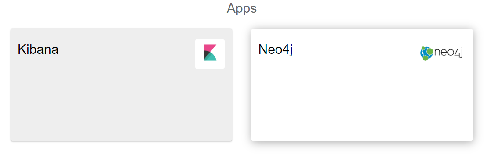

##################
Apps
##################

The applications menu displays two items: *Kibana* and *Neo4j*. If the
are installed and configured on your machine, you can open them clicking
on the card and see relations to OC. If not installed, you will see the
error message “The link to this application does not work, please check
your installations”.

|image0|

