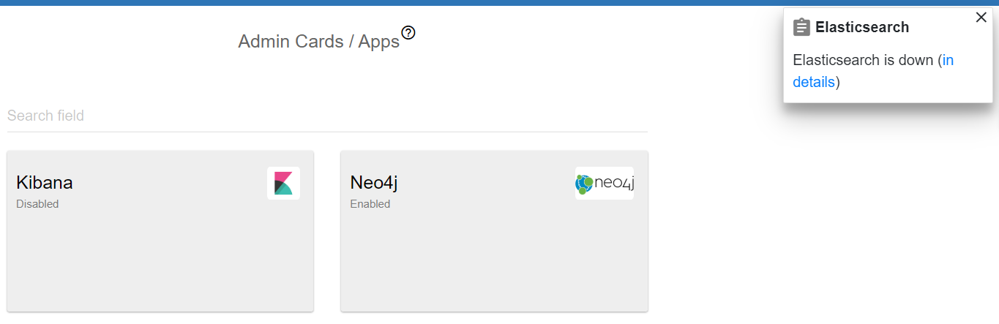

##################
Apps
##################

THe applications menu resides inside *Admin* menu. It displays two items:
*Kibana* and *Neo4j*. If the are installed and configured on your machine,
you can open them clicking on the card and see relations to OC. If not installed,
you will see the notification message, that this system is down. Also,
the corresponded item shows its status: enabled or disabled.

|image0|

