##################
Connections
##################

Connection defines between which connectors do we want to do requests,
what kind of requests and specify mapping between them. This is a core
element of the application. The list of connections displays only a
title.

|image0|

On the right top corner you can see |image1| or |image2| icon. Clicking
on it the application creates a webhook for the specific connection.

|image3|

Due to it the user can trigger this connection using only url. To get
this url, just click on the word *WEBHOOK*. The url is stored in the
buffer. Now you can paste it where you need.

|image4|

Adding/updating connection consist of three steps: direction, mode, and
methods. There is an explanation tour for creating connection. The
direction page has two fields: *title* and *connectors*.They are both
required. The *title* must be unique, it is checking before going to the
next page. The *connectors* are two: from connector and to connector.

|image5|

The mode step has one required field - *mode*. It can be *expert* or
*template.* If *template* is chosen, their will be appeared a select
field, where you can select a template that you need or delete it.

|image6|

if you come back to this step from the next step, choosing another mode
will affect on the adding, that is why you need to confirm your choice.

The methods step has two areas: *methods* and *mapping fields*. There is
also a possibility to add this connection to the *templates*. Clicking
on the **Add Template** button appears a window where should be provided
a name.

|image7|

The *methods* area is divided into two parts: left and right. On the
left side you see elements belongs to *from connector* and on the right
to *to connector.* There are two types of elements: method and
operation.

Method represents the request to the connector with defined parameters.
Each method has his own color that generates automatically. Parameter
can be a simple *text*, a *pointer* or an *object*. The pointer is value
that refers to the result of the method above. To be able to make a
pointer, just type **$** sign in input field. To go back to a simple
text field, remove this **$** sign. The pointer is a field with three
data: *pointer sign* **$**, *method* value and *param* value. *Method*
value is a select box which values generates from created methods above.
Selecting it, the corresponded color appears in the pointer.

|image8|

The *param* value is a simple text. Clicking on it, you will see the
popup input field wider.

|image9|

The *object* field is for json data. They can be typed by hand or
imported.

|image10|

If you want to import, just click on the **Import** button and insert
data into textarea.

|image11|

All parameters can be hidden pressing on the title of the method or on
the arrow. Clicking on this |image12| icon you can delete a method.

Operation can be *loop* - |image13| or *if* - |image14|. *Loop* has two
parameters: *method* and *param*. Method is a select field. Values come
from the selected methods with according colors. *Param* is a text
field. *Loop* operation goes through the array. It means, the *param*
value should be an array with **[]** in the end.

|image15|

The *if* operation checks if the statement is true then fulfill the
instructions inside. It has three parameters: *method, param, relational
operator,* and *compare statement.* The *relational operator* can be
**>=, >, <=, <, ==, !=**.

|image16|

Values for *Method* for *To Connector* come not only from selected
methods in *To Connector*, but also from *From Connector*.

|image17|

To add a new method or operation, click on this button\ |image18|. There
will be a menu. **M** means method and **O** means operation. Click one
of it and select item. If you are inside operation than you can create
**in** or **out** of the instructions.

|image19|

The *mapping* area display the mapping between the *From* and *To
Connectors* through the parameters. First of all you add a new *From
Connector* parameter. You can do it it two ways: typing the name in
**Type Param** field or clicking on |image20|\ icon. In **Type Param**
fields appearing values as you type in. If you type a dot **.** after,
it shows you a list of subparameters inside the property.

|image21|

Clicking on |image22| you add it.

|image23|

Clicking on plus icon comes a dialog box with two parameters: *field
type* and *name*.

|image24|

After creating a param, you can choose this param in *To Connector*
method items clicking on the multiselect field.

|image25|

Immediately after there is a new connection between chosen parameter and
param where it was selected.

|image26|

Each rectangle on the right side has an **Enhancement**. The goal of it
to provide some functionality during the mapping. Clicking it opens a
dialog box with next data: *name, description, mode (simple* or
*expert)* and *code.* *Simple* mode provide more data: *variables,
constants* and *operators.*\ Clicking twice on the element it appears in
the code. Though, you can write very simple code expresion.

|image27|

*Expert* mode has just a textarea where are comments in the beginning.
These comments explains you what variables are assigned to which params.
Use it in the code.

|image28|

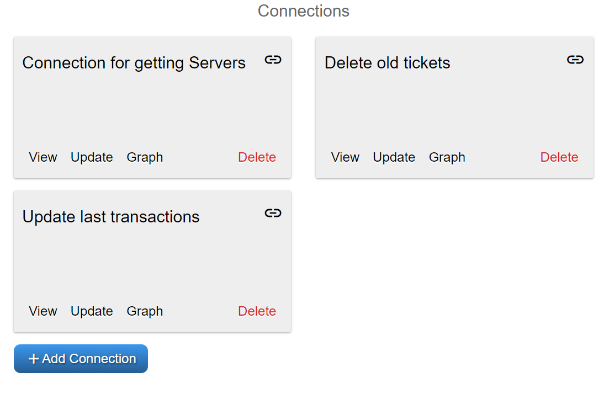
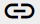
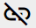
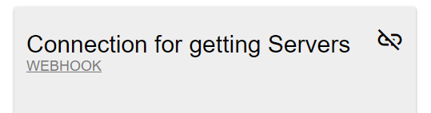
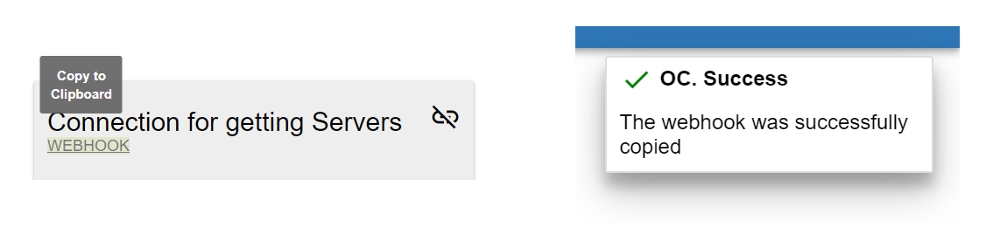
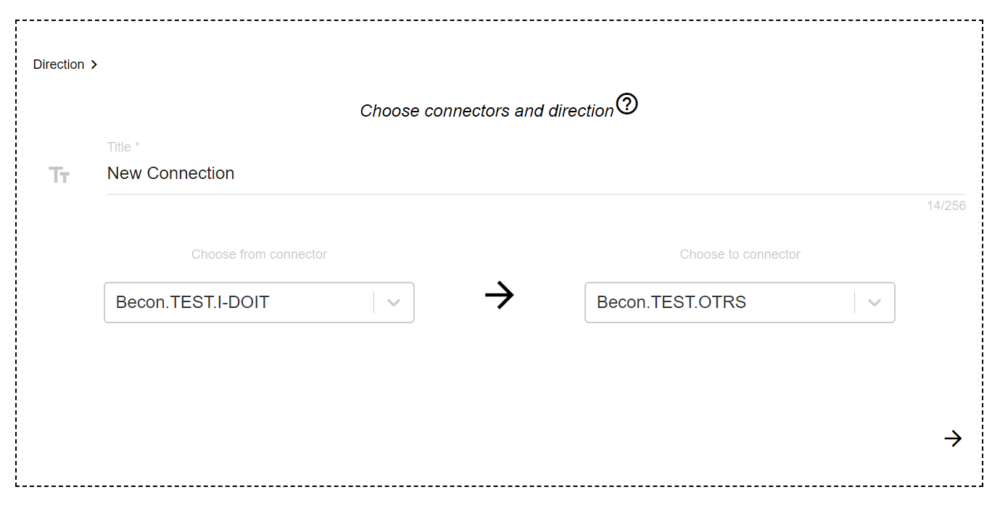
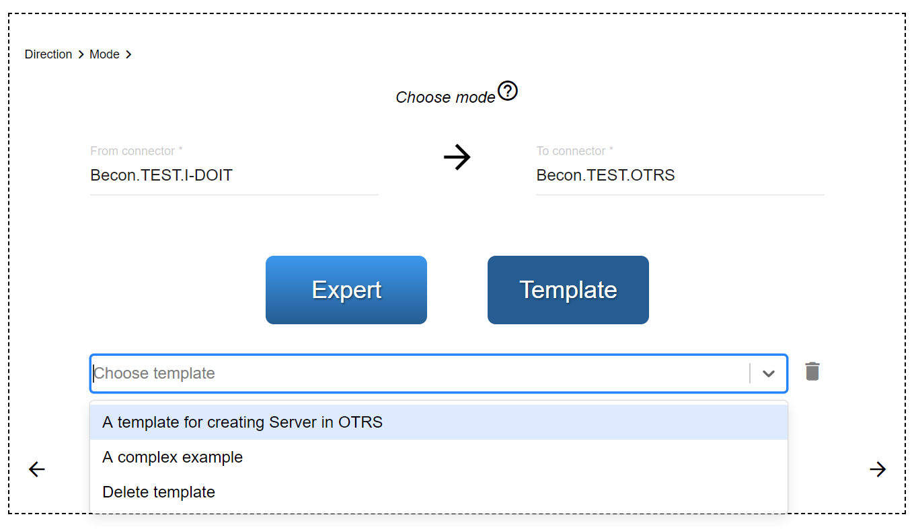
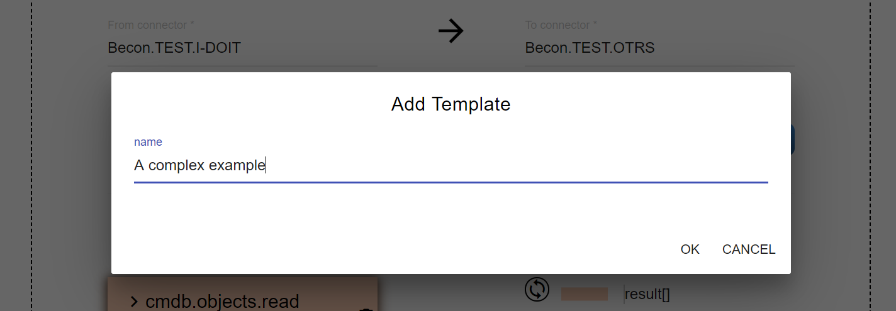
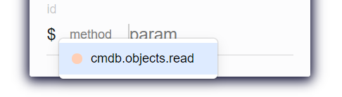
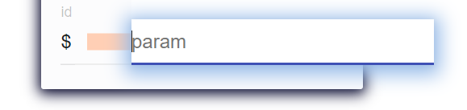
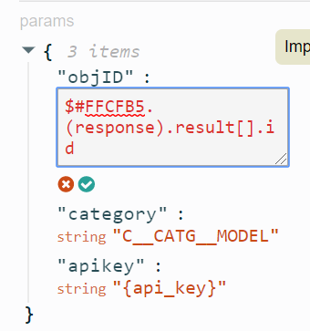
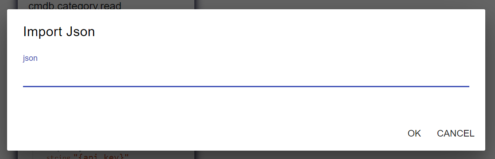
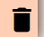
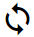
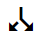
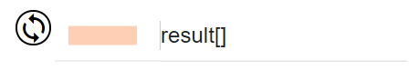
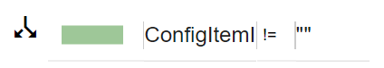
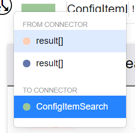

.. |image19| image:: ../img/connection/image19.png
   :width: 4.83333in
   :height: 2.69792in
   :align: middle
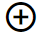
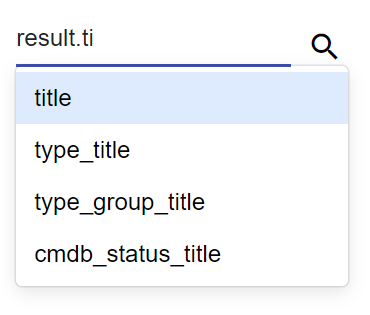
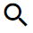
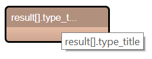
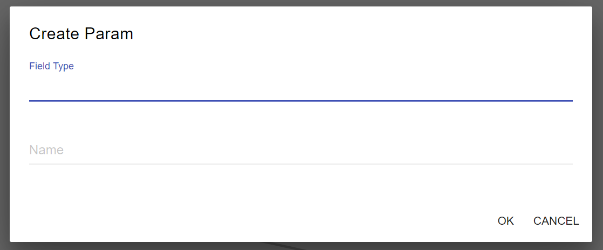
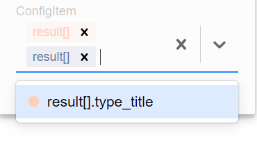
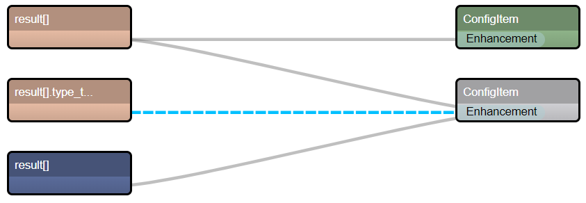
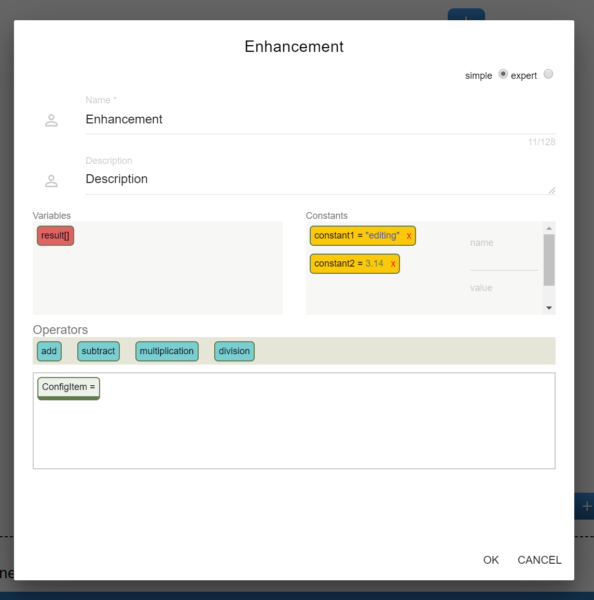
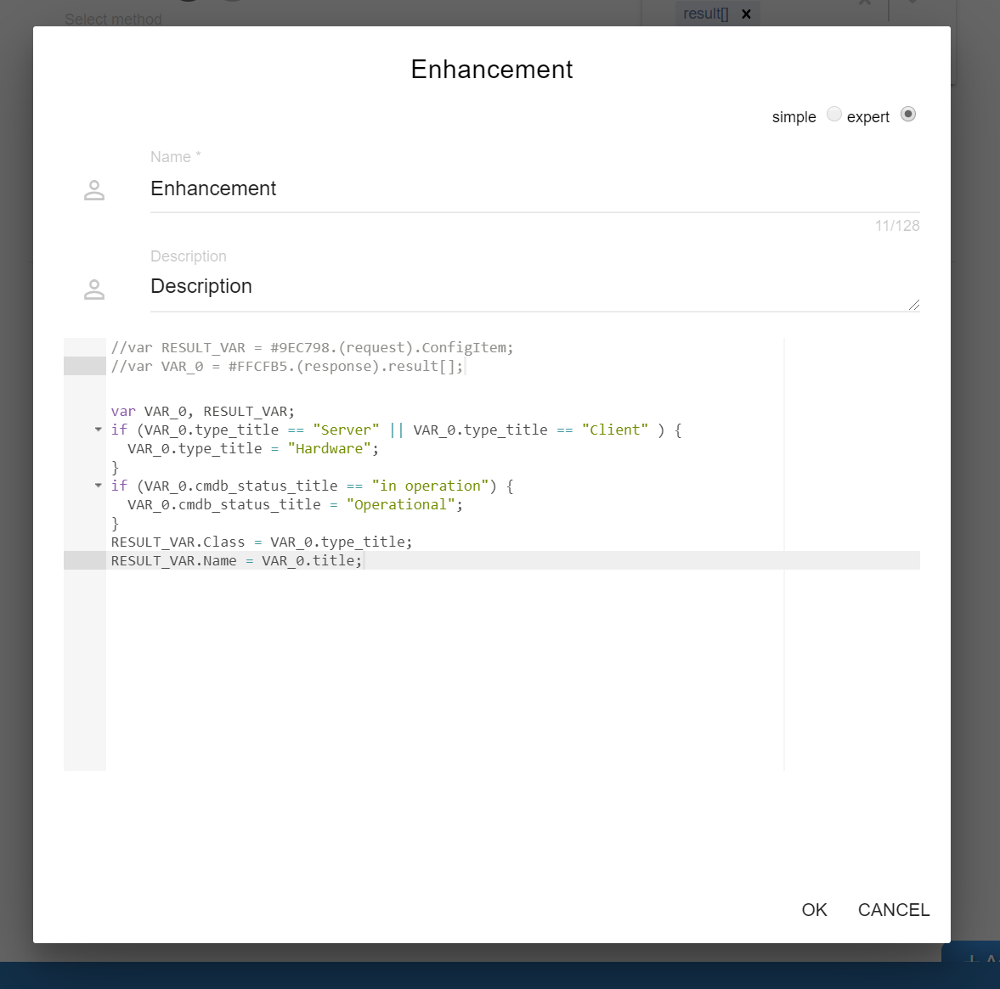
