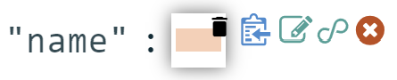
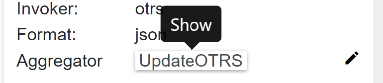
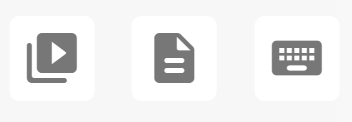

##################
Connections
##################

Connection defines between which connectors do we want to do requests,
what kind of requests and to specify mapping between them. This is a core
element of the application. The list of connections displays a title, a description,
and connectors' titles.

|image0|

Adding connection has three steps: *direction*, *mode*, and
*methods*. Updating connection has just one *methods*.
The *direction* page has three fields: *title*, *description* and
*connectors*. *Title* and *connectors* are required. The *title* must be unique,
it is checking before performing an action (add/update). The *connectors* are two:
*from connector* and *to connector*. The options are loaded from the *connectors*
list.

|image1|

The *mode* step has one required field - *mode*. It can be an *expert* or
a *template.* If the *template* is chosen, their will be appeared a select
field, where you need to select a desired template. Here also you can delete
it, clicking on the bin icon, or upgrade, if the template need to be upgraded
to the current application version. There is also a possibility to create a new
template basing on the current connection pressing on the button |image3|
and defining a template *name* and optionally a template *description*.

|image2|

If you change the mode it will affect on the "methods", that is why you need
to confirm your choice.

The *method* represents the request to the connector with defined parameters.
There are two types of elements: method and operator. The area consists of visual
representation of methods/operators and a panel *Details*.
Clicking on the text *Click here to create...* or moving pointer above the existed
element you will see a placeholder for creating process or operator.

|image4|

The element will be located after the current element and set as a new current.
Each method has his own color that generates automatically. Also, you can set
a label for your personal better reading. To remove a method or an operator just
click on the bin icon of the selected element. The *Details* panel displays
information about the selected element.

|image9| |image10|

If you want to set or to change the *Label* of the connection, just move your mouse
over it in *Details* and click on edit icon. Under the *Format* you can find an
*Aggregator* that also could be (re)set.

*Aggregator* is a feature that provides a possibility to notify a user after the
triggered connection (this happens in *Schedules*). You can create a new aggregator
pressing on the button |image31|.

Here you will see a list of existed aggregators that displaying: *name* and *arguments*

|image17|

or a form to create a new one, if still not exist.

|image18|

Setting *Methods* you can optionally define where should this aggregator be applied after creating.

|image19|

*Arguments* are used inside of the notification it self. You should assign to them an accumulated
value inside of the script section.

Returning to the *Details* panel you can see *Endpoint* and *Body* under the **Request** paragraph
that could be modified clicking on their placeholders.

There is a possibility to add a parameter into the *Endpoint* (except the first
method in *from connector*). This parameter is a reference to the response of
the previously created method.

|image11|

If the response is in json format and array, then you can choose the whole array
or only a specific element in the array typing *[arrayIndex]*. It means to take
the element with the specified index. To choose the whole array you need to type
*[\*]*.
If the response is in xml format then you can also reference to the attribute
of the xml tag. Just type *@* and if the xml tag has attributes they will be
popped up and you can select one.
You choose method, fill out the parameter and click plus button. The parameter
comes from the invoker. If it exists there, you will see it after typing the
third symbol in the input field as a select popup block.

*Body* can also contain references from the previous methods. Type **#** as
the first character and you will see another popup.

|image5|

You can handle with that in the same principe as for the *Query*.
When you finish with editing click on the apply icon |image6|.

Moreover, you can add
an enhancement between fields. Clicking on the reference

.. note::
	Enhancement is currently only supported in the body configuration of the target system (to connector). 

|image7|

you will see a popup window where you set a description and an enhancement
itself.

|image8|

There are predefined variables to relate with the fields. *VAR_[i]* are coming parameters
and *RESULT_VAR* is the final value for *to connector* field.

The reference could be easily deleted if you mouse over it and click on the delete icon |image20|.
All variables related to this references will be automatically replaced on **OC_VAR_NOT_EXIST** in the enhancement's script.

|image21|

When you create an operator there are two options: *if* and *loop*. *if* operator
does a condition before performance. You should define here also a reference, choose
a condition operation and set with what are you doing to compare.

*loop* operator makes request in the loop under conditions that you define.

As you can mention, all items under the operators are shifted on the level down. Selecting
the operator you will see the scope of their influence.

On the bottom you can find the Action Panel.

|image12|

Here you can make most actions regarding to the connection:

|image32| - testing the current connection creating a temporal connection and schedule.
|image33| - saving options: save, save and close, save and go to add schedule (correspondingly |image13|).
|image34| - resize the *methods* section to fullscreen and back.
|image35| - toggle log panel that shows a test connection log messages.
|image36| - configuration that help you to set *name* and *description* in add/update connection form,
also you can set a color mode of the method and its name/label font size.

|image37|

|image38| - toggle data aggregator.
|image39| - template options: create a new template or load existing one (correspondingly |image14|).
|image40| - animation tool for explaining how to use the *method* section. It simulate the method's editor
with the predefined data following with scripts that describe steps.

|image15|

Just press on the required animation on the bottom and watch the simulation. On the right side
you can see the panel where you can pause/play, increase speed or completely stop the simulation.
During the animation you can not interact with it.

|image25|

Only after stop, you can play with the connection by your own. Moving your mouse on the center or
clicking on any place you can see the pause/play/stop icons.

|image26|

|image41| - synchronize invokers. Sometimes you need to change the invoker file manually. The connection
that uses these invokers will not update them automatically, because for some cases it is not needed.
That is why you can sync by your own using this feature.
|image42| - shortcuts

|image16|

On the left side in the *methods* section you can see the zoom in and zoom out actions
|image26|

.. |image0| image:: ../img/connection/0.png
   :align: middle
.. |image1| image:: ../img/connection/1.png
   :align: middle
.. |image2| image:: ../img/connection/2.png
   :align: middle
.. |image3| image:: ../img/connection/3.png
.. |image4| image:: ../img/connection/4.png
   :align: middle
   :width: 200
.. |image5| image:: ../img/connection/5.png
   :align: middle
.. |image6| image:: ../img/connection/6.png

.. |image8| image:: ../img/connection/8.png
   :align: middle
.. |image9| image:: ../img/connection/9.png
   :width: 49%
.. |image10| image:: ../img/connection/10.png
   :width: 49%

.. |image12| image:: ../img/connection/12.png
   :align: middle
.. |image13| image:: ../img/connection/13.png
.. |image14| image:: ../img/connection/14.png
.. |image15| image:: ../img/connection/15.png
   :align: middle
.. |image16| image:: ../img/connection/16.png
   :align: middle
.. |image17| image:: ../img/connection/17.png
   :align: middle
.. |image18| image:: ../img/connection/18.png
   :align: middle
.. |image19| image:: ../img/connection/19.png
   :align: middle

.. |image21| image:: ../img/connection/21.png
   :align: middle

.. |image24| image:: ../img/connection/24.png
   :align: middle
.. |image25| image:: ../img/connection/25.png
   :align: middle
.. |image26| image:: ../img/connection/26.png
   :align: middle

.. |image32| image:: ../img/connection/32.png

.. |image34| image:: ../img/connection/34.png
.. |image35| image:: ../img/connection/35.png
.. |image36| image:: ../img/connection/36.png

.. |image39| image:: ../img/connection/39.png
.. |image40| image:: ../img/connection/40.png

