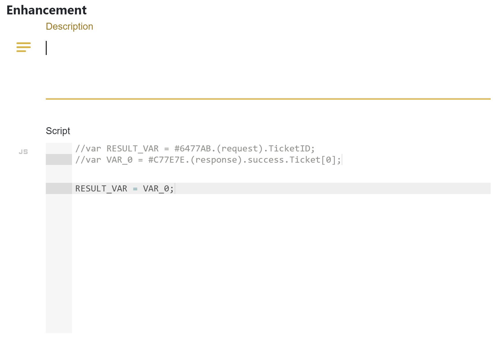
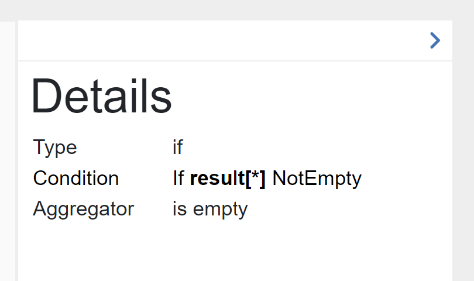
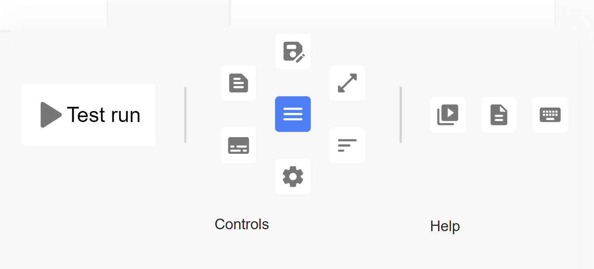
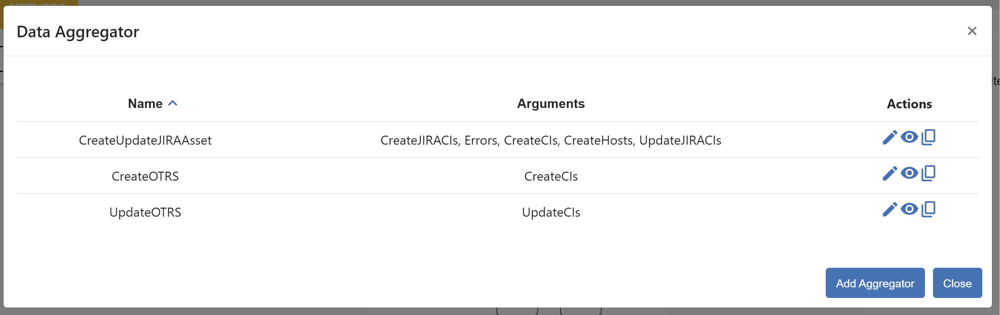
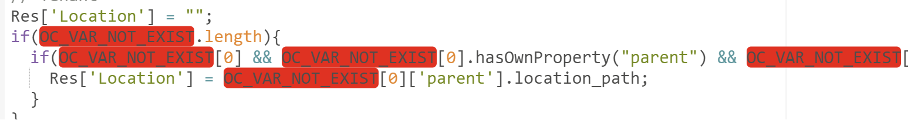
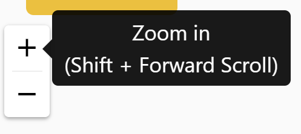

##################
Connections
##################

Connection defines between which connectors do we want to do requests,
what kind of requests and specify mapping between them. This is a core
element of the application. The list of connections displays only a
title.

|image0|

Adding/updating connection consist of three steps: direction, mode, and
methods. There is an explanation tour for creating connection. The
direction page has two fields: *title* and *connectors*.They are both
required. The *title* must be unique, it is checking before going to the
next page. The *connectors* are two: *from connector* and *to connector*.

|image1|

The mode step has one required field - *mode*. It can be *expert* or
*template.* If *template* is chosen, their will be appeared a select
field, where you can select a template that you need or you cat delete
it.

|image2|

if you come back to this step from the next step, choosing another mode
will affect on the adding, that is why you need to confirm your choice.

The methods step has two areas: *methods* and *mapping fields*. There is
also a possibility to add this connection to the *templates*. Clicking
on the |image3| button appears a window where should be provided
a name.

The *methods* area is divided into two parts: left and right. On the
left side you see elements belongs to *from connector* and on the right
to *to connector*.

Method represents the request to the connector with defined parameters.
There are two types of elements: method and operator. Clicking on
the |image4| button you can create the element. The element will be located
after the current element, that is pointed with an arrow |image5|.
Each method has his own color that generates automatically. To remove the
method just click on the recycle icon.

The method consists of *Query* and *Body*.

|image6|

*Query* is a URL that can be modified during the request. It has a prefix,
that is defined in invoker xml file. Mouseover here |image7| you can see it.
There is a possibility to add a parameter into the *Query* (except the first
method in *from connector*). This parameter is a reference to the response of
the  previously created method.

|image8| |image9|

You choose method, fill out the parameter and click plus button. The parameter
comes from the invoker. If it exists there, you will see it after typing the
third symbol in the input field as a select popup block.

*Body* has an icon |image10|. Clicking on it popup a block of request that you
send using this method. It can be modified using |image11| icon or directly change
each parameter. There is also a possibility here to add a parameter from the response
of the previous methods. Type **#** as the first character and you will see another
popup |image12|. You can handle with that in the same principe as for the *Query*.
When you finish with editing click on the apply icon |image13|.

When you create an operator there are two options: *if* and *loop*. *if* operator
does a condition before performance. You should define here also a reference, choose
a condition operation and set with what are you doing to compare.

|image14|

*loop* operator makes request in the loop under conditions that you define.

|image15|

As you can mention, all items under the operators are shifted on the right to see the
scope of their influence. There can be a lot of items, that means can be shifted quite
well on the right. We have limited the overview and brought history here. Both
*from connector* and *to connector* can have 5 elements. If you have more than five, appears
a navigator on the left side with progress bar |image16|. Clicking up or down you can
navigate throw the elements and see how deep you are, just looking on the progress bar.
Moreover, there is a history on the top |image17|. This history displays you all operators
that are participating to fulfill the current item. Clicking on the search icon |image18|
you see the whole structure of the connector.

|image19|

Press arrows up and down to navigate there or left and right arrows to minimize or maximize
accordingly the operators. Clicking on the item here you go directly to that element and it
will selected as the current one.

*Mapping Fields* displays the relationship between the fields of the methods.

|image20|

They are created immediately after setting references in *Body*. The relationship can be one
to one or many to one. Moreover, you can add an enhancement between fields. Clicking on the
enhancement title you will see a popup window where you set a description and an enhancement
itself.

|image21|

There are predefined variables to relate with the fields. *VAR_[i]* are coming parameters
and *RESULT_VAR* is the final value for *to connector* field.

Documentation about APIs of the connectors are available on this page. Clicking on the icon
|image22| you will see the appropriate documentation.

|image23|

There are method and title of the request. If you want to read the specific request in details
just toggle it clicking on the title.

|image24|

Moreover, you can test the request clicking on |image25|. Then you see a popup window where
you already have predefined method, request and body.

|image26|

You can change the method, add headers or update body. To add a header type his key and value.
After click on the |image27| icon. If you have more than two headers just click on |image28|
and |image29| arrows to navigate between them. After you prepared the request, press **Send**
button and the response will appear in the *Response* tab.

|image30|

.. |image0| image:: ../img/connection/0.png
   :align: middle

.. |image2| image:: ../img/connection/2.png
   :align: middle
.. |image3| image:: ../img/connection/3.png
.. |image4| image:: ../img/connection/4.png
.. |image5| image:: ../img/connection/5.png

.. |image7| image:: ../img/connection/7.png

.. |image9| image:: ../img/connection/9.png
   :align: middle

.. |image11| image:: ../img/connection/11.png

.. |image13| image:: ../img/connection/13.png

.. |image15| image:: ../img/connection/15.png
   :align: middle
.. |image16| image:: ../img/connection/16.png

.. |image18| image:: ../img/connection/18.png
.. |image19| image:: ../img/connection/19.png
   :align: middle
.. |image20| image:: ../img/connection/20.png
   :align: middle

.. |image22| image:: ../img/connection/22.png
.. |image23| image:: ../img/connection/23.png
   :align: middle

.. |image25| image:: ../img/connection/25.png
.. |image26| image:: ../img/connection/26.png
   :align: middle
.. |image27| image:: ../img/connection/27.png
.. |image28| image:: ../img/connection/27.png
.. |image29| image:: ../img/connection/27.png
.. |image30| image:: ../img/connection/27.png
   :align: middle