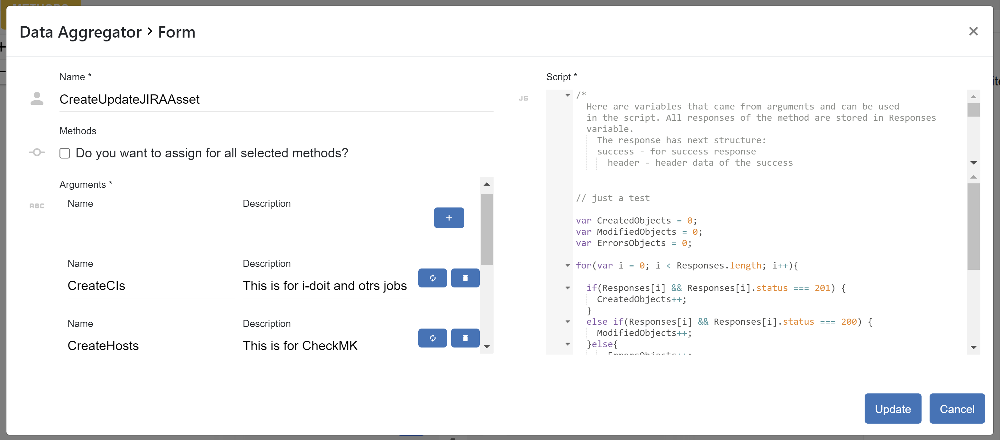

##################
Connections
##################

Connection defines between which connectors do we want to do requests,
what kind of requests and to specify mapping between them. This is a core
element of the application. There is also a possibility to add the connection
to the *templates*. Clicking on the |image3| button appears a window where should
be provided a name.The list of connections displays a title, a description,
and connectors' title.

|image0|

Adding/updating connection consists of three steps: *direction*, *mode*, and
*methods*. The *direction* page has three fields: *title*, *description* and
*connectors*. *Title* and *connectors* are required. The *title* must be unique,
it is checking before performing an action (add/update). The *connectors* are two:
*from connector* and *to connector*. The options are loaded from the *connectors*
list.

|image1|

The *mode* step has one required field - *mode*. It can be an *expert* or
a *template.* If the *template* is chosen, their will be appeared a select
field, where you need to select a desired template. Here also you can delete
it, clicking on the bin icon, or upgrade, if the template need to be upgraded
to the current application version.

|image2|

If you change the mode it will affect on the "methods", that is why you need
to confirm your choice.

The *method* step can be defined in two modes: *column* view (default) and
*diagram* view. You can switch between them mouseovering the icon |form_methods_top_more|.
There you also can open *method* form section on the whole window clicking
on the maximize icon |form_methods_top_icons|.

Column View
=========

The *column* view is divided into two parts: left and right. On the
left side you see elements belongs to *from connector* and on the right
to *to connector*.

Method represents the request to the connector with defined parameters.
There are two types of elements: method and operator. Clicking on
the |image4| button you can create the element. The element will be located
after the current element, that is pointed with an arrow |image5|.
Each method has his own color that generates automatically. To remove the
method just click on the bin icon.

The method consists of *Query* and *Body*.

|image6|

*Query* is a URL that can be modified during the request. It has a prefix,
that is defined in invoker xml file. Mouseover here

|image7|

you can see it. Clicking on this icon popped up an input to modify the *query*.

|image7.1|

There is a possibility to add a parameter into the *Query* (except the first
method in *from connector*). This parameter is a reference to the response of
the  previously created method.

|image8| |image9|

If the response is in json format and array, then you can choose the whole array
or only a specific element in the array typing *[arrayIndex]*. It means to take
the element with the specified index. To choose the whole array you need to type
*[\*]*.

|image9.1|

If the response is in xml format then you can also reference to the attribute
of the xml tag. Just type *@* and if the xml tag has attributes they will be
popped up and you can select one.

|image9.2|

You choose method, fill out the parameter and click plus button. The parameter
comes from the invoker. If it exists there, you will see it after typing the
third symbol in the input field as a select popup block.

*Body* has an icon |image10|. Clicking on it popup a block of request that you
send using this method. It can be modified using |image11| icon or directly change
each parameter. There is also a possibility here to add a parameter from the response
of the previous methods. Type **#** as the first character and you will see another
popup |image12|. You can handle with that in the same principe as for the *Query*.
When you finish with editing click on the apply icon |image13|.

When you create an operator there are two options: *if* and *loop*. *if* operator
does a condition before performance. You should define here also a reference, choose
a condition operation and set with what are you doing to compare.

|image14|

*loop* operator makes request in the loop under conditions that you define.

|image15|

As you can mention, all items under the operators are shifted on the right to see the
scope of their influence. There can be a lot of items, that means can be shifted quite
well on the right. We have limited the overview and brought history here. Both
*from connector* and *to connector* can have 5 elements. If you have more than five, appears
a navigator on the left side with progress bar |image16|. Clicking up or down you can
navigate throw the elements and see how deep you are, just looking on the progress bar.
Moreover, there is a history on the top |image17|. This history displays you all operators
that are participating to fulfill the current item. Clicking on the search icon |image18|
you see the whole structure of the connector.

|image19|

Press arrows up and down to navigate there or left and right arrows to minimize or maximize
accordingly the operators. Clicking on the item here you go directly to that element and it
will selected as the current one.

*Mapping Fields* displays the relationship between the fields of the methods.

|image20|

They are created immediately after setting references in *Body*. The relationship can be one
to one or many to one. Moreover, you can add an enhancement between fields. Clicking on the
enhancement title you will see a popup window where you set a description and an enhancement
itself.

|image21|

There are predefined variables to relate with the fields. *VAR_[i]* are coming parameters
and *RESULT_VAR* is the final value for *to connector* field.

Diagram View
=========

The *diagram* view shows you three panels: *business layout*, *technical layout* and *details*.

|process_view_example|

Each layout can be: opened in the separate window |open_in_a_new_window_icon|, minimized |minimize_layout_icon| or
maximized |maximize_layout_icon|. The *details* can be moved from right to left |move_left_details_icon| and vice versa
|move_right_details_icon|.

The layouts height is resizable. Use your mouse to resize the height grabbing the separate gray line between them.
Also you can drag the layout to see hidden parts outside the screen. Using *shift*+*mouse scroll*
zoom in and out to dive into details or to see the whole picture.

**Technical Layout**

The goal of this layout is define your requests and operators. The *technical* layout displays two connector areas.
They are white bordered boxes with connector labels and clickable text inside "Click here to create...". On the panel
size you can see a settings icon |settings_icon|. Clicking on it the dialog popped up. Here you can define the position
of the color in technical process and business label mode. Business label is a label of the business process to which
the technical item was assigned. It can visible all the time, not visible, or visible only on pressing *b* (business) key.

|settings_dialog|

The *technical* layout has two creatable items: process and operator. The process is a
defined in invoker file operation. The operators can be two: *if* and *loop*. *If* is
a conditional operator and *loop* is an iterable operator. To create an initial technical
item you need to click on the text in the appropriate connector area. You can create as
very first item only a process in the from connector. The to connector has a possibility
to create an operator as his very first item, only if the from connector is not empty.
After the popup dialog appears where you need to select a required name and set a label.
The label serves as an optional name defined by user to bring readability and simplify the
view.

|create_technical_item_1|

Clicking on the add icon you will see a rounded bordered rectangle with the label, if it was
set, otherwise with the name. Each technical process has a unique color to distinguish it
among other processes with the same name. You can easily delete the process clicking on the
bin icon and confirming your decision. To create furthers items in the same connector area
just double click on the element. Now you can see the *operator* options: *if* and *loop*.

|create_technical_item_2|

Select one of the and click on the *add* icon. The *operator* item can have items in his scope.
To define it, double click on the *operator* and choose *in* option.

|create_technical_item_3|

The items that are inside operator's scope placed one level below and arrowed down.

|technical_operator|

As you can see, when you select the operator, all his scoped elements are highlighted
what makes it more readable.

**Business Layout**

The business layout serves to group technical items under the business process for simplicity.
All items can be dragged and dropped where you wish in this layout. To create an item clicking
on the text and define the name. The process appears in the business layout.

|business_item|

It display the name and has two icons: bin for deleting and assign icon to determine what
technical items should be grouped. Clicking on that icon the background of the technical layout
will be changed. That means that you are right now in the assign mode.

|assign_mode|

Click on the need item and it will be determined to the selected business process. Clicking
on the business layout free space you will exit from assign mode. Press now the business process
to see what technical items are assigned to it. The not assigned items are slightly transparent.

|assign_example|

**Details**

The *details* of business process is pretty simple. You can change the name of the process.

|details_business_item|

The *details* of technical process has more configurations.

|technical_process_details|

First of all, the name and the label both configured. But be careful by updating the name,
because it can influence on your predefined workflow.

|details_label|

You can see such information like the invoker that is used and format of the transfer data.
The request has *method* name, *endpoint*, *header* and *body*. Pressing on *H* you can
read the header in details. The *endpoint* and the *body* are editable. The *endpoint* is
a URL of the request where you can add data as references from different responses that
defined before it.

|details_endpoint|

Pressing on the *...* you can read and update the *body*. Typing *#* assign in the text area
you will see a pop up dialog to add a reference.

|details_request_reference|

There is an *enhancement* on the right side as soon as you set the reference.
*Enhancement* is piece of javascript code that will be applied before the definition.

|details_request_enhancement|

The *details* of the *operator* has two fields: *type* and *condition*. Be careful when
you change *type* because it can influence on your predefined workflow. The *condition*
has several input fields depending on the relational operator that you choose.

|details_condition|

.. |image0| image:: ../img/connection/0.png
   :align: middle
.. |image1| image:: ../img/connection/1.png
   :align: middle
.. |image2| image:: ../img/connection/2.png
   :align: middle

.. |image4| image:: ../img/connection/4.png
.. |image5| image:: ../img/connection/5.png
.. |image6| image:: ../img/connection/6.png
   :align: middle
.. |image7| image:: ../img/connection/7.png
   :align: middle
.. |image7.1| image:: ../img/connection/7.1.png
   :align: middle
.. |image8| image:: ../img/connection/8.png
   :align: middle
.. |image9| image:: ../img/connection/9.png
   :align: middle
.. |image9.1| image:: ../img/connection/9.1.png
   :align: middle
.. |image9.2| image:: ../img/connection/9.2.png
   :align: middle
.. |image10| image:: ../img/connection/10.png
.. |image11| image:: ../img/connection/11.png
.. |image12| image:: ../img/connection/12.png

.. |image14| image:: ../img/connection/14.png
   :align: middle
.. |image15| image:: ../img/connection/15.png
   :align: middle
.. |image16| image:: ../img/connection/16.png
.. |image17| image:: ../img/connection/17.png

.. |image19| image:: ../img/connection/19.png
   :align: middle
.. |image20| image:: ../img/connection/20.png
   :align: middle
.. |image21| image:: ../img/connection/21.png
   :align: middle
.. |form_methods_top_more| image:: ../image/connections/form_methods_top_more.png
.. |form_methods_top_icons| image:: ../image/connections/form_methods_top_icons.png
.. |process_view_example| image:: ../image/connections/process_view_example.png
   :align: middle
.. |maximize_layout_icon| image:: ../image/connections/maximize_layout_icon.png
.. |minimize_layout_icon| image:: ../image/connections/minimize_layout_icon.png
.. |move_left_details_icon| image:: ../image/connections/move_left_details_icon.png
.. |move_right_details_icon| image:: ../image/connections/move_right_details_icon.png
.. |open_in_a_new_window_icon| image:: ../image/connections/open_in_a_new_window_icon.png
.. |replace_layout_icon| image:: ../image/connections/replace_layout_icon.png
.. |settings_icon| image:: ../image/connections/settings_icon.png
.. |settings_dialog| image:: ../image/connections/settings_dialog.png
   :align: middle
.. |create_technical_item_1| image:: ../image/connections/create_technical_item_1.png
   :align: middle
.. |technical_process| image:: ../image/connections/technical_process.png
   :align: middle
.. |create_technical_item_2| image:: ../image/connections/create_technical_item_2.png
   :align: middle
.. |create_technical_item_3| image:: ../image/connections/create_technical_item_3.png
   :align: middle
.. |technical_operator| image:: ../image/connections/technical_operator.png
   :align: middle
.. |technical_process_details| image:: ../image/connections/technical_process_details.png
   :align: middle
.. |details_endpoint| image:: ../image/connections/details_endpoint.png
   :align: middle
.. |details_request_reference| image:: ../image/connections/details_request_reference.png
   :align: middle
.. |details_request_enhancement| image:: ../image/connections/details_request_enhancement.png
   :align: middle
.. |details_label| image:: ../image/connections/details_label.png
   :align: middle
.. |details_condition| image:: ../image/connections/details_condition.png
   :align: middle
.. |business_item| image:: ../image/connections/business_item.png
   :align: middle
.. |assign_mode| image:: ../image/connections/assign_mode.png
   :align: middle
.. |assign_example| image:: ../image/connections/assign_example.png
   :align: middle
.. |details_business_item| image:: ../image/connections/details_business_item.png
   :align: middle