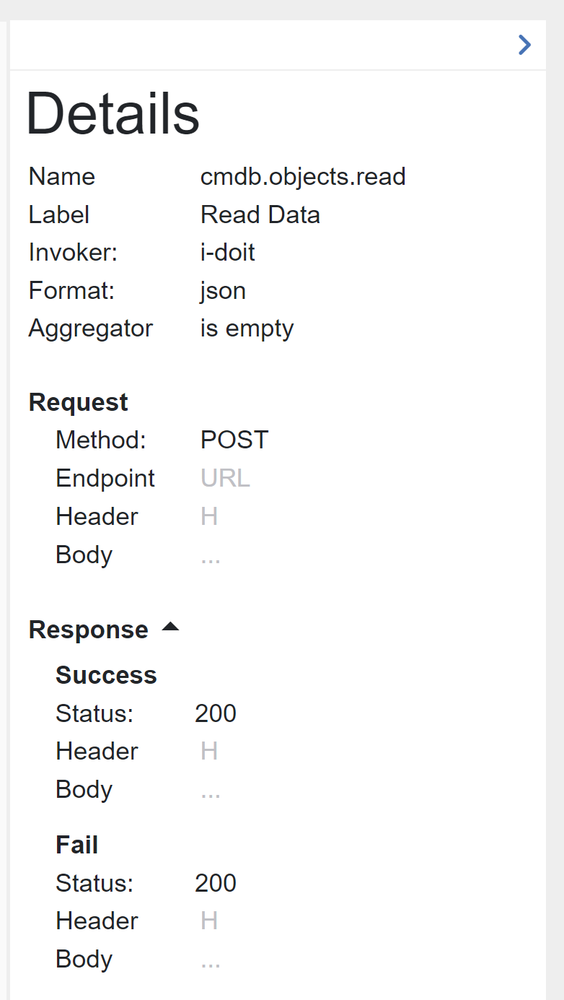
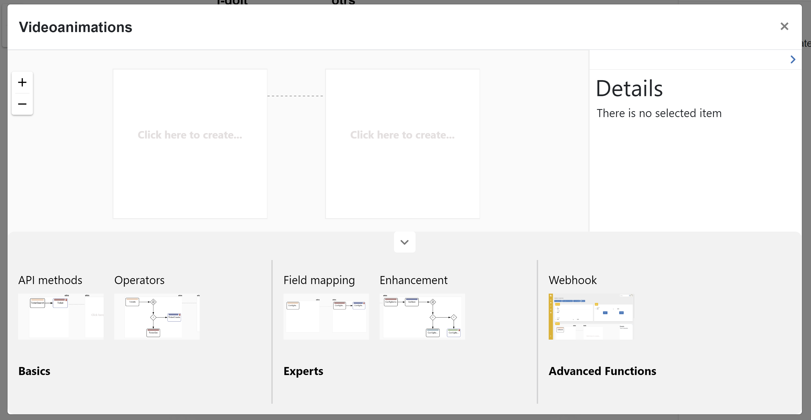
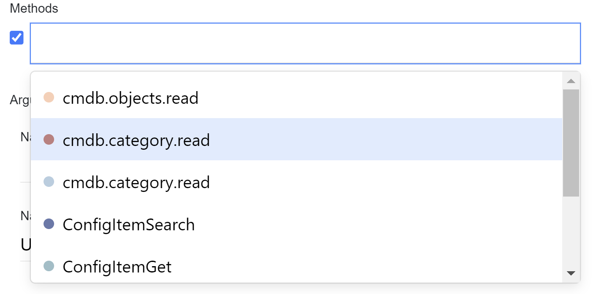

##################
Connections
##################

Connection List
"""""""""""""""""

Connection defines between which connectors we want to do requests,
what kind of requests and to specify mapping between them. This is a core
element of the application. The list of connections displays a *title*, a *description*,
and *connectors' titles*.

|image0|

If you double click on the *title* or on the *description*, you can modify
it inline.

|image49|

There are also categories above the list. The category collects a set of connections.
It can be very helpful to divide connections. As an example, you can have a *demo* category for your demo installations.

|image47|

You can create a category clicking on the *+* icon. Each category can have subcategories.
The path to the parent category will be displayed above as breadcrumb.

|image48|

Each breadcrumb header is a link to the previous category. To delete the category, just
put your mouse over the category title and click on the *x* icon. The dialog will pop up
that suggests you to delete recursively.

.. warning::
    If you delete the category recursively, all subcategories and assigned connections will
    be removed.

General Information
"""""""""""""""""

Adding connection has three steps: *direction*, *mode*, and
*methods*. Updating connection has just one *methods*.
The *direction* page has three fields: *title*, *description* and
*connectors*. *Title* and *connectors* are required. The *title* must be unique,
it is checking before performing an action (add/update). The *connectors* are two:
*from connector* and *to connector*. The options are loaded from the *connectors*
list.

|image1|

The *mode* step has one required field - *mode*. It can be an *expert* or
a *template.* If the *template* is chosen, their will be appeared a select
field, where you need to select a desired template. Here also you can delete
it, clicking on the bin icon, or upgrade, if the template need to be upgraded
to the current application version. There is also a possibility to create a new
template basing on the current connection pressing on the button |image3|
and defining a template *name* and optionally a template *description*.

|image2|

If you change the mode it will affect on the "methods", that is why you need
to confirm your choice.

The *method* represents the request to the connector with defined parameters.
There are two types of elements: method and operator. The area consists of visual
representation of methods/operators and a panel *Details*.
Clicking on the text *Click here to create...* or moving pointer above the existed
element you will see a placeholder for creating process or operator.

|image4|

The element will be located after the current element and set as a new current.
Each method has his own color that generates automatically. Also, you can set
a label for your personal better reading. To remove a method or an operator just
click on the bin icon of the selected element. The *Details* panel displays
information about the selected element.

|image9| |image10|

If you want to set or to change the *Label* of the connection, just move your mouse
over it in *Details* and click on edit icon. Under the *Format* you can find an
*Aggregator* that also could be (re)set. If you want to know more, please
read `Here
<https://docs.opencelium.io/en/dev/usage/admin.html#data-aggregator>`_.
You can create a new aggregator pressing on the button |image31|.

In the *Details* panel you can see *Endpoint* and *Body* under the **Request** paragraph
that could be modified clicking on their placeholders.

Action Panel
"""""""""""""""""

On the bottom you can find the Action Panel.

|image12|

Here you can make most actions regarding to the connection:

|image32| - testing the current connection creating a temporal connection and schedule.

|image33| - saving options: save, save and close, save and go to add schedule (correspondingly |image13|).

|image34| - resize the *methods* section to fullscreen and back.

|image35| - toggle log panel that shows a test connection log messages.

|image36| - configuration that help you to set *name* and *description* in add/update connection form,
also you can set a color mode of the method and its name/label font size.

|image37|

|image38| - toggle data aggregator.

|image39| - template options: create a new template or load existing one (correspondingly |image14|).

|image40| - animation tool for explaining how to use the *method* section. It simulate the method's editor
with the predefined data following with scripts that describe steps.

|image15|

Just press on the required animation on the bottom and watch the simulation. On the right side
you can see the panel where you can pause/play, increase speed or completely stop the simulation.
During the animation you can not interact with it.

|image25|

Only after stop, you can play with the connection by your own. Moving your mouse on the center or
clicking on any place you can see the pause/play/stop icons.

|image26|

|image41| - synchronize invokers. Sometimes you need to change the invoker file manually. The connection
that uses these invokers will not update them automatically, because for some cases it is not needed.
That is why you can sync by your own using this feature.

|image42| - shortcuts

|image16|

On the left side in the *methods* section you can see the zoom in and zoom out actions
|image26|

Create Reference
"""""""""""""""""

There is a possibility to add a parameter into the *Endpoint* (except the first
method in *from connector*). This parameter is a reference to the response of
the previously created method.

|image11|

If the response is in json format and array, then you can choose the whole array
or only a specific element in the array typing *[arrayIndex]*. It means to take
the element with the specified index. To choose the whole array you need to type
*[\*]*.
If the response is in xml format then you can also reference to the attribute
of the xml tag. Just type *@* and if the xml tag has attributes they will be
popped up and you can select one.
You choose method, fill out the parameter and click plus button. The parameter
comes from the invoker. If it exists there, you will see it after typing the
third symbol in the input field as a select popup block.

*Body* can also contain references from the previous methods. Select reference icon
|image46| to open the reference generator.

You can handle with that in the same principe as for the *Query*.
When you finish with editing click on the apply icon |image6|.

Moreover, you can add
an enhancement between fields. Clicking on the reference

.. note::
	Enhancement is currently only supported in the body configuration of the target system (to connector).

|image7|

you will see a popup window where you set a description and an enhancement
itself.

|image8|

There are predefined variables to relate with the fields. *VAR_[i]* are coming parameters
and *RESULT_VAR* is the final value for *to connector* field.

The reference could be easily deleted if you mouse over it and click on the delete icon |image20|.
All variables related to this references will be automatically replaced on **OC_VAR_NOT_EXIST** in the enhancement's script.

|image21|

When you create an operator there are two options: *if* and *loop*. *if* operator
does a condition before performance. You should define here also a reference, choose
a condition operation and set with what are you doing to compare.

*loop* operator makes request in the loop under conditions that you define.

As you can mention, all items under the operators are shifted on the level down. Selecting
the operator you will see the scope of their influence.

Create Webhook
"""""""""""""""""

The connection editor provides an opportunity to use webhook parameters inside of the connection.
If you want to deliver query parameters (using GET) or payload (POST), you need to click on the
reference icon in body of the method |image46| and select the webhook option. Here you will see the list of existing
webhook parameters in the connection and a possibility to create a new one.

|image43|

When you click on the plus icon, a dialog will pop up where you need to enter the name of the parameter
and choose its type.

|image44|

The webhook is also could be used in operators. For *IF* operator you can apply it on both sides.

|image45|

If the process is located inside of the loop, your webhook parameter can also go throw it.
You just need to add *[iterator]* in the end of the parameter.

Example:

You have a loop operator with *i* iterator and you want to have a webhook reference on parameter
*result* and go throw it. Then your webhook parameter will look like that: ``result[i]``.

Or if you want to take just the first element of the array: ``result[1]``.

The webhook parameters can also be used in endpoints. Right now, there is no UI for this (coming in
next version), so you need to add it manually. It has the next format: ``${[name]:[type]}``

Example:
You have the endpoint: ``{url}/api/`` and you want to add the webhook parameter *methodName* with type *string*
it will be: ``{url}/api/${methodName:string}``

Pagination
"""""""""""""""""

Some APIs fetch data with pagination. You define the amount of data and specific page so the system
responses with a bunch of data. To make clear for the connection how much data should it
handle, you need to describe the pagination inside of the invoker file.
There is a new xml-tag on the same level with authType or operations - *pagination*.

Pagination parameters:

#. ``LINK``     - contains url that fetches next data.
#. ``SIZE``     - total number of elements.
#. ``PAGE``     - refers to a page number. Will be incremented to one.
#. ``LIMIT``    - number of elements that should be fetched at a time
#. ``OFFSET``   - refers to the starting point from which data should be retrieved and incremented to LIMIT
#. ``RESULT``   - includes an array of elements retrieved from the response.
#. ``HAS_MORE`` - signifies that the array contains elements which require retrieval.
#. ``CURSOR``   - utilizes a pointer that refers to a specific database record.
#. ``ORDER``    - defines in which sequence elements are organised (asc, desc).

Parameter actions:

#. ``READ``      - Specifies that the value of the property should be retrieved from the specified path in the reference.
#. ``WRITE``     - Specifies that the value of the parameter should be placed at the specified path in the reference.
#. ``INCREMENT`` - Specifies that the value of the parameter should be added and then increased. Used for OFFSET
#. ``COLLECT``   - Specifies that elements from the responses should be aggregated into a single list. Used for RESULT
#. ``FETCH``.    - Specifies the subsequent data to be retrieved. Used for LINK.

Parameter reference examples:

``response.body.$.param1.param2`` - points to a parameter in the RESPONSE BODY.
``request.body.$.param1.param2`` - points to a parameter in the REQUEST BODY.
``response.header.$.param1.`` - points to a parameter in the REQUEST HEADER.
``request.url.$.param1.param2`` - points to a nested parameter within the REQUEST URL.

EXAMPLES:

1. Example for OFFSET-LIMIT pagination:

Pagination:

.. code-block:: xml

        <pagination>
            <limit ref="request.url.$.limit" action="write">5</limit>
            <result ref="response.body.$.items" action="collect"/>
            <offset action="increment">0</offset>
            <size ref="response.body.$.total" action="read"/>
        </pagination>

Request:

.. code-block:: xml

        <request>
            <method>GET</method>
            <endpoint>{url}/offset/example?offset=@{offset}</endpoint>
            <body/>
            <header>
                <item name="Authorization" type="string">{basic}</item>
                <item name="Content-Type" type="string">application/json</item>
            </header>
        </request>

Response:

.. code-block:: xml

        <body type="object" format="json" data="raw">
            <field name="items" type="array">
                <field name="id" type="string"/>
                <field name="name" type="string"/>
                <field name="username" type="string"/>
            </field>
            <field name="nextCursor" type="string"/>
            <field name="nextLink" type="string"/>
            <field name="forin" type="string"/>
            <field name="total" type="string"/>
            <field name="offset" type="string"/>
            <field name="limit" type="string"/>
        </body>

2. Example for PAGE-BASED pagination:

Pagination:

.. code-block:: xml

        <pagination>
            <limit>5</limit>
            <result ref="response.body.$.content" action="collect"/>
            <page action="increment">0</page>
            <size ref="response.body.$.totalElements" action="read"/>
        </pagination>

Request:

.. code-block:: xml

         <request>
            <method>GET</method>
            <endpoint>{url}/page/example?size=@{limit}&amp;page=@{page}</endpoint>
            <body/>
            <header>
                <item name="Authorization" type="string">{basic}</item>
                <item name="Content-Type" type="string">application/json</item>
            </header>
        </request>

Response:

.. code-block:: xml

        <body type="object" format="json" data="raw">
            <field name="content" type="array">
                <field name="id" type="string"/>
                <field name="name" type="string"/>
                <field name="username" type="string"/>
            </field>
            <field name="totalElements" type="number"/>
        </body>

3. Example for CURSOR-BASED pagination with a LINK:

Pagination:

.. code-block:: xml
        <pagination>
            <limit>5</limit>
            <result ref="response.body.$.items" action="collect"/>
            <link ref="response.body.$.nextLink"/>
        </pagination>

Request:

.. code-block:: xml

        <request>
            <method>GET</method>
            <endpoint>{url}/cursor/example?size=@{limit}</endpoint>
            <body/>
            <header>
                <item name="Authorization" type="string">{basic}</item>
                <item name="Content-Type" type="string">application/json</item>
            </header>
        </request>

Response:

.. code-block:: xml

        <body type="object" format="json" data="raw">
            <field name="items" type="array">
                <field name="id" type="string"/>
                <field name="name" type="string"/>
                <field name="username" type="string"/>
            </field>
            <field name="nextCursor" type="string"/>
            <field name="nextLink" type="string"/>
            <field name="forin" type="string"/>
        </body>

.. |image0| image:: ../img/connection/0.png
   :align: middle
.. |image1| image:: ../img/connection/1.png
   :align: middle
.. |image2| image:: ../img/connection/2.png
   :align: middle
.. |image3| image:: ../img/connection/3.png
.. |image4| image:: ../img/connection/4.png
   :align: middle
   :width: 200
.. |image6| image:: ../img/connection/6.png
.. |image7| image:: ../img/connection/7.png
   :align: middle
.. |image8| image:: ../img/connection/8.png
   :align: middle

.. |image10| image:: ../img/connection/10.png
   :width: 49%
.. |image11| image:: ../img/connection/11.png
   :align: middle
.. |image12| image:: ../img/connection/12.png
   :align: middle
.. |image13| image:: ../img/connection/13.png
   :width: 110
.. |image14| image:: ../img/connection/14.png
   :width: 70

.. |image17| image:: ../img/connection/17.png
   :align: middle
.. |image18| image:: ../img/connection/18.png
   :align: middle

.. |image20| image:: ../img/connection/20.png
   :width: 30
.. |image21| image:: ../img/connection/21.png
   :align: middle
.. |image22| image:: ../img/connection/22.png
.. |image23| image:: ../img/connection/23.png
.. |image24| image:: ../img/connection/24.png
   :align: middle

.. |image26| image:: ../img/connection/26.png
   :align: middle
.. |image31| image:: ../img/connection/31.png
   :width: 90

.. |image33| image:: ../img/connection/33.png
   :width: 30

.. |image37| image:: ../img/connection/37.png
   :align: middle
.. |image38| image:: ../img/connection/38.png
   :width: 30

.. |image41| image:: ../img/connection/41.png
   :width: 30
.. |image42| image:: ../img/connection/42.png
   :width: 30

