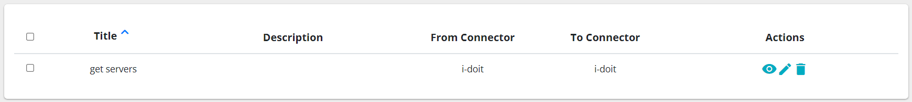
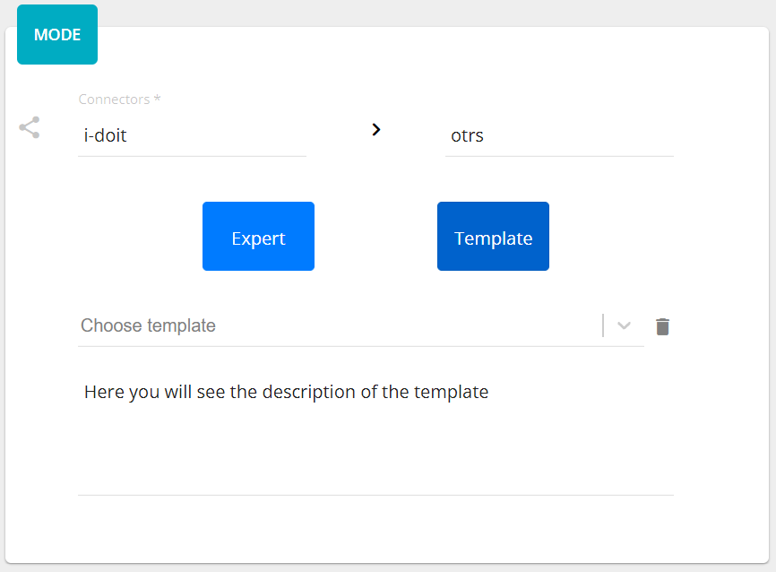

##################
Connections
##################

Connection defines between which connectors do we want to do requests,
what kind of requests and to specify mapping between them. This is a core
element of the application. There is also a possibility to add the connection
to the *templates*. Clicking on the |image3| button appears a window where should
be provided a name. The list of connections displays a title, a description,
and connectors' titles.

|image0|

Adding/updating connection consists of three steps: *direction*, *mode*, and
*methods*. The *direction* page has three fields: *title*, *description* and
*connectors*. *Title* and *connectors* are required. The *title* must be unique,
it is checking before performing an action (add/update). The *connectors* are two:
*from connector* and *to connector*. The options are loaded from the *connectors*
list.

|image1|

The *mode* step has one required field - *mode*. It can be an *expert* or
a *template.* If the *template* is chosen, their will be appeared a select
field, where you need to select a desired template. Here also you can delete
it, clicking on the bin icon, or upgrade, if the template need to be upgraded
to the current application version.

|image2|

If you change the mode it will affect on the "methods", that is why you need
to confirm your choice.

The *method* represents the request to the connector with defined parameters.
There are two types of elements: method and operator. The area consists of visual
representation of methods/operators and a panel *Details*.
Clicking on the text *Click here to create...* or moving pointer above the existed
element you will see a placeholder for creating process or operator.

|image4|

The element will be located after the current element and set as a new current.
Each method has his own color that generates automatically. Also, you can set
a label for your personal better reading. To remove a method or an operator just
click on the bin icon of the selected element. The *Details* panel displays
information about the selected element.

|image9| |image10|

Clicking on *Endpoint* or *Body* you can modify the corresponded content.

There is a possibility to add a parameter into the *Endpoint* (except the first
method in *from connector*). This parameter is a reference to the response of
the previously created method.

|image11|

If the response is in json format and array, then you can choose the whole array
or only a specific element in the array typing *[arrayIndex]*. It means to take
the element with the specified index. To choose the whole array you need to type
*[\*]*.
If the response is in xml format then you can also reference to the attribute
of the xml tag. Just type *@* and if the xml tag has attributes they will be
popped up and you can select one.
You choose method, fill out the parameter and click plus button. The parameter
comes from the invoker. If it exists there, you will see it after typing the
third symbol in the input field as a select popup block.

*Body* can also contain references from the previous methods. Type **#** as
the first character and you will see another popup.

|image5|

You can handle with that in the same principe as for the *Query*.
When you finish with editing click on the apply icon |image6|.

Moreover, you can add
an enhancement between fields. Clicking on the reference

.. note::
	Enhancement is currently only supported in the body configuration of the target system (to connector). 

|image7|

you will see a popup window where you set a description and an enhancement
itself.

|image8|

There are predefined variables to relate with the fields. *VAR_[i]* are coming parameters
and *RESULT_VAR* is the final value for *to connector* field.

When you create an operator there are two options: *if* and *loop*. *if* operator
does a condition before performance. You should define here also a reference, choose
a condition operation and set with what are you doing to compare.

*loop* operator makes request in the loop under conditions that you define.

As you can mention, all items under the operators are shifted on the level down. Selecting
the operator you will see the scope of their influence.

.. |image1| image:: ../img/connection/1.png
   :align: middle

.. |image3| image:: ../img/connection/3.png
.. |image4| image:: ../img/connection/4.png
   :align: middle
   :width: 200
.. |image5| image:: ../img/connection/5.png
   :align: middle
.. |image6| image:: ../img/connection/6.png
.. |image7| image:: ../img/connection/7.png
   :align: middle
.. |image8| image:: ../img/connection/8.png
   :align: middle
.. |image9| image:: ../img/connection/9.png
   :width: 49%
.. |image10| image:: ../img/connection/10.png
   :width: 49%
.. |image11| image:: ../img/connection/11.png
   :align: middle
